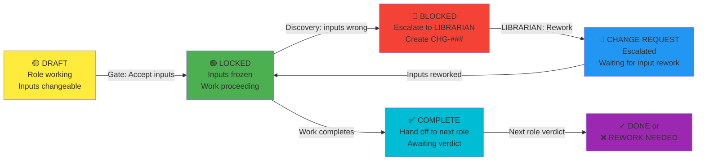
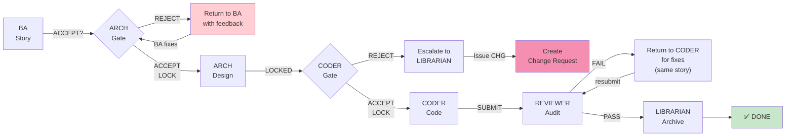

# 🔴 Circular Dependency Fix: Sequential Lock Protocol

## Problem Statement

The role system can create circular loops:

```
BA writes story
  ↓
ARCH designs schema
  ↓
CODER implements code
  ↓
CODER discovers: "AC is impossible to implement"
  ↓
CODER requests BA to change AC
  ↓
BA reworks story
  ↓
ARCH must rework design (because schema changed)
  ↓
Cycle repeats ← CIRCULAR DEPENDENCY
```

**Result:** Work gets stuck in endless loops. No progress to REVIEWER.

---

## Root Cause: No Input Validation Gates

Each role accepts input without upfront validation:
- BA writes story → ARCH assumes it's implementable (without checking)
- ARCH designs schema → CODER assumes it's buildable (without checking)
- CODER codes → REVIEWER assumes design is sound (without checking)

**When things are wrong:** feedback loops backward = circular dependency.

---

## Solution: Sequential Lock Protocol

### 🔒 Core Rules

**Rule 1: Input Acceptance Gates**
- Each role MUST validate inputs BEFORE starting work
- If inputs fail validation → REJECT immediately, don't begin
- Once work begins → inputs are FROZEN (no changes)

**Rule 2: No Backward Feedback Loops**
- CODER cannot ask BA to rewrite story mid-implementation
- ARCH cannot ask BA to reclarify AC while designing
- REVIEWER cannot ask ARCH to redesign while reviewing
- Instead: Create formal Change Request (escalation path)

**Rule 3: Forward-Only Communication**
- CODER discovers issue → escalate to LIBRARIAN (not back to BA)
- LIBRARIAN decides: finish current work or halt for change request
- Changes require NEW story, not rework of current story

**Rule 4: Phase Completion = Phase Lock**
- Once BA completes story → BA inputs frozen
- Once ARCH completes design → ARCH inputs frozen
- Once CODER submits code → CODER inputs frozen until REVIEWER verdict

---

## Implementation: Input Validation Checklists

### ✅ BA Input Gate (Before ARCHITECT starts)

**ARCHITECT checks story before accepting it:**

```markdown
## Story Acceptance Checklist (ARCHITECT reviews BA output)

- [ ] Story has unique ID (US-###)
- [ ] AC count: 2-5 criteria (not 1, not 10+)
- [ ] Each AC is measurable (not vague like "improve performance")
- [ ] Edge cases named (not implied)
- [ ] No implementation details in AC
- [ ] No contradictory AC
- [ ] Story size: fits in 5 days of CODER work

VERDICT: ⬜ ACCEPT | ❌ REJECT

If REJECT:
→ Return to BA with specific feedback
→ ARCHITECT does NOT start design
→ Re-evaluate when BA resubmits
```

**If ARCHITECT accepts:** Story is LOCKED. ARCHITECT cannot request changes.

---

### ✅ BA + ARCH Input Gate (Before HFD starts)

**HFD checks business rules + data model before accepting:**

```markdown
## UI Design Acceptance Checklist (HFD reviews BA + ARCH output)

- [ ] Business rules are clear and measurable
- [ ] Data model includes: primary key, FK relationships, constraints
- [ ] Sensitive fields are identified (don't display PII)
- [ ] Performance expectations stated (real-time? eventual consistency?)
- [ ] Mobile constraints specified (screen size, touch targets)
- [ ] Accessibility requirements named

VERDICT: ⬜ ACCEPT | ❌ REJECT

If REJECT:
→ Return to BA or ARCH with specific feedback
→ HFD does NOT start design
→ Re-evaluate when inputs resubmitted
```

**If HFD accepts:** Inputs are LOCKED.

---

### ✅ ARCH + HFD + BA Input Gate (Before CODER starts)

**CODER checks all inputs before implementing:**

```markdown
## Implementation Acceptance Checklist (CODER reviews ARCH + HFD + BA)

- [ ] Story AC is testable (each AC → test case)
- [ ] Database schema is normalized (3NF minimum)
- [ ] FK constraints reference unique columns only
- [ ] RLS policy is defined in schema
- [ ] UI component structure matches HFD spec
- [ ] No conflicting AC

VERDICT: ⬜ ACCEPT | ❌ REJECT

If REJECT:
→ CODER must escalate to LIBRARIAN
→ LIBRARIAN decides: rework inputs or create change request
→ CODER does NOT start implementation
```

**If CODER accepts:** CODER begins Red-Green-Refactor. All inputs are FROZEN.

---

### ✅ CODER Output Gate (Before REVIEWER starts)

**REVIEWER checks code completeness before auditing:**

```markdown
## Code Acceptance Checklist (REVIEWER accepts CODER output)

- [ ] All AC have corresponding test cases
- [ ] Code compiles without warnings
- [ ] No mock database (integration tests only)
- [ ] No stale Java processes blocking JAR
- [ ] JaCoCo coverage calculated (branch %)
- [ ] All tests pass (mvn clean test)

VERDICT: ⬜ ACCEPT REVIEW | ❌ REJECT (incomplete submission)

If REJECT:
→ Return to CODER
→ CODER must complete missing pieces
→ REVIEWER does NOT begin audit
```

**If REVIEWER accepts:** REVIEWER conducts full 6-gate audit.

---

## Change Request Protocol (Breaking the Lock)

**If CODER discovers input is wrong DURING implementation:**

```
CODER discovers: AC is impossible
  ↓
CODER escalates to LIBRARIAN (not back to BA)
  ↓
LIBRARIAN options:
   A) "Finish current work, create NEW story for the rework"
   B) "Halt this story, create CHANGE REQUEST for input rework"
  ↓
If A: Continue implementation with notes in PR
If B: Archive current story (INCOMPLETE), create:
      - CHG-### (Change Request ID)
      - Reference original story
      - Describe required input changes
      - New story created after inputs reworked
```

**Change Request Template:**

```markdown
## CHG-501: Story Impossibility

**Original Story:** US-500: Quick Pay Settlement

**Issue:** AC#1 requires real-time payout, but Stripe API has 5-minute latency

**Root Cause:** BA didn't research Stripe limitations

**Options:**
1. Extend AC#1 to accept 5-minute latency
2. Use different payment provider
3. Implement async notification system

**Recommendation:** Option 1 (simplest)

**Next Step:** BA reworks US-500, ARCH reviews design impact, CODER resumes

**Status:** CODER work paused (U500-v2-in-progress)
```

---

## Enforcement: Four Lock States



---

## Example: Fixing a Real Circular Dependency

### ❌ Before (Circular Loop)

```
Day 1: BA writes US-501 (Quick Pay)
Day 2: ARCH designs schema
Day 3: HFD designs UI
Day 4: CODER starts implementation
Day 5: CODER discovers: AC#1 (real-time) violates Stripe API latency (5min)
       CODER asks BA: "Can we change AC#1 to 5-minute latency?"
       BA reworks AC#1
Day 6: ARCH must review whether design still works
       ARCH discovers: settlement status field needs extra state enum
       ARCH asks CODER: "Can you add PENDING_STRIPE_CONFIRMATION state?"
       CODER adds state, re-tests
Day 7: REVIEWER sees changes, asks: "Are these AC changes documented?"
       Endless back-and-forth...
```

Result: **Story stuck in rework loop. No progress.**

### ✅ After (Sequential Lock)

```
Day 1: BA writes US-501 (Quick Pay)

Day 2: ARCH reviews with ACCEPTANCE CHECKLIST
       ❌ REJECTED: "AC#1 vague on payout timing"
       
       BA clarifies AC#1: "Payout within 5 minutes of Stripe confirmation"
       
Day 2b: ARCH re-reviews
        ✅ ACCEPTED
        
Day 3: ARCHITECT locks inputs. Designs schema.
       (BA cannot request changes after this)
       
Day 4: CODER reviews with ACCEPTANCE CHECKLIST
       ✅ ACCEPTED
       
Day 4b: CODER locks inputs. Begins Red-Green-Refactor.
        
Day 5: During implementation, CODER discovers: "Stripe API returns latency"
       CODER escalates to LIBRARIAN (not BA)
       
Day 5b: LIBRARIAN decides:
        "Finish current story with what we have. Create CHG-501 to track
         Stripe latency issue. New story (US-501-v2) will address."
         
Day 6: CODER finishes US-501 as designed (5-min latency acceptable)
       CODER submits to REVIEWER
       
Day 7: REVIEWER audits (all inputs were pre-validated)
       ✅ APPROVED
       
Day 8: LIBRARIAN marks US-501 DONE
       CHG-501 escalated to BA for next cycle

Result: US-501 COMPLETE in 7 days. No circular loops.
```

---

## Prevention: Input Quality Standards

Roles must meet these standards BEFORE next role accepts them:

| Role | Output Must Have | Quality Gate |
|------|---|---|
| **BA** | Story ID, 2-5 AC, edge cases, zero ambiguity | ARCHITECT acceptance checklist |
| **ARCHITECT** | Schema diagram, RLS policy, no code | CODER acceptance checklist |
| **HFD** | UI mockup, component list, interaction flows | CODER acceptance checklist |
| **CODER** | Code + tests, 80%+ coverage, compiles clean | REVIEWER acceptance checklist |
| **REVIEWER** | 6-gate verdict (PASS/FAIL only) | Cannot be changed once issued |
| **LIBRARIAN** | Story_Map.md update, traceability link | Story marked DONE (final) |

---

## New Protocol: No Feedback Backward



**Key:** Backward feedback only happens WITHIN a role (CODER ↔ REVIEWER), never ACROSS previous roles (CODER ⇸ BA).

---

## Enforcement: Role Instructions

Add to each role's rule file:

### ARCHITECT.md (Addition)
```markdown
## Input Acceptance Gate (Non-Negotiable)

Before beginning design:
1. Review BA story with ARCHITECT acceptance checklist
2. If ANY item fails → REJECT story, return to BA
3. If ALL items pass → Mark as ACCEPTED and LOCKED
4. Once locked: Do NOT request BA changes mid-design
5. If issue discovered → Escalate to LIBRARIAN
```

### CODER.md (Addition)
```markdown
## Input Acceptance Gate (Non-Negotiable)

Before writing code:
1. Review ARCH schema, HFD UI, BA AC with CODER acceptance checklist
2. If ANY item fails → REJECT, escalate to LIBRARIAN
3. If ALL items pass → Mark as ACCEPTED and LOCKED
4. Once locked: Begin Red-Green-Refactor
5. If issue discovered mid-coding → Escalate to LIBRARIAN (NOT back to BA/ARCH)
```

---

## Summary: Breaking the Cycle

| Old Problem | New Solution |
|-------------|--|
| CODER asks BA to change AC | CODER escalates to LIBRARIAN, create CHG request |
| ARCH asks BA to clarify story | ARCH rejects story upfront with acceptance gate |
| REVIEWER asks ARCH to redesign | Inputs pre-validated; no redesigns mid-review |
| Endless rework loops | Each phase locked after acceptance; changes → new story |
| No visibility into blocks | Change Request protocol makes blocks explicit & tracked |

---

## Metrics: Lock Efficiency

Track these to prevent circular loops:

```
✅ Stories with 0 rejection cycles: [target: 80%]
✅ Stories requiring 1 CHG request: [target: 15%]
❌ Stories stuck in rework (>2 CHG): [target: <5%]
⏱️ Days from BA start to DONE: [target: 7 days]
```

---

**Effective Date:** 2026-05-25  
**Authority:** CLAUDE.md Sequential Gate Protocol  
**Status:** MANDATORY (enforce in all PRs)
