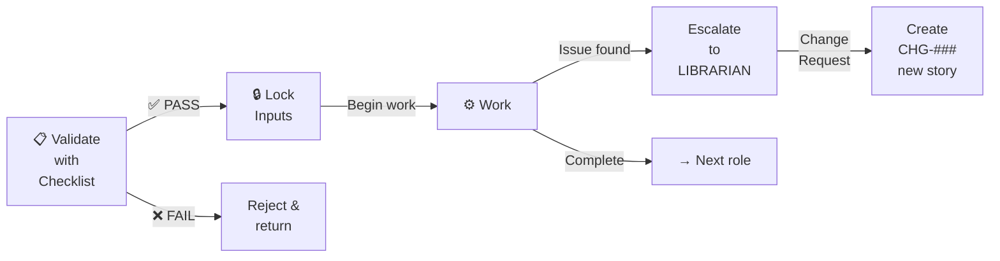

# 📌 Circular Dependency Fix — Summary

## What Was Wrong

The role system could create **infinite feedback loops** when issues were discovered mid-implementation:

```
BA writes story → ARCH designs → CODER implements
  ↑                                      ↓
  ← CODER discovers: "AC impossible"
  ← CODER asks BA to change AC
  ← BA reworks story
  ← ARCH must rework design
  ← CODER must restart (loop continues)
```

**Result:** Stories stuck in rework cycles. No progress to REVIEWER.

---

## The Fix: Sequential Lock Protocol

### Core Idea: **Input Acceptance Gates + Phase Lock**

1. **Before starting work**: Validate inputs with acceptance checklist
2. **After accepting**: Inputs are LOCKED (no backward changes)
3. **If issue found**: Escalate to LIBRARIAN → create Change Request → new story



---

## What Changed (By Role)

### 🏛️ ARCHITECT
- **Before:** Accept story, start design, hope AC is right, maybe loop back to BA
- **After:** Validate BA story with acceptance checklist FIRST. Only start design if checklist passes. Once started, story is locked.

**Acceptance Checklist for BA story:**
```
- [ ] AC count: 2-5 (measurable, not vague)
- [ ] Each AC testable (pass/fail clear)
- [ ] Edge cases named (not implied)
- [ ] No contradictions
- [ ] Story fits 5-day scope
```

### 🎨 HFD (Human Factors Designer)
- **Before:** Accept BA rules + ARCH schema, design, maybe loop back if data model wrong
- **After:** Validate BA + ARCH inputs with acceptance checklist FIRST. Only start if checklist passes. Once started, locked.

### 💻 CODER
- **Before:** Accept story + design + UI spec, implement, discover issue, ask BA to change AC (circular!)
- **After:** Validate all inputs with acceptance checklist FIRST. If any fail → escalate to LIBRARIAN (not back to BA). Once checklist passes → locked, begin implementation.

**Acceptance Checklist for inputs:**
```
- [ ] Schema normalized (3NF)
- [ ] FK constraints valid
- [ ] RLS policy defined
- [ ] UI components specified
- [ ] All AC testable
```

**NEW: If issue discovered mid-coding:**
```
DO NOT: Ask BA to change AC
DO: Escalate to LIBRARIAN
    LIBRARIAN decides:
      A) "Finish story with current design" → note in PR
      B) "Create CHG-### change request" → pause, new story after rework
```

### 🔍 REVIEWER
- **Before:** Review code, find issues, maybe ask ARCHITECT to redesign (blocks everything)
- **After:** Pre-validated inputs mean no design flaws. Review code quality only. Return to CODER for fixes (same story).

### 📚 LIBRARIAN
- **Before:** Archive completed stories
- **After:** SAME, but now also manage Change Requests (CHG-###) for blocked items

---

## Step-by-Step: How to Apply

### When starting a story:

```
1. BA writes story

2. ARCHITECT reviews with checklist:
   ✅ All items pass? → ARCHITECT accepts (LOCK)
   ❌ Some fail? → Return story to BA with feedback
   
3. BA fixes & resubmits
   
4. ARCHITECT accepts & LOCKS story
   → ARCHITECT begins design

5. (Parallel) HFD reviews BA + ARCH with checklist:
   ✅ All items pass? → HFD accepts (LOCK)
   ❌ Some fail? → Return to BA or ARCHITECT
   
6. (Parallel) CODER reviews ARCH + HFD + BA with checklist:
   ✅ All items pass? → CODER accepts (LOCK)
   ❌ Some fail? → Escalate to LIBRARIAN
       LIBRARIAN decides: rework or CHG request
   
7. CODER begins Red-Green-Refactor

8. During coding, CODER finds issue:
   → Escalate to LIBRARIAN (not back to BA)
   → LIBRARIAN: "Finish as is + CHG ticket"
   → CODER finishes story
   
9. CODER submits to REVIEWER

10. REVIEWER audits code quality
    ✅ PASS? → REVIEWER issues verdict
    ❌ FAIL? → CODER fixes & resubmits (same story)
    
11. REVIEWER issues PASS
    → LIBRARIAN marks story DONE
```

---

## Example: Before vs After

### ❌ BEFORE (Circular Loop)

```
Day 1: BA writes US-501 (Quick Pay)

Day 2: ARCH designs schema
       (assumes AC is implementable)

Day 3: HFD designs UI

Day 4: CODER starts coding

Day 5: CODER discovers: AC#1 (real-time payout)
       conflicts with Stripe API (5-min latency)
       
       CODER: "BA, can you change AC#1?"
       BA: "OK, payout in 5 minutes"
       
Day 6: ARCH sees AC changed
       Must redesign schema!
       ARCH: "CODER, I added PENDING_STRIPE status"
       CODER: "Let me retest everything..."
       
Day 7-10: Rework loop continues
          No PR submitted to REVIEWER
          Story stuck indefinitely
```

### ✅ AFTER (Sequential Lock)

```
Day 1: BA writes US-501 (Quick Pay)

Day 2: ARCHITECT reviews with ACCEPTANCE CHECKLIST
       ❌ REJECTED: "AC#1 vague on payout timing"
       
       BA clarifies: "5-minute max latency (Stripe limit)"
       
Day 2b: ARCHITECT re-checks → ✅ ACCEPTED & LOCKED

Day 3: ARCHITECT designs schema
       (inputs locked, AC is clear)

Day 4: CODER checks with ACCEPTANCE CHECKLIST
       ✅ All items pass → CODER ACCEPTS & LOCKS
       
       CODER begins Red-Green-Refactor

Day 5: CODER finishes code (all tests pass)
       → REVIEWER

Day 6: REVIEWER audits code
       ✅ PASS → LIBRARIAN marks DONE

Result: US-501 COMPLETE in 6 days. No loops.
```

---

## Change Request Protocol (CHG-###)

If CODER discovers input was wrong:

```markdown
## CHG-501: Stripe API Latency Impact

**Original Story:** US-500: Quick Pay Settlement
**Discovered:** Stripe API has 5+ minute latency (AC assumes <1min)
**Root Cause:** BA didn't research Stripe API spec

**Recommendation:** Extend AC timeout to 5 minutes
**Assign to:** BA (to rework US-500-v2)

**Next Steps:**
1. BA fixes requirements in new story
2. ARCH reviews new story
3. CODER resumes (or creates new story)

**Status:** CHG-501 escalated (waiting for BA rework)
```

---

## Enforcement Checklist

Add this to CLAUDE.md enforcement:

- [ ] Every role has acceptance checklist in docs/roles/
- [ ] Checklists are used BEFORE starting work
- [ ] Once accepted, inputs marked as LOCKED (no changes)
- [ ] Issues escalate to LIBRARIAN, not backward
- [ ] Change Requests (CHG-###) used for rework requests
- [ ] CODER never goes directly back to BA (→ LIBRARIAN instead)
- [ ] REVIEWER audits code only (inputs pre-validated)

---

## Metrics to Track

Monitor these to ensure no circular loops:

```
✅ Stories with 0 input rejections: [target: 80%]
✅ Stories requiring 1 CHG request: [target: 15%]
❌ Stories with 2+ CHG requests: [target: <5%]
⏱️ Days from BA → DONE: [target: 6-7 days]
🔄 Rework cycles per story: [target: <2]
```

---

## Files Updated

1. **CIRCULAR_DEPENDENCY_FIX.md** (NEW) — Full protocol, checklists, examples
2. **ROLE_INTERACTIONS.md** — Gate matrix updated with lock states
3. **ROLE_DATA_FLOW.md** — Circular dependency diagram updated
4. **ROLE_QUICK_REFERENCE.md** — Blocks & blocks table updated, CHG protocol added

---

## TL;DR

| Before | After |
|--------|-------|
| Roles accept input without validation | Roles validate input before starting |
| Feedback loops go backward (CODER → BA) | Feedback escalates forward (→ LIBRARIAN) |
| Changes mid-work derail timelines | Changes create CHG ticket + new story |
| Stories stuck in rework loops | 6-7 day predictable timeline |
| No visibility into why things blocked | CHG tickets make blocks explicit |

**Result:** Zero circular dependencies. Predictable delivery. Clear escalation path.

---

**Status:** ACTIVE (2026-05-25)  
**Enforcement:** Mandatory in all PRs  
**Authority:** CLAUDE.md Sequential Gate Protocol
