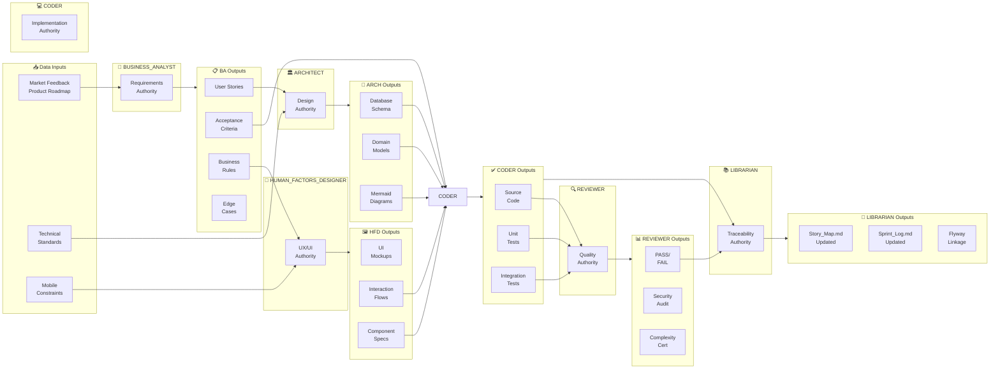
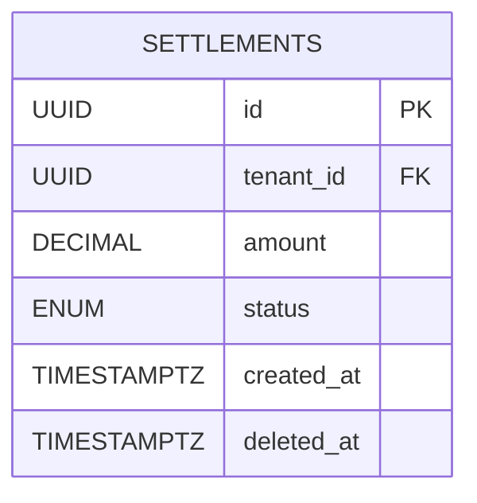
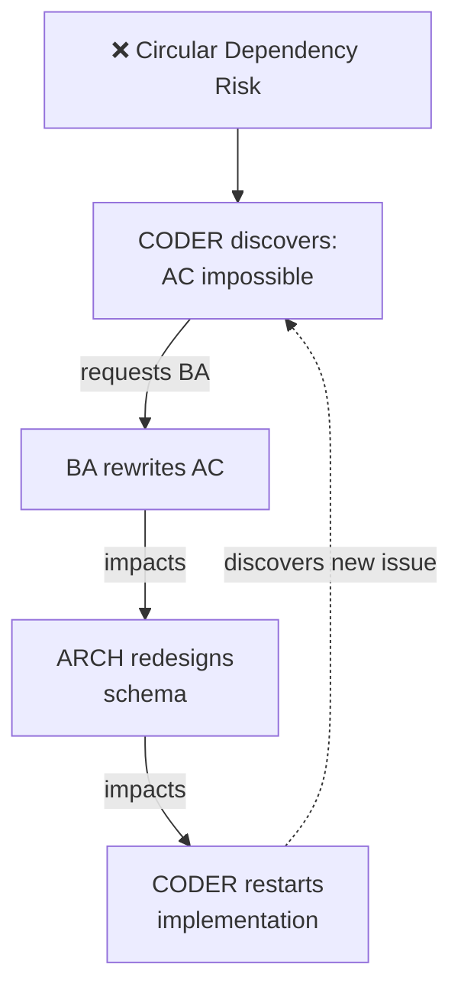
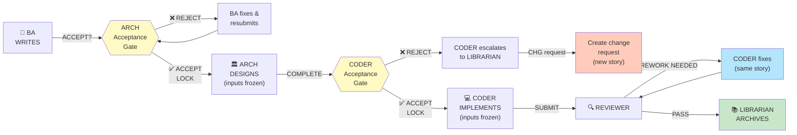
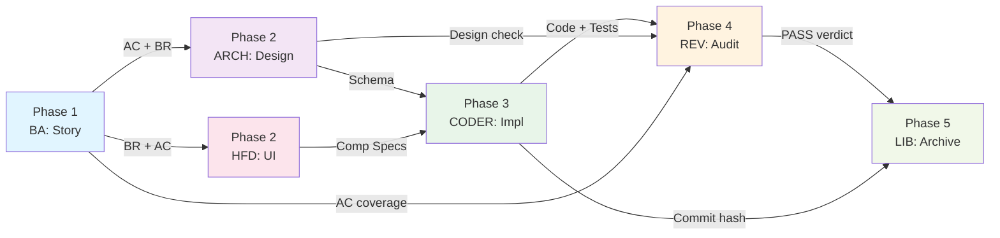
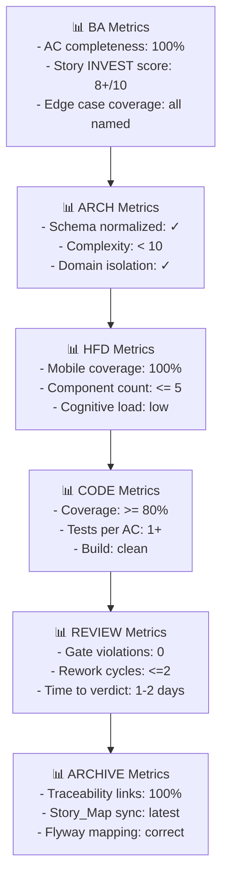

# Role Data Flow & Dependencies

## 🔗 Data Input/Output Matrix

Shows what each role consumes and produces:



---

## 📋 Detailed Data Handoff Points

### 📤 BA → ARCHITECT
**What:** User Story + Acceptance Criteria  
**Format:**
```markdown
**US-501:** Quick Pay Settlement
- AC1: System computes settlement in real-time
- AC2: Driver sees payout within 5 minutes
- Edge Case: Chargebacks block payouts
```
**Expectation:** ARCHITECT designs schema & domain model to enable AC1-AC2

---

### 📤 ARCHITECT → CODER
**What:** Database schema + Domain model + Constraints  
**Format:**

**Expectation:** CODER maps entity to JPA + ensures all constraints

---

### 📤 BA + ARCHITECT → HFD
**What:** Business rules + Data model  
**Content:**
- Which fields are user-editable?
- What's the business validation?
- Performance requirements (real-time display)?
**Expectation:** HFD designs form layout & validation UX

---

### 📤 HFD → CODER
**What:** UI component specifications + interaction flows  
**Format:**
```markdown
## Settlement Detail Card
- Display: amount (large), status (badge), action button
- Colors: Green (success), Yellow (pending), Red (failed)
- Mobile: Stack vertically, single-column
- Interaction: Click "Pay" → confirmation dialog
```
**Expectation:** CODER builds React component matching spec

---

### 📤 CODER → REVIEWER
**What:** PR with code + test results + JaCoCo coverage  
**Includes:**
- Source files changed
- Unit test cases (one per AC)
- Integration test results
- Coverage report (branch %)
**Expectation:** REVIEWER validates all 6 hard gates

---

### 📤 REVIEWER → LIBRARIAN
**What:** PASS/FAIL verdict  
**Format:**
```
✓ APPROVED: US-501 Quick Pay Settlement
- BA Gate: AC coverage 100%
- Architect Gate: Cyclomatic < 10 ✓
- Security Gate: RLS enforced ✓
- Reliability Gate: Coverage 85% ✓
- API Gate: Version aligned ✓
- Spring Security Gate: Filters safe ✓
```
**Expectation:** LIBRARIAN marks story DONE and archives

---

### 📤 LIBRARIAN → Archive
**What:** Story completion metadata  
**Format:**
```markdown
| Story | Requirement ID | Flyway Version | Branch | Merge Commit | Coverage | Reviewer |
|-------|---|---|---|---|---|---|
| US-501 | REQ-025 | V20260525_1545 | feature/quick-pay | abc123def | 85% | @reviewer |
```
**Expectation:** Full traceability from requirement → deployment

---

## 🔄 Circular Dependencies (Sequential Lock Protocol)

**Problem:** Roles can request backward changes → circular loops



**Solution:** Sequential Lock Protocol



**Key Rules:**
1. **Input Acceptance Gates** - Each role validates inputs BEFORE starting
2. **Phase Lock** - Once accepted, inputs are FROZEN (no changes)
3. **Forward-Only Feedback** - Issues escalate to LIBRARIAN, not backward
4. **Change Requests** - Backward changes → create CHG ticket + new story

See **CIRCULAR_DEPENDENCY_FIX.md** for full protocol.

---

## 🎯 Critical Path Analysis

**Longest sequence of dependent tasks (blocking path):**

```
BA writes story (1 day)
  ↓
ARCHITECT designs (2 days) ← Must wait for BA
  ↓
CODER implements (3 days) ← Must wait for ARCHITECT
  ↓
REVIEWER audits (2 days) ← Must wait for CODER
  ↓
LIBRARIAN archives (1 day) ← Must wait for REVIEWER
────────────────────────────
CRITICAL PATH: 9 days

Parallel tracks:
- HFD can start after BA + ARCHITECT (day 3) and finish by day 5
- CODER can start day 3 once HFD finishes (no blocking)
```

---

## ⚡ Optimizations for Faster Delivery

| Optimization | What | Impact |
|--------------|------|--------|
| **Batch stories** | BA writes 5 stories upfront | ARCHITECT/HFD/CODER pipeline-feed |
| **ARCH + HFD parallel** | Both start day 2 after BA | Saves 1 day in critical path |
| **Automated tests** | CODER writes tests during implementation | Avoids QA bottleneck |
| **Pre-review checklist** | CODER self-checks 6 gates before PR | REVIEWER turnaround < 1 day |
| **Continuous integration** | Tests run on every commit | Catch regressions early |

---

## 📊 Dependency Graph (Execution Order)



---

## 🔐 Authorization Matrix

**Who can approve what:**

| Artifact | Owner | Can Approve | Cannot Approve |
|----------|-------|-------------|---|
| User Story | BA | BA, LIBRARIAN | ARCH, CODER, HFD |
| Technical Design | ARCHITECT | ARCHITECT, REVIEWER | BA, CODER, HFD |
| UI Design | HFD | HFD, REVIEWER | BA, ARCH, CODER |
| Code | CODER | CODER, REVIEWER | BA, ARCH, HFD, LIBRARIAN |
| Quality Verdict | REVIEWER | REVIEWER only | All others |
| Story DONE | LIBRARIAN | LIBRARIAN only (if REVIEWER PASS) | All others |

---

## 📈 Metrics Per Data Handoff

Track quality at each handoff:



---

**Created:** 2026-05-25  
**Purpose:** Visualize role dependencies, data flow, and handoff points  
**Audience:** All roles, product leadership, onboarding
