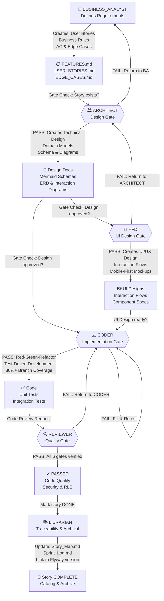
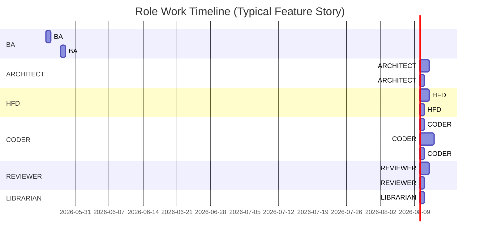
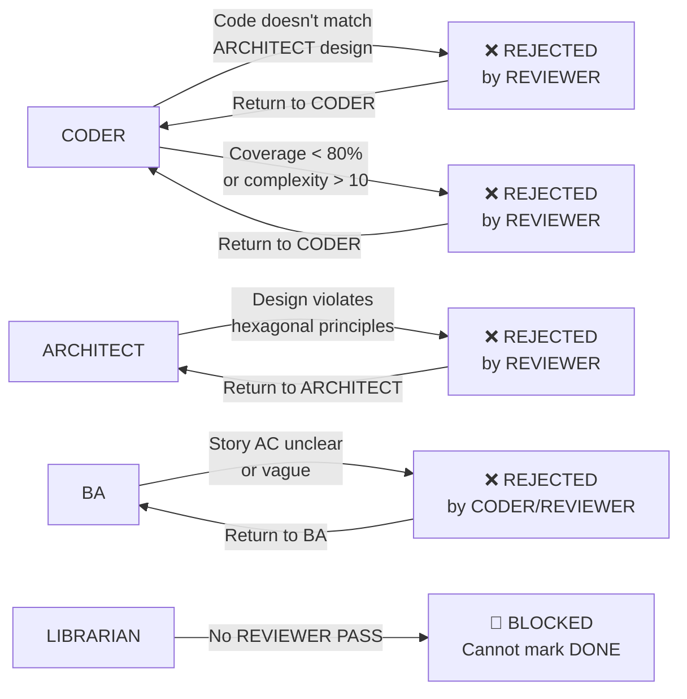

# FreightClub Role Interaction Map

## 🎯 Executive Overview
The FreightClub engineering system operates as a **Sequential Gate Protocol** where each role validates the output of the previous role before proceeding. This ensures domain purity, security, traceability, and quality.

---

## 📊 Role Interaction Flow (Main Workflow)



---

## 🔄 Detailed Role Responsibilities & Interactions

### 1️⃣ **BUSINESS_ANALYST** (Requirements Authority)
**Inputs:** Market feedback, product roadmap, stakeholder requirements  
**Outputs:** User Stories, Business Rules, Edge Cases, Acceptance Criteria  
**Gate Authority:** Determines if a story is ready for ARCHITECT review

| Interaction | To Role | Deliverable |
|-------------|---------|-------------|
| → ARCHITECT | Provides story & AC | User Story ID + Acceptance Criteria |
| ← REVIEWER | Receives feedback on unclear AC | Clarified acceptance criteria |
| ← LIBRARIAN | Syncs with Story_Map | Real-time catalog validation |

---

### 2️⃣ **ARCHITECT** (Domain & Schema Design)
**Inputs:** User Story (from BA), Technical constraints, Database standards  
**Outputs:** Technical design, Domain models, Database schemas, Mermaid diagrams  
**Gate Authority:** Validates design against Hexagonal & DDD principles  
**Constraint:** NO JAVA CODE — design only

| Interaction | To Role | Deliverable |
|-------------|---------|-------------|
| ← BA | Receives user story | Story ID + business rules |
| → CODER | Provides technical design | Schema + domain model diagrams |
| → HFD | Provides data model | Entity relationships & constraints |
| ← REVIEWER | Receives architecture review | Design approval or rejection |

---

### 3️⃣ **HUMAN_FACTORS_DESIGNER** (UX/UI Authority)
**Inputs:** Business Rules (from BA), Data Model (from ARCHITECT), Mobile constraints  
**Outputs:** UI mockups, interaction flows, component specifications  
**Gate Authority:** Ensures salience & cognitive load reduction

| Interaction | To Role | Deliverable |
|-------------|---------|-------------|
| ← BA | Receives business rules | Feature requirements & user flows |
| ← ARCHITECT | Receives data model | Entity structure & constraints |
| → CODER | Provides UI design | Component specs + Tailwind patterns |
| ← REVIEWER | Receives UX audit | Accessibility & mobile check |

---

### 4️⃣ **CODER** (Implementation Authority)
**Inputs:** Technical design (ARCHITECT) + UI specs (HFD) + Story AC (BA)  
**Outputs:** Source code, unit tests, integration tests (80%+ coverage)  
**Gate Authority:** Enforces Red-Green-Refactor TDD workflow

| Interaction | To Role | Deliverable |
|-------------|---------|-------------|
| ← ARCHITECT | Receives design | Schema + domain layer blueprint |
| ← HFD | Receives UI design | Component templates + CSS patterns |
| ← BA | Receives AC | Test cases from acceptance criteria |
| → REVIEWER | Submits PR | Code + test suite |
| ← REVIEWER | Receives QA feedback | Defects & rework requests |

---

### 5️⃣ **REVIEWER** (Quality & Security Gate)
**Inputs:** Codebase (from CODER), Requirements (from BA), Design (from ARCHITECT)  
**Outputs:** PASS/FAIL verdict, security audit, complexity certification  
**Gate Authority:** 6 mandatory hard gates (BA, Architect, Data/Security, Reliability, API, Spring Security)

| Interaction | To Role | Deliverable |
|-------------|---------|-------------|
| ← CODER | Receives PR | Source code + test results |
| ← BA | Validates AC coverage | Requirement traceability check |
| ← ARCHITECT | Validates design adherence | Complexity & domain purity audit |
| → LIBRARIAN | Issues PASS verdict | "APPROVED" stamp for story archival |
| → CODER | Issues FAIL verdict | Return for fixes |

---

### 6️⃣ **LIBRARIAN** (Traceability & Archival)
**Inputs:** PASS verdict (from REVIEWER), completed code (from CODER)  
**Outputs:** Story_Map.md, Sprint_Log.md, Flyway version linkage  
**Gate Authority:** Only role authorized to mark story "DONE"  
**Constraint:** Cannot mark DONE without REVIEWER PASS

| Interaction | To Role | Deliverable |
|-------------|---------|-------------|
| ← REVIEWER | Receives PASS verdict | Story completion authorization |
| ← CODER | Receives version info | Commit hash + Flyway migration ID |
| → BA | Updates backlog status | Story marked COMPLETE |
| → All Roles | Archives to history | Story cataloged with full traceability |

---

## 🔀 Parallel Execution Diagram (Timeline)



**Key Observation:** ARCHITECT, HFD, and CODER can work in **parallel** after BA completes, but CODER cannot merge until ARCHITECT + HFD are both ready.

---

## 🛡️ Gate Check Matrix

| Stage | Gate Owner | Approval Condition | Next Step |
|-------|------------|-------------------|-----------|
| 1 | BA | Story written per INVEST standard | → ARCHITECT |
| 2 | ARCHITECT | Acceptance checklist PASS + design complete, cyclomatic < 10 | → CODER + HFD (inputs LOCKED) |
| 3 | HFD | Acceptance checklist PASS + UI spec complete, mobile-first | → CODER (inputs LOCKED) |
| 4 | CODER | Acceptance checklist PASS + Red-Green-Refactor, 80%+ coverage | → REVIEWER (inputs LOCKED) |
| 5 | REVIEWER | All 6 hard gates PASS (BA, ARCH, SEC, REL, API, SPRING) | → LIBRARIAN |
| 6 | LIBRARIAN | REVIEWER PASS + story in Story_Map.md | **COMPLETE** |

**NEW: Sequential Lock Protocol** — See [CIRCULAR_DEPENDENCY_FIX.md](CIRCULAR_DEPENDENCY_FIX.md)  
Each role **validates inputs with acceptance checklist** before starting work. Once accepted, inputs are **FROZEN** (no backward changes). Issues escalate to LIBRARIAN → create Change Request + new story.

---

## 🚫 Blocking & Rejection Flows



---

## 📌 Cross-Role Communication Channels

| From | To | Channel | Content |
|------|----|---------|---------| 
| BA | ARCHITECT | Story ID + AC | Requirements clarity |
| ARCHITECT | CODER | Design docs + Mermaid | Schema, domain model, constraints |
| HFD | CODER | UI spec + component list | Layout, colors, interaction flow |
| CODER | REVIEWER | PR + test results | Implementation proof |
| REVIEWER | LIBRARIAN | "PASS" or "FAIL" verdict | Story completion status |
| LIBRARIAN | BA | Updated Story_Map.md | Backlog sync |

---

## ⚡ Workflow Rules (From CLAUDE.md)

1. **Sequential Gate Protocol:** No role can proceed until the previous role's gate passes.
2. **STRICT BREVITY:** All role updates use one-sentence status format: `[Action]: [Result].`
3. **No Code Until Story Exists:** CODER cannot write code without BA user story + AC.
4. **REVIEWER Mandatory:** Every PR reviewed against 6 hard gates; no exceptions.
5. **Librarian Authority:** Only LIBRARIAN marks story DONE (and only after REVIEWER PASS).
6. **Cyclomatic Complexity < 10:** Enforced by REVIEWER; single method > 10 = REJECT.
7. **80% Branch Coverage:** JaCoCo enforced; coverage < 80% = REJECT.
8. **Silent Execution:** No narration of intermediate steps; only deliver final results.

---

## 🎓 Role Enforcement

Load role rules BEFORE responding to user requests:

```
User says "design the load board"
  ↓
Load ARCHITECT.md
  ↓
Produce domain models & schemas
  ↓
NO JAVA CODE
  ↓
Output: Mermaid diagrams + requirements for CODER
```

---

## 📊 Metrics & Visibility

Each role maintains these metrics:

| Role | Metric | Target | Enforced By |
|------|--------|--------|------------|
| BA | Story completion rate | 100% stories have AC | LIBRARIAN |
| ARCHITECT | Cyclomatic complexity | < 10 per method | REVIEWER |
| HFD | Mobile responsiveness | 100% components tested | REVIEWER |
| CODER | Branch coverage | ≥ 80% (JaCoCo) | Build gate (Maven) |
| REVIEWER | Time to verdict | < 2 business days | LIBRARIAN |
| LIBRARIAN | Story traceability | 100% stories in Story_Map | Git hook |

---

**Last Updated:** 2026-05-25  
**Authority:** CLAUDEMD Governance System  
**Status:** Active (Phase 7 - Fleet Management)
