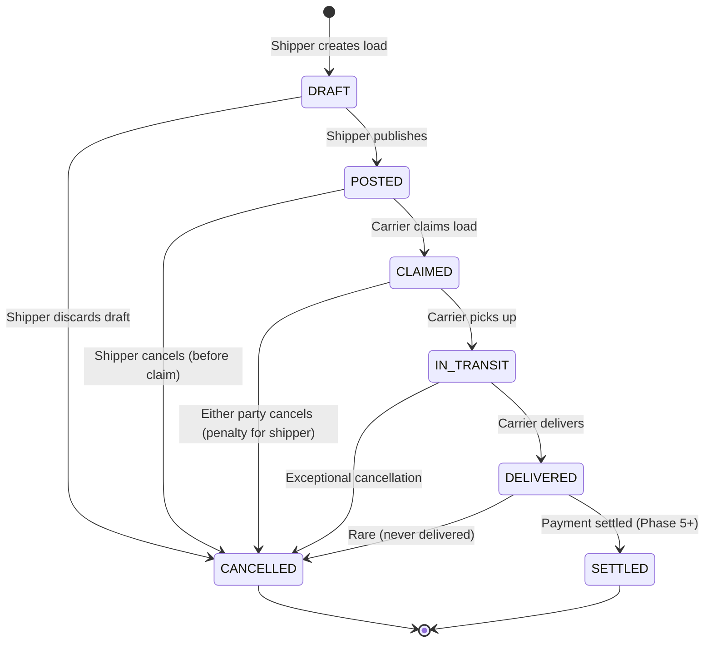

# ARCHITECT DESIGN SPECIFICATION: US-103-v2 Load Creation (Full Workflow + Dashboard Integration)

**Story ID:** US-103-v2  
**Phase:** Phase 11+ (Load Creation Redesign)  
**Scope:** Backend architecture, API contracts, domain models, database schema  
**ARCHITECT Authority:** Domain & System Design Role  
**Date:** 2026-06-17  
**Status:** 🔒 LOCKED FOR IMPLEMENTATION  
**Target Audience:** CODER (Backend implementation), LIBRARIAN (traceability)

---

## Executive Summary

US-103-v2 Load Creation requires a redesigned backend to support a full-featured form with real-time calculations, multi-step validation, and draft/publish workflows. This spec defines the domain model, service layer contracts, REST API endpoints, database schema, and integration points with external systems (distance calculation, address book).

**Key Architectural Decisions:**
1. **Status Workflow:** DRAFT → POSTED → CLAIMED → IN_TRANSIT → DELIVERED (with CANCELLED as soft-delete)
2. **Address Book:** Separate tenant-scoped facility lookup (Phase 11+ enhancement; stub for MVP)
3. **Distance Calculation:** Externalized service (Google Maps / MapBox API) with caching
4. **Soft Deletes:** All loads use `deleted_at` column; queries filter `WHERE deleted_at IS NULL`
5. **Multi-Tenancy:** Implicit tenant isolation via `TenantContextHolder` + PostgreSQL RLS
6. **Draft Persistence:** Drafts saved in `loads` table with status=DRAFT; full editable until published

---

## 1. Domain Model (Entities & Value Objects)

### 1.1 Load Aggregate (Root Entity)

**Class Name:** `Load`  
**Location:** `backend/src/main/java/com/freightclub/domain/Load.java`  
**Type:** JPA Entity (No Lombok)

**Core Fields:**

```java
public class Load {
  
  // Identity
  @Id
  private String id;  // UUID as VARCHAR(36)
  
  @Column(nullable = false)
  private String tenantId;  // Multi-tenancy isolation
  
  @Column(nullable = false)
  private String shipperId;  // Shipper who created load
  
  private String truckerId;  // Carrier who claimed load (nullable until CLAIMED)
  
  // Status & Audit
  @Enumerated(EnumType.STRING)
  @Column(nullable = false)
  private LoadStatus status;  // DRAFT, POSTED, CLAIMED, IN_TRANSIT, DELIVERED, CANCELLED
  
  @Column(nullable = false)
  private OffsetDateTime createdAt;  // When shipper created load
  
  @Column(nullable = false)
  private OffsetDateTime updatedAt;  // Last update timestamp
  
  private OffsetDateTime deletedAt;  // Soft delete marker (NULL = active)
  
  // Locations (Pickup)
  @Column(nullable = false)
  private String pickupAddress1;  // Street address
  
  private String pickupAddress2;  // Suite/Unit (optional)
  
  @Column(nullable = false)
  private String pickupCity;
  
  @Column(nullable = false)
  private String pickupState;  // US state code (CA, TX, etc.)
  
  @Column(nullable = false)
  private String pickupZip;  // 5-digit or 5+4 format
  
  // Locations (Delivery)
  @Column(nullable = false)
  private String deliveryAddress1;
  
  private String deliveryAddress2;
  
  @Column(nullable = false)
  private String deliveryCity;
  
  @Column(nullable = false)
  private String deliveryState;
  
  @Column(nullable = false)
  private String deliveryZip;
  
  // Distance (calculated externally)
  private BigDecimal distanceMiles;  // Nullable until addresses verified
  
  // Pickup Window
  @Column(nullable = false)
  private OffsetDateTime pickupFrom;  // Earliest pickup date/time
  
  @Column(nullable = false)
  private OffsetDateTime pickupTo;  // Latest pickup date/time
  
  // Delivery Window
  @Column(nullable = false)
  private OffsetDateTime deliveryFrom;  // Earliest delivery date/time
  
  @Column(nullable = false)
  private OffsetDateTime deliveryTo;  // Latest delivery date/time
  
  // Cargo
  @Column(nullable = false)
  private String commodity;  // What's being shipped (e.g., "Steel coils")
  
  @Column(nullable = false)
  private BigDecimal weightLbs;  // Must be > 0, typically < 150,000
  
  private BigDecimal lengthFt;  // Optional dimensions
  private BigDecimal widthFt;
  private BigDecimal heightFt;
  
  // Equipment & Payment
  @Enumerated(EnumType.STRING)
  @Column(nullable = false)
  private EquipmentType equipmentType;  // DRY_VAN, FLATBED, REFRIGERATED, TANKER, SPECIALIZED, STEP_DECK
  
  @Column(nullable = false)
  private BigDecimal payRate;  // Must be > 0.01
  
  @Enumerated(EnumType.STRING)
  @Column(nullable = false)
  private PayRateType payRateType;  // FLAT_RATE or PER_MILE
  
  @Enumerated(EnumType.STRING)
  private PaymentTerms paymentTerms;  // IMMEDIATE, NET_7, NET_14, NET_30 (optional)
  
  // Special Instructions
  private String specialRequirements;  // Max 500 chars (optional)
  
  // Flags
  private Boolean overweightAcknowledged;  // TRUE if weight > 80k lbs
  
  // Relationships (Lazy)
  @ManyToOne(fetch = FetchType.LAZY)
  @JoinColumn(name = "shipper_id", insertable = false, updatable = false)
  private Shipper shipper;
  
  @ManyToOne(fetch = FetchType.LAZY)
  @JoinColumn(name = "trucker_id", insertable = false, updatable = false)
  private Trucker trucker;
  
  @OneToMany(fetch = FetchType.LAZY, mappedBy = "load")
  private List<LoadEvent> events = new ArrayList<>();  // Audit trail
}
```

**Constructor (No-Arg + Manual Getters/Setters):**
```java
public Load() {}

public Load(String id, String tenantId, String shipperId) {
  this.id = id;
  this.tenantId = tenantId;
  this.shipperId = shipperId;
  this.status = LoadStatus.DRAFT;
  this.createdAt = OffsetDateTime.now();
  this.updatedAt = OffsetDateTime.now();
}

// Standard getters/setters for all fields
public String getId() { return id; }
public void setId(String id) { this.id = id; }
// ... etc for all fields
```

### 1.2 LoadStatus Enum

**Location:** `backend/src/main/java/com/freightclub/domain/LoadStatus.java`

```java
public enum LoadStatus {
  DRAFT,          // Saved but not published
  POSTED,         // Published to load board (available for carriers to claim)
  CLAIMED,        // Carrier has claimed the load (in negotiation or pickup scheduled)
  IN_TRANSIT,     // Carrier has picked up, en route to destination
  DELIVERED,      // Carrier has delivered to destination
  CANCELLED,      // Shipper cancelled (soft delete, never truly removed)
  SETTLED;        // Payment settled (Phase 5+ feature, stub for now)
}
```

### 1.3 EquipmentType Enum

**Location:** `backend/src/main/java/com/freightclub/domain/EquipmentType.java`

```java
public enum EquipmentType {
  DRY_VAN,        // Standard enclosed trailer
  FLATBED,        // Open platform for pallets, machinery
  REFRIGERATED,   // Temperature-controlled (was REEFER in US-103)
  TANKER,         // For liquids, gases
  SPECIALIZED,    // Heavy haul, oversized, etc.
  STEP_DECK;      // Lowboy trailer for equipment
}
```

**Storage:** Persisted as VARCHAR(20) in database (safe for future additions)

### 1.4 PayRateType Enum

```java
public enum PayRateType {
  FLAT_RATE,      // Fixed amount for entire load
  PER_MILE;       // Rate × distance calculation
}
```

### 1.5 PaymentTerms Enum

```java
public enum PaymentTerms {
  IMMEDIATE,      // Quick Pay (same/next day)
  NET_7,          // 7 days after delivery
  NET_14,         // 14 days after delivery
  NET_30;         // 30 days after delivery
}
```

### 1.6 LoadEvent Value Object

**Purpose:** Immutable audit trail for load status transitions

```java
@Entity
@Table(name = "load_events")
public class LoadEvent {
  
  @Id
  private String id;
  
  @Column(nullable = false)
  private String loadId;
  
  @Enumerated(EnumType.STRING)
  @Column(nullable = false)
  private LoadEventType eventType;  // CREATED, PUBLISHED, CLAIMED, etc.
  
  @Column(nullable = false)
  private String actorId;  // Who triggered event (shipper, carrier, system)
  
  private String note;  // Optional context (e.g., "Carrier claimed load")
  
  @Column(nullable = false)
  private OffsetDateTime createdAt;
}
```

---

## 2. Database Schema (Flyway Migration)

### 2.1 Loads Table

**File:** `backend/src/main/resources/db/migration/V20260617_1100__Create_loads_table_v2.sql`

```sql
CREATE TABLE IF NOT EXISTS loads (
  id VARCHAR(36) PRIMARY KEY,
  tenant_id VARCHAR(36) NOT NULL,
  shipper_id VARCHAR(36) NOT NULL,
  trucker_id VARCHAR(36),
  
  -- Status & Audit
  status VARCHAR(20) NOT NULL DEFAULT 'DRAFT',
  created_at TIMESTAMPTZ NOT NULL DEFAULT CURRENT_TIMESTAMP,
  updated_at TIMESTAMPTZ NOT NULL DEFAULT CURRENT_TIMESTAMP,
  deleted_at TIMESTAMPTZ,  -- Soft delete
  
  -- Pickup Location
  pickup_address1 VARCHAR(255) NOT NULL,
  pickup_address2 VARCHAR(50),
  pickup_city VARCHAR(50) NOT NULL,
  pickup_state CHAR(2) NOT NULL,
  pickup_zip VARCHAR(10) NOT NULL,
  
  -- Delivery Location
  delivery_address1 VARCHAR(255) NOT NULL,
  delivery_address2 VARCHAR(50),
  delivery_city VARCHAR(50) NOT NULL,
  delivery_state CHAR(2) NOT NULL,
  delivery_zip VARCHAR(10) NOT NULL,
  
  -- Distance (calculated)
  distance_miles NUMERIC(8,2),
  
  -- Pickup Window
  pickup_from TIMESTAMPTZ NOT NULL,
  pickup_to TIMESTAMPTZ NOT NULL,
  
  -- Delivery Window
  delivery_from TIMESTAMPTZ NOT NULL,
  delivery_to TIMESTAMPTZ NOT NULL,
  
  -- Cargo
  commodity VARCHAR(100) NOT NULL,
  weight_lbs NUMERIC(10,2) NOT NULL,
  length_ft NUMERIC(8,2),
  width_ft NUMERIC(8,2),
  height_ft NUMERIC(8,2),
  
  -- Equipment & Payment
  equipment_type VARCHAR(20) NOT NULL,
  pay_rate NUMERIC(10,2) NOT NULL,
  pay_rate_type VARCHAR(20) NOT NULL,
  payment_terms VARCHAR(20),
  
  -- Special Instructions
  special_requirements TEXT,
  
  -- Flags
  overweight_acknowledged BOOLEAN DEFAULT FALSE,
  
  -- Foreign Keys
  CONSTRAINT fk_loads_tenant FOREIGN KEY (tenant_id) REFERENCES tenants(id),
  CONSTRAINT fk_loads_shipper FOREIGN KEY (shipper_id) REFERENCES users(id),
  CONSTRAINT fk_loads_trucker FOREIGN KEY (trucker_id) REFERENCES users(id),
  
  -- Indexes
  CONSTRAINT unique_load_id_per_tenant UNIQUE (tenant_id, id),
  INDEX idx_loads_tenant_status (tenant_id, status),
  INDEX idx_loads_tenant_deleted (tenant_id, deleted_at),
  INDEX idx_loads_shipper_status (shipper_id, status),
  INDEX idx_loads_created_at (created_at DESC),
  INDEX idx_loads_pickup_state (pickup_state),
  INDEX idx_loads_delivery_state (delivery_state)
);

-- Row-Level Security
ALTER TABLE loads ENABLE ROW LEVEL SECURITY;

CREATE POLICY loads_tenant_isolation ON loads
  USING (tenant_id = current_setting('app.current_tenant'));

-- Soft Delete Filter (via application, not DB policy)
-- Application queries MUST include: WHERE deleted_at IS NULL
```

### 2.2 Load Events Table (Audit Trail)

```sql
CREATE TABLE IF NOT EXISTS load_events (
  id VARCHAR(36) PRIMARY KEY,
  load_id VARCHAR(36) NOT NULL,
  event_type VARCHAR(20) NOT NULL,
  actor_id VARCHAR(36) NOT NULL,
  note TEXT,
  created_at TIMESTAMPTZ NOT NULL DEFAULT CURRENT_TIMESTAMP,
  
  CONSTRAINT fk_load_events_load FOREIGN KEY (load_id) REFERENCES loads(id),
  INDEX idx_load_events_load_id (load_id),
  INDEX idx_load_events_created_at (created_at DESC)
);
```

### 2.3 Address Book Table (Phase 11+ Stub, Prepared for MVP)

**File:** `backend/src/main/resources/db/migration/V20260617_1110__Create_address_book_table.sql`

```sql
CREATE TABLE IF NOT EXISTS facility_addresses (
  id VARCHAR(36) PRIMARY KEY,
  tenant_id VARCHAR(36) NOT NULL,
  name VARCHAR(100) NOT NULL,
  
  -- Address
  street_address1 VARCHAR(255) NOT NULL,
  street_address2 VARCHAR(50),
  city VARCHAR(50) NOT NULL,
  state CHAR(2) NOT NULL,
  zip VARCHAR(10) NOT NULL,
  
  -- Metadata
  is_pickup_location BOOLEAN DEFAULT FALSE,
  is_delivery_location BOOLEAN DEFAULT FALSE,
  created_at TIMESTAMPTZ NOT NULL DEFAULT CURRENT_TIMESTAMP,
  updated_at TIMESTAMPTZ NOT NULL DEFAULT CURRENT_TIMESTAMP,
  deleted_at TIMESTAMPTZ,
  
  CONSTRAINT fk_facility_addresses_tenant FOREIGN KEY (tenant_id) REFERENCES tenants(id),
  CONSTRAINT unique_facility_per_tenant UNIQUE (tenant_id, id),
  INDEX idx_facility_addresses_tenant (tenant_id),
  INDEX idx_facility_addresses_name (tenant_id, name)
);

ALTER TABLE facility_addresses ENABLE ROW LEVEL SECURITY;

CREATE POLICY facility_addresses_tenant_isolation ON facility_addresses
  USING (tenant_id = current_setting('app.current_tenant'));
```

---

## 3. Service Layer (Business Logic)

### 3.1 LoadCreationService

**Location:** `backend/src/main/java/com/freightclub/modules/shipper/application/LoadCreationService.java`

**Responsibilities:**
- Create load in DRAFT status
- Publish load to POSTED status
- Validate business rules
- Coordinate with external services (distance calculation)

```java
@Service
public class LoadCreationService {
  
  private final LoadRepository loadRepository;
  private final DistanceCalculationService distanceCalcService;
  private final TenantContextHolder tenantContextHolder;
  private final EntityManager entityManager;
  
  public LoadCreationService(
    LoadRepository loadRepository,
    DistanceCalculationService distanceCalcService,
    TenantContextHolder tenantContextHolder,
    EntityManager entityManager
  ) {
    this.loadRepository = loadRepository;
    this.distanceCalcService = distanceCalcService;
    this.tenantContextHolder = tenantContextHolder;
    this.entityManager = entityManager;
  }
  
  /**
   * AC-1 & AC-7: Create load in DRAFT status and optionally publish.
   * 
   * @param request CreateLoadRequest (all form data)
   * @param publish boolean (if TRUE, set status=POSTED; if FALSE, status=DRAFT)
   * @return LoadDTO with created load details
   * @throws ValidationException if required fields missing or invalid date ranges
   */
  @Transactional
  public LoadDTO createLoad(CreateLoadRequest request, boolean publish) {
    String tenantId = tenantContextHolder.getTenantId();
    String shipperId = tenantContextHolder.getCurrentUserId();
    
    // 1. Validate input
    validateCreateLoadRequest(request);
    
    // 2. Calculate distance (AC-2)
    BigDecimal distanceMiles = distanceCalcService.calculateDistance(
      request.getPickupZip(),
      request.getDeliveryZip()
    );
    
    // 3. Create Load entity
    Load load = new Load(UUID.randomUUID().toString(), tenantId, shipperId);
    
    // Set all fields from request
    load.setPickupAddress1(request.getPickupAddress1());
    load.setPickupAddress2(request.getPickupAddress2());
    load.setPickupCity(request.getPickupCity());
    load.setPickupState(request.getPickupState());
    load.setPickupZip(request.getPickupZip());
    
    load.setDeliveryAddress1(request.getDeliveryAddress1());
    load.setDeliveryAddress2(request.getDeliveryAddress2());
    load.setDeliveryCity(request.getDeliveryCity());
    load.setDeliveryState(request.getDeliveryState());
    load.setDeliveryZip(request.getDeliveryZip());
    
    load.setDistanceMiles(distanceMiles);
    
    load.setPickupFrom(request.getPickupFrom());
    load.setPickupTo(request.getPickupTo());
    load.setDeliveryFrom(request.getDeliveryFrom());
    load.setDeliveryTo(request.getDeliveryTo());
    
    load.setCommodity(request.getCommodity());
    load.setWeightLbs(request.getWeightLbs());
    load.setLengthFt(request.getLengthFt());
    load.setWidthFt(request.getWidthFt());
    load.setHeightFt(request.getHeightFt());
    
    load.setEquipmentType(request.getEquipmentType());
    load.setPayRate(request.getPayRate());
    load.setPayRateType(request.getPayRateType());
    load.setPaymentTerms(request.getPaymentTerms());
    
    load.setSpecialRequirements(request.getSpecialRequirements());
    load.setOverweightAcknowledged(request.isOverweightAcknowledged());
    
    // 4. Set status (DRAFT or POSTED)
    if (publish) {
      load.setStatus(LoadStatus.POSTED);  // AC-7
    } else {
      load.setStatus(LoadStatus.DRAFT);
    }
    
    // 5. Save to database
    load.setCreatedAt(OffsetDateTime.now());
    load.setUpdatedAt(OffsetDateTime.now());
    loadRepository.save(load);
    
    // 6. Record event
    recordLoadEvent(load.getId(), "CREATED", shipperId, "Load created");
    if (publish) {
      recordLoadEvent(load.getId(), "PUBLISHED", shipperId, "Load published to board");
    }
    
    // 7. Return DTO (AC-8: For immediate dashboard visibility)
    return mapToDTO(load);
  }
  
  /**
   * AC-2: Calculate distance between two US ZIP codes.
   * 
   * @param originZip 5-digit or 5+4 format
   * @param destinationZip 5-digit or 5+4 format
   * @return BigDecimal distance in miles
   * @throws LocationException if ZIP codes invalid or distance calc fails
   */
  private BigDecimal calculateDistance(String originZip, String destinationZip) {
    return distanceCalcService.calculateDistance(originZip, destinationZip);
  }
  
  /**
   * AC-10: Validate all required fields and business rules.
   */
  private void validateCreateLoadRequest(CreateLoadRequest request) {
    // Required fields
    if (StringUtils.isBlank(request.getPickupAddress1())) {
      throw new ValidationException("Pickup street address is required");
    }
    if (StringUtils.isBlank(request.getPickupCity())) {
      throw new ValidationException("Pickup city is required");
    }
    if (StringUtils.isBlank(request.getPickupState())) {
      throw new ValidationException("Pickup state is required");
    }
    if (StringUtils.isBlank(request.getPickupZip())) {
      throw new ValidationException("Pickup ZIP code is required");
    }
    
    // Similar for delivery, dates, commodity, weight, equipment, pay rate...
    // See Section 3.2 for full validation rule list
    
    // Date Range Validation (AC-3)
    if (request.getPickupTo().isBefore(request.getPickupFrom())) {
      throw new ValidationException("Latest Pickup cannot be before Earliest Pickup");
    }
    if (request.getDeliveryFrom().isBefore(request.getPickupTo())) {
      throw new ValidationException("Earliest Delivery cannot be before Latest Pickup");
    }
    if (request.getDeliveryTo().isBefore(request.getDeliveryFrom())) {
      throw new ValidationException("Latest Delivery cannot be before Earliest Delivery");
    }
    
    // Weight Validation (AC-4)
    if (request.getWeightLbs().compareTo(BigDecimal.ZERO) <= 0) {
      throw new ValidationException("Weight must be > 0");
    }
    if (request.getWeightLbs().compareTo(new BigDecimal("150000")) > 0) {
      throw new ValidationException("Weight cannot exceed 150,000 lbs");
    }
    if (request.getWeightLbs().compareTo(new BigDecimal("80000")) > 0) {
      if (!request.isOverweightAcknowledged()) {
        throw new ValidationException("Must acknowledge special permit requirement for loads > 80,000 lbs");
      }
    }
    
    // Pay Rate Validation (AC-5)
    if (request.getPayRate().compareTo(new BigDecimal("0.01")) < 0) {
      throw new ValidationException("Pay rate must be > $0.00");
    }
  }
  
  private void recordLoadEvent(String loadId, String eventType, String actorId, String note) {
    LoadEvent event = new LoadEvent();
    event.setId(UUID.randomUUID().toString());
    event.setLoadId(loadId);
    event.setEventType(LoadEventType.valueOf(eventType));
    event.setActorId(actorId);
    event.setNote(note);
    event.setCreatedAt(OffsetDateTime.now());
    entityManager.persist(event);
  }
  
  private LoadDTO mapToDTO(Load load) {
    return LoadDTO.builder()
      .id(load.getId())
      .tenantId(load.getTenantId())
      .shipperId(load.getShipperId())
      .status(load.getStatus().name())
      .pickupAddress1(load.getPickupAddress1())
      // ... all other fields
      .build();
  }
}
```

### 3.2 DistanceCalculationService

**Location:** `backend/src/main/java/com/freightclub/modules/shipper/application/DistanceCalculationService.java`

**Responsibilities:**
- Call external distance API (Google Maps / MapBox)
- Cache results for 24 hours (NFR-504)
- Handle API failures gracefully

```java
@Service
public class DistanceCalculationService {
  
  private final RestTemplate restTemplate;
  private final CacheManager cacheManager;
  private final String googleMapsApiKey;  // Injected from application.yml
  
  public DistanceCalculationService(
    RestTemplate restTemplate,
    CacheManager cacheManager,
    @Value("${google.maps.api-key}") String googleMapsApiKey
  ) {
    this.restTemplate = restTemplate;
    this.cacheManager = cacheManager;
    this.googleMapsApiKey = googleMapsApiKey;
  }
  
  /**
   * AC-2: Calculate distance between two US ZIP codes.
   * Cached for 24 hours per NFR-504.
   * 
   * @param originZip 5-digit ZIP
   * @param destinationZip 5-digit ZIP
   * @return BigDecimal distance in miles
   * @throws LocationException if calculation fails
   */
  @Cacheable(value = "distance", key = "#originZip + ':' + #destinationZip", 
    cacheManager = "cacheManager24h")
  public BigDecimal calculateDistance(String originZip, String destinationZip) {
    try {
      // Call Google Maps Distance Matrix API
      String url = String.format(
        "https://maps.googleapis.com/maps/api/distancematrix/json?origins=%s&destinations=%s&key=%s&units=imperial",
        originZip, destinationZip, googleMapsApiKey
      );
      
      ResponseEntity<DistanceMatrixResponse> response = restTemplate.getForEntity(
        url, DistanceMatrixResponse.class
      );
      
      if (response.getStatusCode() != HttpStatus.OK || response.getBody() == null) {
        throw new LocationException("Distance API returned non-200 status");
      }
      
      // Parse response
      DistanceMatrixResponse body = response.getBody();
      if (body.getRows().isEmpty()) {
        throw new LocationException("No distance data returned for ZIP codes");
      }
      
      // Extract distance (in meters, convert to miles)
      long distanceMeters = body.getRows().get(0).getElements().get(0).getDistance().getValue();
      BigDecimal distanceMiles = new BigDecimal(distanceMeters).divide(
        new BigDecimal("1609.34"), 2, RoundingMode.HALF_UP
      );
      
      return distanceMiles;
      
    } catch (RestClientException e) {
      throw new LocationException("Failed to calculate distance: " + e.getMessage(), e);
    }
  }
}
```

### 3.3 LoadDTO (Data Transfer Object)

```java
@Data
@Builder
@NoArgsConstructor
@AllArgsConstructor
public class LoadDTO {
  private String id;
  private String tenantId;
  private String shipperId;
  private String truckerId;
  private String status;
  private OffsetDateTime createdAt;
  private OffsetDateTime updatedAt;
  
  private String pickupAddress1;
  private String pickupAddress2;
  private String pickupCity;
  private String pickupState;
  private String pickupZip;
  
  private String deliveryAddress1;
  private String deliveryAddress2;
  private String deliveryCity;
  private String deliveryState;
  private String deliveryZip;
  
  private BigDecimal distanceMiles;
  
  private OffsetDateTime pickupFrom;
  private OffsetDateTime pickupTo;
  private OffsetDateTime deliveryFrom;
  private OffsetDateTime deliveryTo;
  
  private String commodity;
  private BigDecimal weightLbs;
  private BigDecimal lengthFt;
  private BigDecimal widthFt;
  private BigDecimal heightFt;
  
  private String equipmentType;
  private BigDecimal payRate;
  private String payRateType;
  private String paymentTerms;
  
  private String specialRequirements;
  private Boolean overweightAcknowledged;
}
```

---

## 4. REST API Specification

### 4.1 Create Load (Draft or Publish)

**Endpoint:** `POST /api/v1/loads`

**Headers:**
- `Authorization: Bearer {jwt_token}`
- `Content-Type: application/json`

**Request Body:**
```json
{
  "pickupAddress1": "123 Industrial Way",
  "pickupAddress2": null,
  "pickupCity": "Los Angeles",
  "pickupState": "CA",
  "pickupZip": "90001",
  
  "deliveryAddress1": "456 Commerce Drive",
  "deliveryAddress2": null,
  "deliveryCity": "Chicago",
  "deliveryState": "IL",
  "deliveryZip": "60601",
  
  "pickupFrom": "2026-06-18T08:00:00-07:00",
  "pickupTo": "2026-06-18T14:00:00-07:00",
  "deliveryFrom": "2026-06-19T08:00:00-05:00",
  "deliveryTo": "2026-06-20T18:00:00-05:00",
  
  "commodity": "Steel coils",
  "weightLbs": 45000,
  "lengthFt": 16.5,
  "widthFt": 8,
  "heightFt": 6.67,
  
  "equipmentType": "FLATBED",
  "payRate": 2500,
  "payRateType": "FLAT_RATE",
  "paymentTerms": "NET_7",
  
  "specialRequirements": "No forklifts — hand-unload only",
  "overweightAcknowledged": false
}
```

**Response (201 Created):**
```json
{
  "id": "load-uuid-123456",
  "tenantId": "tenant-uuid",
  "shipperId": "shipper-uuid",
  "status": "POSTED",
  "distanceMiles": 847.50,
  "createdAt": "2026-06-17T10:30:00Z",
  "updatedAt": "2026-06-17T10:30:00Z",
  // ... all other fields
}
```

**Error Responses:**
- `400 Bad Request` — Validation error (missing field, invalid date range, etc.)
  ```json
  {
    "error": "validation_failed",
    "message": "Latest Pickup cannot be before Earliest Pickup",
    "field": "pickupTo"
  }
  ```
- `401 Unauthorized` — Missing or invalid JWT token
- `403 Forbidden` — User is not a shipper
- `500 Internal Server Error` — Distance API failure, database error

### 4.2 Save as Draft

**Endpoint:** `POST /api/v1/loads/draft`

**Identical to 4.1**, but query parameter or header flag indicates status=DRAFT

**Response (201 Created):**
- Same as 4.1, but `status: "DRAFT"`

### 4.3 Retrieve Load (For Edit)

**Endpoint:** `GET /api/v1/loads/{loadId}`

**Response (200 OK):**
- Full LoadDTO

**Error Responses:**
- `404 Not Found` — Load doesn't exist or shipper doesn't have access
- `401 Unauthorized`

### 4.4 List Active Loads (Shipper Dashboard)

**Endpoint:** `GET /api/v1/shipper/shipments/active`

**Query Parameters:**
- `status` (optional): POSTED, CLAIMED, IN_TRANSIT, DELIVERED
- `limit` (optional): Default 50, max 500
- `offset` (optional): Default 0 (pagination)

**Response (200 OK):**
```json
{
  "content": [
    { "id": "load-1", "status": "POSTED", ... },
    { "id": "load-2", "status": "CLAIMED", ... }
  ],
  "totalElements": 42,
  "totalPages": 1,
  "number": 0,
  "size": 50
}
```

**Caching:** 60 seconds (per NFR-504)

---

## 5. Data Flow Diagrams

### 5.1 Load Creation Flow (Shipper Perspective)

```
┌─────────────────────────────────────────────────────────┐
│ Shipper fills LoadCreationForm (React Hook Form)        │
│ - Live validation on blur (FE)                          │
│ - Auto-distance calculation (calls /distance API)      │
│ - Auto-payment estimation (FE math)                     │
└─────────────────────────────────────────────────────────┘
                          ↓
┌─────────────────────────────────────────────────────────┐
│ Shipper clicks "Create & Post Load"                     │
│ - FE validates all required fields (Zod schema)        │
│ - POST /api/v1/loads with status=POSTED               │
└─────────────────────────────────────────────────────────┘
                          ↓
┌─────────────────────────────────────────────────────────┐
│ Backend (LoadCreationService)                           │
│ 1. Extract tenant_id from JWT                          │
│ 2. Validate all fields (required, ranges, formats)    │
│ 3. Call DistanceCalculationService                    │
│    (Google Maps API, cache 24h)                        │
│ 4. Create Load entity with status=POSTED              │
│ 5. Save to database (RLS filters by tenant_id)        │
│ 6. Record LoadEvent (CREATED, PUBLISHED)              │
│ 7. Return LoadDTO                                      │
└─────────────────────────────────────────────────────────┘
                          ↓
┌─────────────────────────────────────────────────────────┐
│ FE receives 201 response with loadId                    │
│ - Show success message: "Load #LC-123 posted"          │
│ - React Query: invalidateQueries(["shipmentStatus"])   │
│   (Shipment Status Panel auto-refetches within 1–2s)   │
│ - Show "Create Another Load" & "Back to Dashboard"     │
└─────────────────────────────────────────────────────────┘
```

### 5.2 Save as Draft Flow

```
Identical to above, except:
- POST /api/v1/loads/draft (or status=DRAFT param)
- Load created with status=DRAFT (not PUBLISHED event)
- FE auto-navigates to dashboard after 2 seconds
- Load can be edited later from "My Loads"
```

---

## 6. Status Transition State Machine

**Diagram (Mermaid):**


**Rules:**
- DRAFT: Editable, not visible to carriers
- POSTED: Visible to carriers, no edit allowed (must cancel & recreate)
- CLAIMED: Carrier assigned, in-progress
- IN_TRANSIT: Pickup confirmed
- DELIVERED: Unload complete, awaiting settlement
- SETTLED: Payment distributed (Phase 5+)
- CANCELLED: Soft-deleted (deleted_at set, not removed from DB)

---

## 7. Validation Rules (AC-10 Implementation)

| Field | Rule | Error Message |
|-------|------|---|
| Pickup Address | Not empty, ≤255 chars | "Street address is required" |
| Pickup City | Not empty, ≤50 chars | "City is required" |
| Pickup State | Not empty, valid US state code | "Select a state" |
| Pickup ZIP | Matches `^\d{5}(-\d{4})?$` | "ZIP code must be 5 digits" |
| Delivery Address | Same as pickup | Same |
| Delivery City/State/ZIP | Same as pickup | Same |
| Earliest Pickup | Not past date, ≤ Latest Pickup | "Must be in future" / "Latest must be ≥ Earliest" |
| Latest Pickup | ≥ Earliest Pickup, ≤ Earliest Delivery | "Latest Pickup must be ≥ Earliest Pickup" |
| Earliest Delivery | ≥ Latest Pickup | "Earliest Delivery must be ≥ Latest Pickup" |
| Latest Delivery | ≥ Earliest Delivery | "Latest Delivery must be ≥ Earliest Delivery" |
| Commodity | Not empty, ≤100 chars | "Commodity is required" |
| Weight | 0.01–150,000 lbs | "Must be between 0.01 and 150,000 lbs" |
| Weight >80k | overweightAcknowledged=true | "Acknowledge special permit requirement" |
| Equipment Type | Must be valid enum | "Equipment type is required" |
| Pay Rate | >0.01 | "Pay rate must be > $0.00" |
| Pay Rate Type | FLAT_RATE or PER_MILE | "Choose a rate type" |
| Special Instructions | ≤500 chars | "Exceeds 500 character limit" |

---

## 8. External Service Integrations

### 8.1 Distance Calculation API

**Service:** Google Maps Distance Matrix API (or MapBox alternative)

**Trigger:** After both Pickup and Delivery ZIPs are entered (FE), before form submission

**Integration Point:** `DistanceCalculationService.calculateDistance()`

**Caching:** 24 hours (Cache Manager, see Section 12)

**Fallback:** If API fails:
- Show error message on FE: "Distance calculation failed. Please verify addresses."
- Allow shipper to submit form anyway (distance will be NULL, backfilled later)
- Backend will reject if distance not available (depending on business rules)

### 8.2 Address Book Integration (Phase 11+ MVP)

**Status:** Stub implementation for US-103-v2 MVP

**What's Prepared:**
- `facility_addresses` table with tenant isolation + RLS
- `FacilityAddressService` (stub)
- `GET /api/v1/facilities/search?query=...` endpoint

**What's Deferred:**
- Autocomplete UI integration in FE form
- Address book CRUD operations
- "Save this address?" prompt

**Prepare for Phase 11:**
```java
@Service
public class FacilityAddressService {
  // STUB: Will implement in Phase 11
  
  @Cacheable(value = "facilityAddresses", key = "#tenantId")
  public List<FacilityAddressDTO> searchFacilities(String tenantId, String query) {
    // TODO: Query facility_addresses table, apply tenant filter
    return List.of();
  }
}
```

---

## 9. Performance & Caching (NFR-504)

### 9.1 Cache Configuration

**Location:** `backend/src/main/java/com/freightclub/config/CacheConfig.java`

**Caches Required:**

| Cache Name | TTL | Use Case |
|---|---|---|
| `distance` | 24 hours | Distance calculation results (ZIP pair → miles) |
| `facilityAddresses` | 1 hour | Address book search results (shipper-specific) |
| `shipmentStatus` | 60 seconds | Active shipments for dashboard (AC-8, NFR-504) |

```java
@Configuration
@EnableCaching
public class CacheConfig {
  
  @Bean
  public CacheManager cacheManager() {
    SimpleCacheManager cacheManager = new SimpleCacheManager();
    cacheManager.setCaches(List.of(
      new CaffeineCache("distance", 
        Caffeine.newBuilder().expireAfterWrite(24, TimeUnit.HOURS).build()),
      new CaffeineCache("facilityAddresses",
        Caffeine.newBuilder().expireAfterWrite(1, TimeUnit.HOURS).build()),
      new CaffeineCache("shipmentStatus",
        Caffeine.newBuilder().expireAfterWrite(60, TimeUnit.SECONDS).build())
    ));
    return cacheManager;
  }
}
```

---

## 10. Error Handling & Exceptions

### 10.1 Custom Exceptions

```java
public class ValidationException extends RuntimeException {
  public ValidationException(String message) {
    super(message);
  }
}

public class LocationException extends RuntimeException {
  public LocationException(String message, Throwable cause) {
    super(message, cause);
  }
}

public class LoadNotFoundException extends RuntimeException {
  public LoadNotFoundException(String loadId) {
    super("Load not found: " + loadId);
  }
}

public class TenantIsolationException extends RuntimeException {
  public TenantIsolationException(String message) {
    super(message);
  }
}
```

### 10.2 Global Exception Handler

**Location:** `backend/src/main/java/com/freightclub/infrastructure/rest/GlobalExceptionHandler.java`

```java
@RestControllerAdvice
public class GlobalExceptionHandler {
  
  @ExceptionHandler(ValidationException.class)
  public ResponseEntity<ErrorResponse> handleValidationException(ValidationException ex) {
    return ResponseEntity.badRequest().body(
      ErrorResponse.builder()
        .error("validation_failed")
        .message(ex.getMessage())
        .build()
    );
  }
  
  @ExceptionHandler(LocationException.class)
  public ResponseEntity<ErrorResponse> handleLocationException(LocationException ex) {
    return ResponseEntity.status(503).body(
      ErrorResponse.builder()
        .error("distance_calculation_failed")
        .message("Unable to calculate distance. Please try again.")
        .build()
    );
  }
  
  @ExceptionHandler(LoadNotFoundException.class)
  public ResponseEntity<ErrorResponse> handleLoadNotFound(LoadNotFoundException ex) {
    return ResponseEntity.notFound().build();
  }
}
```

---

## 11. Multi-Tenancy & Security

### 11.1 Tenant Isolation

**Pattern:** RLS (Row-Level Security) + Application-level enforcement

**Database Level:**
```sql
-- RLS policy on loads table
CREATE POLICY loads_tenant_isolation ON loads
  USING (tenant_id = current_setting('app.current_tenant'));
```

**Application Level:**
```java
// In LoadCreationService.createLoad()
String tenantId = tenantContextHolder.getTenantId();  // Set by JWT interceptor
load.setTenantId(tenantId);

// In queries
List<Load> loads = loadRepository.findAll(
  Specification.where(LoadSpecifications.byTenantId(tenantId))
    .and(LoadSpecifications.notDeleted())
);
```

### 11.2 Soft Deletes

**Rule:** All queries must include `WHERE deleted_at IS NULL`

**Repository Pattern:**
```java
@Repository
public interface LoadRepository extends JpaRepository<Load, String> {
  
  @Query("SELECT l FROM Load l WHERE l.tenantId = ?1 AND l.deletedAt IS NULL")
  List<Load> findAllByTenant(String tenantId);
  
  @Query("SELECT l FROM Load l WHERE l.id = ?1 AND l.deletedAt IS NULL")
  Optional<Load> findById(String id);
}
```

---

## 12. Testing Strategy (For CODER)

### 12.1 Backend Unit Tests

**Location:** `backend/src/test/java/com/freightclub/modules/shipper/application/LoadCreationServiceTest.java`

**Test Cases (TDD Red-Green-Refactor):**

```java
@SpringBootTest
@Transactional
public class LoadCreationServiceTest {
  
  @Autowired
  private LoadCreationService loadCreationService;
  
  @Autowired
  private LoadRepository loadRepository;
  
  @MockBean
  private DistanceCalculationService distanceCalcService;
  
  // AC-1: Load can be created in DRAFT status
  @Test
  void testCreateLoadAsDraft() { }
  
  // AC-1 & AC-7: Load can be published to POSTED status
  @Test
  void testCreateLoadAndPublish() { }
  
  // AC-2: Distance is calculated from ZIP codes
  @Test
  void testDistanceCalculation() { }
  
  // AC-3: Date range validation prevents invalid windows
  @Test
  void testDateRangeValidation_PickupAfterDelivery() { }
  
  // AC-4: Weight > 80k requires acknowledgment
  @Test
  void testOverweightValidation_RequiresAcknowledgment() { }
  
  // AC-8: Load appears in dashboard after creation
  @Test
  void testLoadVisibilityAfterCreation() { }
  
  // AC-10: Validation errors are clearly communicated
  @Test
  void testValidationErrorMessages() { }
  
  // Multi-tenancy: Shipper A cannot see Shipper B's loads
  @Test
  void testTenantIsolation() { }
  
  // Soft deletes: Cancelled loads are hidden but not deleted
  @Test
  void testSoftDeleteBehavior() { }
}
```

### 12.2 Backend Integration Tests

**Location:** `backend/src/test/java/com/freightclub/modules/shipper/infrastructure/rest/ShipperControllerTest.java`

```java
@SpringBootTest(webEnvironment = SpringBootTest.WebEnvironment.RANDOM_PORT)
public class ShipperControllerTest {
  
  @LocalServerPort
  private int port;
  
  @Autowired
  private TestRestTemplate restTemplate;
  
  // POST /api/v1/loads with valid payload → 201 Created
  @Test
  void testCreateLoad_Valid_Returns201() { }
  
  // POST /api/v1/loads with missing field → 400 Bad Request
  @Test
  void testCreateLoad_MissingField_Returns400() { }
  
  // POST /api/v1/loads/draft → 201 with status=DRAFT
  @Test
  void testCreateDraft_Returns201WithDraftStatus() { }
  
  // GET /api/v1/shipper/shipments/active → 200 with paginated results
  @Test
  void testGetActiveShipments_Returns200WithPagination() { }
  
  // Unauthenticated request → 401 Unauthorized
  @Test
  void testCreateLoad_NoAuth_Returns401() { }
}
```

### 12.3 JaCoCo Coverage (80% Minimum)

**Target Branches:**
- `LoadCreationService.createLoad()`: All validation paths
- `LoadCreationService.validateCreateLoadRequest()`: All error conditions
- `DistanceCalculationService.calculateDistance()`: Success + failure paths

**Coverage Report:** `mvn clean verify` (generates `target/site/jacoco/index.html`)

---

## 13. Dependencies & External Services

### 13.1 Maven Dependencies (Backend)

```xml
<dependency>
  <groupId>org.springframework.boot</groupId>
  <artifactId>spring-boot-starter-data-jpa</artifactId>
</dependency>

<dependency>
  <groupId>org.springframework.boot</groupId>
  <artifactId>spring-boot-starter-cache</artifactId>
</dependency>

<dependency>
  <groupId>com.github.ben-manes.caffeine</groupId>
  <artifactId>caffeine</artifactId>
</dependency>

<dependency>
  <groupId>org.springframework.boot</groupId>
  <artifactId>spring-boot-starter-web</artifactId>
</dependency>

<!-- Testing -->
<dependency>
  <groupId>org.springframework.boot</groupId>
  <artifactId>spring-boot-starter-test</artifactId>
  <scope>test</scope>
</dependency>
```

### 13.2 Environment Variables (application-dev.yml)

```yaml
spring:
  cache:
    type: caffeine
    caffeine:
      spec: "maximumSize=1000,expireAfterWrite=24h"
  
  datasource:
    url: jdbc:postgresql://localhost:5432/freightclub_dev
    username: freightclub_runtime
    password: password
  
  jpa:
    hibernate:
      ddl-auto: validate  # Flyway manages schema
    show-sql: false

google:
  maps:
    api-key: ${GOOGLE_MAPS_API_KEY}
    distance-matrix-url: https://maps.googleapis.com/maps/api/distancematrix/json

logging:
  level:
    com.freightclub: DEBUG
```

---

## 14. Implementation Checklist (For CODER)

### Backend Implementation Order (TDD)

- [ ] 1. Create Load entity + enums (Section 1.1–1.5)
- [ ] 2. Create Flyway migrations (Section 2)
- [ ] 3. Create LoadRepository interface + queries
- [ ] 4. **RED:** Write LoadCreationServiceTest (Section 12.1)
- [ ] 5. **GREEN:** Implement LoadCreationService (Section 3.1)
- [ ] 6. **GREEN:** Implement DistanceCalculationService (Section 3.2)
- [ ] 7. Refactor: Extract validation logic, improve naming
- [ ] 8. **RED:** Write ShipperControllerTest (Section 12.2)
- [ ] 9. **GREEN:** Implement ShipperController endpoints (Section 4)
- [ ] 10. Run `mvn clean verify` → Ensure 80%+ coverage
- [ ] 11. **REFACTOR:** Code cleanup, remove duplicates
- [ ] 12. Final testing: All tests PASS, JaCoCo ≥80%

### Frontend Implementation Order (React Hook Form + Zod)

- [ ] 1. Create LoadFormValues interface (from BA story ACs)
- [ ] 2. Create Zod schema matching validation rules (Section 7)
- [ ] 3. Implement LoadCreationForm with React Hook Form
- [ ] 4. Wire address inputs + auto-distance calculation
- [ ] 5. Wire date/time fields + validation
- [ ] 6. Wire cargo, equipment, payment fields
- [ ] 7. Implement "Cancel" button → navigation
- [ ] 8. Implement "Save as Draft" button → API call + navigation
- [ ] 9. Implement "Create & Post" button → API call + success flow
- [ ] 10. Test golden path: Fill form → Submit → Success → Create Another
- [ ] 11. Test error paths: Invalid dates, missing fields, API errors
- [ ] 12. E2E test via Playwright POM (golden path + error case)

---

## 15. Sign-Off & Next Steps

**ARCHITECT Status:** 🔒 **LOCKED FOR IMPLEMENTATION**  
**Date Locked:** 2026-06-17  
**Locked By:** ARCHITECT

**Distribution:**
- **CODER:** Implement backend per Sections 1–14
- **LIBRARIAN:** Ensure Flyway migrations are versioned correctly + tested
- **REVIEWER:** Audit domain model, service contracts, API responses against this spec

**Expected Delivery:** 4–5 days (CODER)

---

**End of ARCHITECT Design Specification**

**Questions?** Contact ARCHITECT or LIBRARIAN for clarifications before CODER begins implementation.
