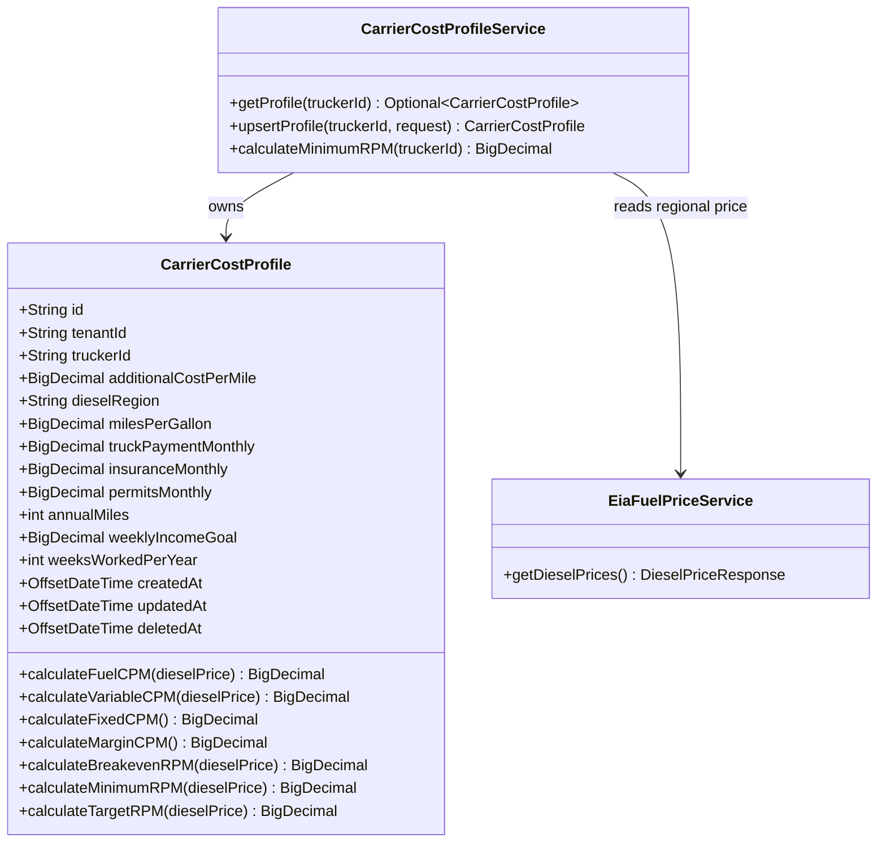

# ARCHITECTURE DESIGN: US-730a-v2 Cost Profile Wizard Redesign

**Story ID:** US-730a-v2
**Change Request:** CHG-US730-007
**Supersedes:** US-730a (Cost Profile Setup API & UI, COMPLETED)
**Status:** ✅ **APPROVED FOR HFD**
**Architect Sign-Off:** 2026-07-06
**Authority:** Solution Architect (Sequential Lock Protocol)
**Reference HFD Spec:** `docs/hfd/US-730a-v2_Cost_Profile_Wizard_Design_Spec.md`
**Reference Prototype (Master):** `Prototype/ui_kits/carrier/cost-profile.html`, `Prototype/COST_PROFILE_INTEGRATION.md`

---

## 0. Input Acceptance Gate

- [x] Story has unique ID (US-730a-v2)
- [x] Scope: one dedicated screen (`/carrier/cost-profile`), summary + 3-step wizard
- [x] Edge cases named: no-profile-yet (triggers wizard), mid-wizard nav-away warning, save failure
- [x] No contradictory AC
- [x] Fits ~5 days CODER work

**Verdict:** ✅ ACCEPT — LOCKED.

**Platform Reuse Check:** `CarrierCostProfileService.calculateMinimumRPM()` (`backend/src/main/java/com/freightclub/modules/carrier/application/CarrierCostProfileService.java`) is the existing domain service already consumed by `LoadService` for load-board RPM coloring (US-730b). This design **extends** that service — no `V2` service is created, consolidating the two previously-disconnected cost-profile data stores (see CHG-US730-007 debt entry).

---

## 1. 🏗️ Domain Model & Logic



**Derived-value formulas (ported 1:1 from `COST_PROFILE_INTEGRATION.md` Step 4):**
- `fuelCpm = dieselPrice(region) / milesPerGallon`
- `varCpm = fuelCpm + additionalCostPerMile`
- `fixedCpm = (truckPaymentMonthly + insuranceMonthly + permitsMonthly) * 12 / annualMiles`
- `marginCpm = (weeklyIncomeGoal * weeksWorkedPerYear) / annualMiles`
- `breakevenRpm = varCpm + fixedCpm`
- `minRpm = breakevenRpm + marginCpm`
- `targetRpm = minRpm * 1.2`

**Region mapping:** `dieselRegion` is one of `EAST | MIDWEST | SOUTH | ROCKY | WEST`, matching `DieselPriceResponse`'s `eastPrice`/`midwestPrice`/`southPrice`/`rockyPrice`/`westPrice` fields exactly (see decision: use the real 5 EIA regions, not the prototype's 4-region literal labels).

**Divide-by-zero guards:** `milesPerGallon <= 0` → `fuelCpm = 0`; `annualMiles <= 0` → `fixedCpm = 0`, `marginCpm = 0` (mirrors prototype `computeCostProfile()` guard clauses).

---

## 2. 🗄️ Database Schema

**Migration:** `V20260706_HHmm__CarrierCostProfile_US730a_v2.sql`

```sql
ALTER TABLE freightclub.carrier_cost_profiles
  ADD COLUMN diesel_region VARCHAR(20),
  ADD COLUMN additional_cost_per_mile NUMERIC(10,4),
  ADD COLUMN truck_payment_monthly NUMERIC(10,2),
  ADD COLUMN insurance_monthly NUMERIC(10,2),
  ADD COLUMN permits_monthly NUMERIC(10,2),
  ADD COLUMN annual_miles INTEGER,
  ADD COLUMN weekly_income_goal NUMERIC(10,2),
  ADD COLUMN weeks_worked_per_year SMALLINT;

ALTER TABLE freightclub.carrier_cost_profiles
  ADD CONSTRAINT chk_diesel_region
  CHECK (diesel_region IS NULL OR diesel_region IN ('EAST','MIDWEST','SOUTH','ROCKY','WEST'));
```

- **Additive only.** Existing columns (`monthly_fixed_costs`, `fuel_cost_per_gallon`, `monthly_miles_target`) remain nullable and untouched — no destructive drop in this migration. Removal is a follow-up migration once the old `ProfilePage.tsx` `CostProfileSection` is deleted (tracked as a note in CHG-US730-007, not blocking).
- **RLS:** Already enabled on `carrier_cost_profiles` via `V20260522_2100__CreateRLSPolicies_5Tables.sql` — no new policy required.
- **PK/FK:** `id VARCHAR(36)` PK unchanged. `trucker_id → users(id)`, already unique/PK — satisfies FK Validation gate.
- **Soft delete:** `deleted_at` already present on this table — unaffected.

---

## 3. 📋 Field Contract Table (Architect-filled — awaiting HFD validation)

| UI Field | API Param | DB Column | Type | Required | Notes |
|---|---|---|---|---|---|
| MPG input | `milesPerGallon` | `carrier_cost_profiles.miles_per_gallon` | NUMERIC(10,2) | Yes | existing column, reused |
| Diesel region chips | `dieselRegion` | `carrier_cost_profiles.diesel_region` | VARCHAR(20) | Yes | enum-constrained |
| Additional cost/mi | `additionalCostPerMile` | `carrier_cost_profiles.additional_cost_per_mile` | NUMERIC(10,4) | Yes | oil/tires/DEF |
| Truck payment/mo | `truckPaymentMonthly` | `carrier_cost_profiles.truck_payment_monthly` | NUMERIC(10,2) | Yes | 0 if paid off |
| Insurance/mo | `insuranceMonthly` | `carrier_cost_profiles.insurance_monthly` | NUMERIC(10,2) | Yes | |
| Permits/mo | `permitsMonthly` | `carrier_cost_profiles.permits_monthly` | NUMERIC(10,2) | Yes | IFTA/UCR/base plate |
| Annual miles | `annualMiles` | `carrier_cost_profiles.annual_miles` | INTEGER | Yes | replaces `monthly_miles_target` |
| Weekly income goal | `weeklyIncomeGoal` | `carrier_cost_profiles.weekly_income_goal` | NUMERIC(10,2) | Yes | |
| Weeks worked/yr | `weeksWorkedPerYear` | `carrier_cost_profiles.weeks_worked_per_year` | SMALLINT | Yes | chip selector 44/46/48/50/52 |
| Break-even KPI tile | `breakevenRpm` | *(derived)* | NUMERIC(10,4) | Yes | computed, never stored |
| Min RPM KPI tile | `minRpm` | *(derived)* | NUMERIC(10,4) | Yes | computed, never stored |
| Target KPI tile | `targetRpm` | *(derived)* | NUMERIC(10,4) | Yes | computed, never stored |
| Diesel region live price | *(N/A — external)* | *(N/A)* | N/A | N/A | sourced live from `GET /api/v1/market/diesel-prices`, not persisted per-carrier |
| `tenant_id` | *(N/A)* | `carrier_cost_profiles.tenant_id` | VARCHAR(36) | Yes | backend-only, from `TenantContextHolder` |
| `deleted_at` | *(N/A)* | `carrier_cost_profiles.deleted_at` | TIMESTAMPTZ | No | backend-only, soft delete |

ARCH sign-off: ✅ Complete — ready for HFD validation.

---

## 4. API Contract

```
GET  /api/v1/carrier/cost-profile
  200 → CostProfileResponse (existing profile)
  204 → no body (no profile yet → frontend shows wizard)

PUT  /api/v1/carrier/cost-profile
  Body: CostProfileRequest (all 8 fields above, Required=Yes)
  200 → CostProfileResponse (includes derived breakevenRpm/minRpm/targetRpm)
```

New `CarrierCostProfileController` (`modules/carrier/presentation`), following the existing `CarrierPublicProfileController` package convention. `@RequestBody` (not `@RequestParam`) — matches full-object PUT semantics per reviewer-checklist §5.

---

## 5. ⚙️ Implementation Directives

1. **No-Lombok:** `CarrierCostProfile` domain class already hand-written getters/setters — extend the same way.
2. **DTO boundary:** New `CostProfileRequest`/`CostProfileResponse` DTOs — do not leak `CarrierCostProfileEntity` to the controller layer.
3. **LoadService untouched:** `calculateMinimumRPM(truckerId)` signature unchanged; only its internal formula gains the diesel-region lookup via `EiaFuelPriceService` instead of the old `fuel_cost_per_gallon` manual input. This is the fix for the CHG-US730-007 two-data-store disconnect — `LoadService` and the new wizard now read/write the same entity.
4. **Old `User`-entity cost fields:** leave untouched in this PR (still read by the legacy `ProfilePage.tsx` section, which is not touched by US-730a-v2). Removal is scoped to a later cleanup CHG once that section is deleted from the frontend.
5. **Coverage:** New controller requires `CarrierCostProfileControllerTest` (`@SpringBootTest` + `MockMvc`), 80%+ branch coverage on the new formula methods.

---

## ARCHITECT Sign-Off

**Architect:** ✅ APPROVED FOR HFD
**Date:** 2026-07-06
**Status:** LOCKED
**Authority:** ARCHITECT Role (Sequential Lock Protocol)
