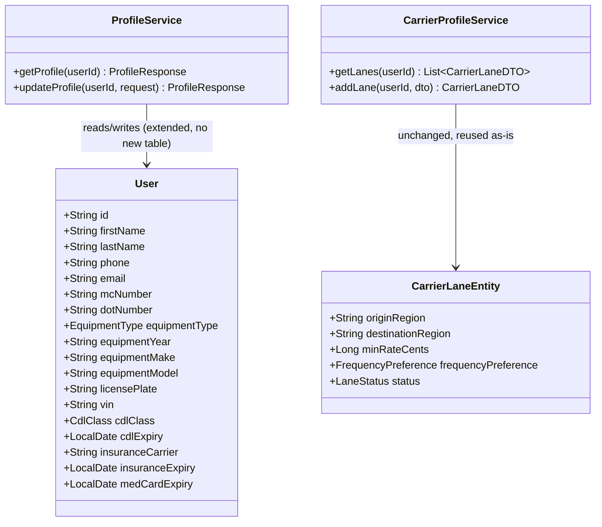

# ARCHITECTURE DESIGN: US-730h Carrier Identity & Credentials Profile

**Story ID:** US-730h
**Change Request:** CHG-US730-008
**Supersedes:** US-730e's Equipment/Lanes tabs (Equipment tab UI only — see Platform Reuse Check below)
**Status:** ✅ **APPROVED FOR HFD**
**Architect Sign-Off:** 2026-07-08
**Authority:** Solution Architect (Sequential Lock Protocol)
**Reference HFD Spec:** `docs/hfd/US-730h_Carrier_Identity_Credentials_Profile_Design_Spec.md`
**Reference Prototype (Master):** `Prototype/ui_kits/carrier/carrier-profile.html`, `Prototype/CARRIER_PROFILE_INTEGRATION.md`

---

## 0. Input Acceptance Gate

- [x] Story has unique ID (US-730h, renamed from US-730g 2026-07-06 to resolve collision with Phase 7b US-730g)
- [x] Scope: one dedicated screen (`/carrier/profile`), 4 tabs (Identity/Equipment/Credentials/Lanes)
- [x] Edge cases named: equipment-type change confirmation, credential-expiry warning banner, max-3-lanes cap, email validation
- [x] No contradictory AC
- [x] Fits ~4 days CODER work (smaller than it looks — see Platform Reuse Check)

**Verdict:** ✅ ACCEPT — LOCKED.

**Platform Reuse Check (the critical finding of this design):**

The raw integration doc (`CARRIER_PROFILE_INTEGRATION.md`) specifies new endpoints `GET/PUT /api/carrier/profile`. Investigation found this would duplicate existing, already-shipped infrastructure:

1. **Identity + Equipment + Credentials fields already live on `users`.** `mc_number`, `dot_number`, `equipment_type` are already columns on `freightclub.users` (`V20260422_02__Create_users.sql`), already exposed via the existing `GET/PUT /api/v1/profile` (`ProfileController.java` → `ProfileResponse`/`UpdateProfileRequest`/`User.java`) — the same endpoint `ProfilePage.tsx`'s `PersonalInfoSection` already consumes. Creating a second `/api/carrier/profile` controller writing the same `users` row would violate the Platform Integrity hard gate (duplicate domain logic across services).
2. **Shipper-side search already reads the single-value `equipment_type` column.** `CarrierSearchService.searchCarriersByLane()` reads `u.getEquipmentType()` directly off `User` — confirming the single-equipment-type model this story wants is *already* the production data model, not a new decision.
3. **Lanes are load-bearing shipper-facing infrastructure — do not touch the schema.** `carrier_lanes` (`CarrierLaneEntity`/`CarrierLaneDTO`, existing `GET/POST/PUT /api/v1/profile/lanes`) backs `PublicCarrierProfileDTO.lanes` (shipper's public-profile view of a carrier) and `US-762`'s lane-based carrier search (`CarrierPublicProfileController.searchCarriersByLane`). This story's simplified "up to 3 lanes, origin/destination state only" UI must call the *existing* lane endpoints, not a new or restructured table.
4. **The multi-equipment CRUD table (`CarrierEquipmentDTO`/`GET-POST-PUT /api/v1/profile/equipment`) is confirmed unused by shipper-side matching** (search reads `users.equipment_type`, not this table). Left untouched as-is — out of scope, not deprecated, not migrated.

**Net effect:** this story is an **additive migration on `users`** (10 new columns) plus **frontend-only** consumption of 3 already-existing endpoint groups. No new controller, no new table, no new service.

---

## 1. 🏗️ Domain Model & Logic



**New enum:** `CdlClass { CLASS_A, CLASS_B, CLASS_C }` (backend/src/main/java/com/freightclub/domain/CdlClass.java) — mirrors the existing `EquipmentType` enum pattern.

**Expiry status (frontend-computed, never stored — ported 1:1 from `carrier-profile.html`):**
```
daysUntil(date)   = ceil((date - now) / 1 day)
expiryStatus(date) = expired if daysUntil < 0
                    = critical if daysUntil <= 30
                    = warn if daysUntil <= 90
                    = ok otherwise
```
This logic lives in the frontend only (same as US-730a-v2's derived RPM values) — no backend "status" column, since it's a function of `now()` and would go stale if persisted.

**Completeness check:** 11 boolean checks (firstName, lastName, phone, email, equipmentType, licensePlate, dotNumber, cdlClass, cdlExpiry, insuranceExpiry, insuranceCarrier present) → percentage, ported 1:1 from the prototype's `ComplPill`. Frontend-computed, matches this project's existing completeness-bar pattern (US-730a-v2's `Form Completion` meter).

**Equipment-change confirmation:** frontend-only UX (bottom sheet). On confirm, `PUT /api/v1/profile` with the new `equipmentType` — existing `React Query` cache invalidation of the load board query (`['loads']` or the board's query key) must fire on success, matching the pattern already established in US-730a-v2's `useCostProfile` `onSuccess` (cross-feature invalidation).

---

## 2. 🗄️ Database Schema

**Migration:** `V20260708_HHmm__CarrierIdentityCredentials_US730h.sql`

```sql
ALTER TABLE freightclub.users
  ADD COLUMN equipment_year VARCHAR(4),
  ADD COLUMN equipment_make VARCHAR(50),
  ADD COLUMN equipment_model VARCHAR(50),
  ADD COLUMN license_plate VARCHAR(20),
  ADD COLUMN vin VARCHAR(17),
  ADD COLUMN cdl_class VARCHAR(10),
  ADD COLUMN cdl_expiry DATE,
  ADD COLUMN insurance_carrier VARCHAR(100),
  ADD COLUMN insurance_expiry DATE,
  ADD COLUMN med_card_expiry DATE;

ALTER TABLE freightclub.users
  ADD CONSTRAINT chk_cdl_class
  CHECK (cdl_class IS NULL OR cdl_class IN ('CLASS_A', 'CLASS_B', 'CLASS_C'));
```

- **Purely additive.** No existing column touched, no NOT NULL relaxation needed (all new columns nullable — a carrier with an incomplete profile has NULLs, exactly matching the prototype's completeness-percentage model).
- **RLS:** `users` already has RLS from prior security hardening (SEC-002 predates this table's carrier-specific columns) — no new policy required, new columns inherit the existing row-level policy automatically since RLS is row-scoped, not column-scoped.
- **PK/FK:** No new FK — all new columns are scalar on the existing `users.id` PK.
- **Soft delete:** `users.deleted_at` already present — unaffected.
- **`carrier_lanes` — NO MIGRATION.** Confirmed unchanged; this story adds zero columns to that table.

---

## 3. 📋 Field Contract Table (Architect-filled — awaiting HFD validation)

| UI Field | API Param | DB Column | Type | Required | Notes |
|---|---|---|---|---|---|
| First name | `firstName` | `users.first_name` | VARCHAR(100) | Yes | existing column/endpoint, reused |
| Last name | `lastName` | `users.last_name` | VARCHAR(100) | Yes | existing column/endpoint, reused |
| Phone | `phone` | `users.phone` | VARCHAR(20) | No | existing column/endpoint, reused; `formatPhone()` display-only |
| Email | `email` | `users.email` | VARCHAR(255) | Yes | existing column/endpoint, reused; frontend regex validation only, no backend change |
| Equipment type | `equipmentType` | `users.equipment_type` | VARCHAR(30) enum | Yes | existing column/endpoint, reused — single value drives load board query |
| Equipment year | `equipmentYear` | `users.equipment_year` | VARCHAR(4) | No | **new column** |
| Equipment make | `equipmentMake` | `users.equipment_make` | VARCHAR(50) | No | **new column** |
| Equipment model | `equipmentModel` | `users.equipment_model` | VARCHAR(50) | No | **new column** |
| License plate | `licensePlate` | `users.license_plate` | VARCHAR(20) | No | **new column** |
| VIN | `vin` | `users.vin` | VARCHAR(17) | No | **new column**, optional |
| DOT # | `dotNumber` | `users.dot_number` | VARCHAR(20) | No | existing column/endpoint, reused |
| MC # | `mcNumber` | `users.mc_number` | VARCHAR(20) | No | existing column/endpoint, reused |
| CDL class | `cdlClass` | `users.cdl_class` | VARCHAR(10) enum | No | **new column** |
| CDL expiry | `cdlExpiry` | `users.cdl_expiry` | DATE | No | **new column** |
| Insurance carrier | `insuranceCarrier` | `users.insurance_carrier` | VARCHAR(100) | No | **new column** |
| Insurance expiry | `insuranceExpiry` | `users.insurance_expiry` | DATE | No | **new column** |
| Med card expiry | `medCardExpiry` | `users.med_card_expiry` | DATE | No | **new column** |
| Lane 1/2/3 origin+dest | `originRegion`/`destinationRegion` | `carrier_lanes.origin_region`/`.destination_region` | VARCHAR(50) | No | **existing table/endpoint, reused** — capped at 3 rows client-side; `frequencyPreference` defaults `ANY`, `status` defaults `ACTIVE`, `minRateCents` left `null` (not part of this simplified UI) |
| Expiry status badges | *(N/A — derived)* | *(N/A)* | N/A | N/A | computed client-side from expiry dates, never stored |
| Completeness % | *(N/A — derived)* | *(N/A)* | N/A | N/A | computed client-side, never stored |
| `tenant_id` | *(N/A)* | `users.tenant_id` | VARCHAR(36) | Yes | backend-only, from `TenantContextHolder` |

ARCH sign-off: ✅ Complete — ready for HFD validation.

---

## 4. API Contract

```
GET  /api/v1/profile
  200 → ProfileResponse (extended with 10 new nullable fields)

PUT  /api/v1/profile
  Body: UpdateProfileRequest (extended with 10 new nullable fields)
  200 → ProfileResponse

GET  /api/v1/profile/lanes
  200 → List<CarrierLaneDTO>   (existing, unchanged)

POST /api/v1/profile/lanes
  Body: CarrierLaneDTO
  201 → CarrierLaneDTO          (existing, unchanged; frontend enforces max-3 client-side)

PUT  /api/v1/profile/lanes/{id}
  200 → CarrierLaneDTO          (existing, unchanged)
```

**No new controller.** `ProfileController` (`/api/v1/profile`) and its existing `/lanes` sub-resource cover this entire story. `CarrierProfileService`/`ProfileService` gain new field mappings only, no new methods beyond what `ProfileResponse.from()`/`UpdateProfileRequest` already need for the 10 new columns.

---

## 5. ⚙️ Implementation Directives

1. **No-Lombok:** `User.java` already hand-written getters/setters — extend the same way for the 10 new fields.
2. **DTO boundary:** Extend `ProfileResponse`/`UpdateProfileRequest` records with the 10 new fields — do not create parallel DTOs.
3. **`CdlClass` enum:** new file, mirrors `EquipmentType`'s existing pattern exactly (same package, same `@Enumerated(EnumType.STRING)` convention on `User.java`).
4. **Lanes: zero backend changes.** Frontend calls the existing `/profile/lanes` endpoints; enforce the max-3 cap in the UI (disable "add lane" past 3 rows) — do not add a server-side count check in this story (out of scope; note as a follow-up hardening item if abuse is ever observed, since this is self-service data on the carrier's own account, not a security boundary).
5. **Equipment-type change → load board cache invalidation:** on `PUT /api/v1/profile` success where `equipmentType` changed, invalidate the load board's React Query key — mirrors US-730a-v2's `useCostProfile` onSuccess pattern (cross-feature `queryClient.invalidateQueries`).
6. **Coverage:** No new controller means no new `*ControllerTest` is required by the reviewer-checklist's "new endpoint" gate — but the extended `ProfileResponse`/`UpdateProfileRequest` mapping must be covered by the *existing* `ProfileControllerTest` (add cases for the 10 new fields, not a new test file).

---

## ARCHITECT Sign-Off

**Architect:** ✅ APPROVED FOR HFD
**Date:** 2026-07-08
**Status:** LOCKED
**Authority:** ARCHITECT Role (Sequential Lock Protocol)
