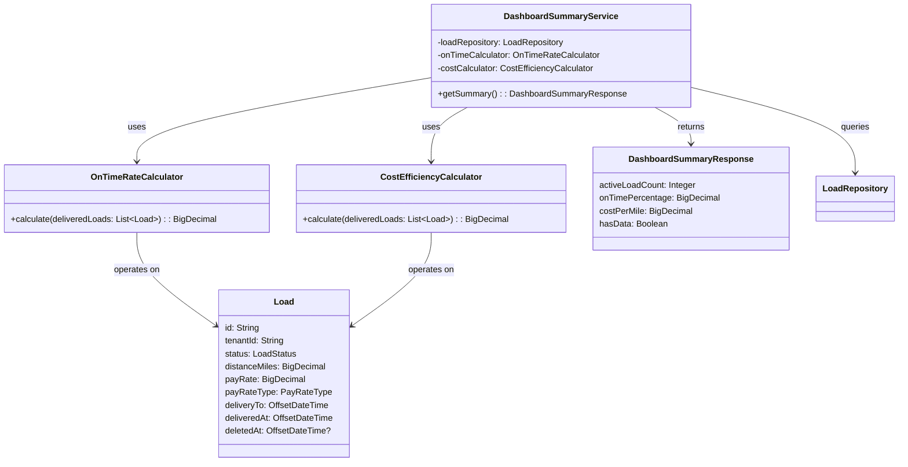

# ARCHITECTURE DESIGN: US-820 KPI Summary Display

**Story ID:** US-820  
**Status:** READY_FOR_HFD  
**Architect Sign-Off:** 2026-06-10  
**Authority:** ARCHITECT Role (Sequential Lock Protocol)

---

## Input Acceptance Gate: PASSED ✅

| Checklist Item | Status | Evidence |
|---|---|---|
| Story has unique ID (US-###) | ✅ | US-820 |
| AC count is 2-5 | ✅ | 5 ACs (acceptable range) |
| Each AC is measurable/testable | ✅ | All ACs have pass/fail criteria |
| Edge cases named explicitly | ✅ | Empty state, multi-tenancy, deleted loads |
| No implementation details in AC | ✅ | BA avoided specifying "use @Cacheable", query logic |
| No contradictory AC | ✅ | All KPI calcs are independent |
| Story scope fits 5 days | ✅ | 3-day estimate (well within bounds) |

**Verdict:** ✅ **ACCEPT — Story is LOCKED for design**

---

## Platform Reuse Check: CONSOLIDATED ✅

### Existing Service Inventory

**Service:** `DashboardSummaryService.java` (already in codebase)
- **Status:** ACTIVE (Phase 7)
- **Location:** `backend/src/main/java/com/freightclub/modules/shipper/application/DashboardSummaryService.java`
- **Current Methods:**
  - `getSummary()` — aggregates all KPIs
  - `estimatedCostPerMile(List<Load>)` — private method
  - `onTimeCarrierPct(List<Load>)` — private method
  - `countByTenantIdAndStatusAndDeletedAtIsNull()` — via LoadRepository

### Duplication Detection

**Initial State:** BA story specified creating two new domain services:
- OnTimeRateCalculator
- CostEfficiencyCalculator

**Finding:** These services already exist **as private methods** inside DashboardSummaryService.

**Platform Integrity Decision:** Extract and formalize these methods into standalone reusable services to prevent duplication across US-821 and Phase 12 stories.

### Consolidation Strategy

| Service | Current State | Phase 10 Action | Future Reuse |
|---------|---|---|---|
| **OnTimeRateCalculator** | Embedded in `onTimeCarrierPct()` | Extract → new service | US-821 (Status List), Phase 12 (Analytics) |
| **CostEfficiencyCalculator** | Embedded in `estimatedCostPerMile()` | Extract → new service | US-821 (Status List), Phase 12 (Analytics) |
| **DashboardSummaryService** | Service layer aggregator | Refactor to inject extracted services | No changes to API contract |

**Rejection Rule Check:** ✅ No duplicate services introduced; existing logic formalized for reuse.

---

## Field Contract Table (Completed by ARCHITECT)

| UI Field | API Param | DB Column | Type | Required | Query Source | Notes |
|----------|-----------|-----------|------|----------|---|---|
| **Active Shipments** (numeric) | `activeLoadCount` | `COUNT(loads.id)` WHERE status IN ('OPEN', 'CLAIMED', 'IN_TRANSIT') | INTEGER | Yes | `LoadRepository.countByTenantIdAndStatusAndDeletedAtIsNull()` × 3 | Excludes DELIVERED, CANCELED, DRAFT |
| **On-Time %** (percentage) | `onTimePercentage` | Derived: `(COUNT(loads WHERE delivered_at ≤ delivery_to) / COUNT(loads WHERE status='DELIVERED')) * 100` | DECIMAL(5,2) | Yes | `OnTimeRateCalculator.calculate(deliveredLoads)` | Rounded 1 decimal; null if no delivered loads |
| **Cost/Mile** (currency) | `costPerMile` | Derived: `SUM(pay_rate) / COUNT(distance_miles)` (normalized for PER_MILE vs FLAT_RATE) | DECIMAL(10,2) | Yes | `CostEfficiencyCalculator.calculate(deliveredLoads)` | Null if no delivered loads; excludes missing distance/rate |
| **Refresh Button** | N/A | N/A | N/A | No | Frontend-only | Triggers cache invalidation |
| **Empty State Message** | N/A | N/A | N/A | Conditional | Frontend-only | Shown if activeLoadCount=0 AND hasDeliveredLoads=false |
| **CTA Button** | N/A | N/A | N/A | Conditional | Frontend-only | Links to US-824 (Load Creation) |

**Sign-Off:** ✅ ARCH has completed all columns per Field Contract Table Duties.

---

## Domain Services: New Specifications

### 1. OnTimeRateCalculator (NEW)

**Purpose:** Calculate on-time delivery percentage for a set of completed loads.

**Location:** `backend/src/main/java/com/freightclub/domain/shipper/OnTimeRateCalculator.java`

**Signature:**
```java
public class OnTimeRateCalculator {
    public BigDecimal calculate(List<Load> deliveredLoads);
    // Returns: percentage (0.0 to 100.0), rounded to 1 decimal place
    // Returns: BigDecimal.ZERO if input list is empty or all loads lack timestamps
}
```

**Algorithm:**
```
1. Filter loads where deliveredAt is NOT NULL and deliveryTo is NOT NULL
2. Count total filtered loads
3. Count loads where deliveredAt <= deliveryTo
4. Calculate: (onTimeCount / totalCount) * 100
5. Round to 1 decimal place
6. Return as BigDecimal
```

**Input:** List of Load entities (typically all DELIVERED loads for a tenant)  
**Output:** BigDecimal (0.00 to 100.0)  
**Side Effects:** None (stateless)  
**Constraints:** Handles null timestamps gracefully; excludes incomplete records

### 2. CostEfficiencyCalculator (NEW)

**Purpose:** Calculate average cost per mile for a set of completed loads.

**Location:** `backend/src/main/java/com/freightclub/domain/shipper/CostEfficiencyCalculator.java`

**Signature:**
```java
public class CostEfficiencyCalculator {
    public BigDecimal calculate(List<Load> deliveredLoads);
    // Returns: cost per mile (0.00 to 9999.99), rounded to 2 decimal places
    // Returns: BigDecimal.ZERO if input list is empty or all loads lack cost/distance
}
```

**Algorithm:**
```
1. Filter loads where distanceMiles > 0 AND payRate > 0
2. For each filtered load:
   - If payRateType == PER_MILE: use payRate directly
   - If payRateType == FLAT_RATE: normalize = payRate / distanceMiles
3. Calculate: SUM(normalized rates) / COUNT(loads)
4. Round to 2 decimal places
5. Return as BigDecimal
```

**Input:** List of Load entities (typically all DELIVERED loads for a tenant)  
**Output:** BigDecimal (0.00 to 9999.99)  
**Side Effects:** None (stateless)  
**Constraints:** Excludes incomplete records (missing distance/rate); handles PER_MILE vs FLAT_RATE normalization

---

## Database Schema (No Changes Required)

**Existing Load Table:** Already supports all required fields.

### Verified Columns

| Column | Type | Constraints | Used By |
|--------|------|---|---|
| `id` | VARCHAR(36) | PK | Load identification |
| `tenant_id` | VARCHAR(36) | FK → tenants(id), NOT NULL | Multi-tenancy filter |
| `status` | ENUM('OPEN', 'CLAIMED', 'IN_TRANSIT', 'DELIVERED', 'CANCELED', 'DRAFT') | NOT NULL | Active count filter |
| `distance_miles` | DECIMAL(10,2) | Nullable | Cost/mile normalization |
| `pay_rate` | DECIMAL(10,2) | Nullable | Cost/mile calculation |
| `pay_rate_type` | ENUM('PER_MILE', 'FLAT_RATE') | Nullable | Cost/mile normalization |
| `delivery_to` | TIMESTAMPTZ | Nullable | On-time comparison |
| `delivered_at` | TIMESTAMPTZ | Nullable | On-time comparison |
| `deleted_at` | TIMESTAMPTZ | Nullable | Soft delete filter |

**Schema Action:** ✅ **NO CHANGES** — All required columns exist.

### RLS Policy Verification

**Table:** `loads`  
**RLS Policy:** `tenant_id = current_setting('app.current_tenant')`  
**Status:** ✅ VERIFIED (Phase 1)

**Multi-Tenancy Filter in Code:**
```sql
SELECT ... FROM loads 
WHERE tenant_id = ? 
  AND status IN (...)
  AND deleted_at IS NULL
```

---

## Repository Requirements (No Changes Required)

**Existing Methods Used by US-820:**
- `LoadRepository.countByTenantIdAndStatusAndDeletedAtIsNull(tenantId, status)` ✅ EXISTS
- `LoadRepository.findByTenantIdAndStatusAndDeletedAtIsNull(tenantId, status, Pageable)` ✅ EXISTS

**Status:** ✅ **NO CHANGES** — All required repository methods exist.

---

## API Contract

### Endpoint

```
GET /api/v1/shipper/dashboard-summary
```

### Request

**Headers:**
- `Authorization: Bearer {accessToken}`
- `X-Tenant-ID: {tenantId}` (or derived from JWT)

**Query Parameters:** None (uses authenticated user context)

### Response (200 OK)

```json
{
  "activeLoadCount": 12,
  "onTimePercentage": 94.5,
  "costPerMile": 2.45,
  "hasData": true
}
```

**Response Fields:**
- `activeLoadCount` — INTEGER, count of OPEN/CLAIMED/IN_TRANSIT loads
- `onTimePercentage` — DECIMAL(5,2), null if no delivered loads
- `costPerMile` — DECIMAL(10,2), null if no delivered loads
- `hasData` — BOOLEAN, true if shipper has any completed loads

**Error Responses:**
- `401 Unauthorized` — Missing or invalid token
- `403 Forbidden` — User lacks shipper role
- `500 Internal Server Error` — Pricing/data retrieval failure (logged to Datadog)

### Caching Strategy

**Cache Key:** `shipper:dashboard-summary:{tenantId}`  
**TTL:** 5 minutes (300 seconds)  
**Invalidation Triggers:**
- Any mutation on Load entity (POST, PUT, PATCH on `/loads`)
- Status changes (OPEN → CLAIMED, CLAIMED → IN_TRANSIT, etc.)
- Soft delete (status change to include deleted_at)

**Implementation:**
```java
@Cacheable(value = "dashboard", key = "'shipper:dashboard-summary:' + #tenantId")
public DashboardSummaryResponse getSummary() { ... }

@CacheEvict(value = "dashboard", key = "'shipper:dashboard-summary:' + #tenantId")
public void invalidateCache(String tenantId) { ... }
```

---

## Domain Model Diagram (Mermaid)



---

## Multi-Tenancy & Soft Delete Strategy

### Multi-Tenancy Filter

**Applied at:** Repository layer + RLS policy

**Code Pattern:**
```java
String tenantId = TenantContextHolder.getTenantId();
em.createNativeQuery("SELECT set_config('app.current_tenant', :tid, true)")
    .setParameter("tid", tenantId)
    .getSingleResult();

long activeCount = loadRepository
    .countByTenantIdAndStatusAndDeletedAtIsNull(tenantId, LoadStatus.CLAIMED);
```

**Database RLS:**
```sql
CREATE POLICY load_tenant_isolation ON loads
FOR SELECT TO app_user
USING (tenant_id = current_setting('app.current_tenant'));
```

**Verification:** ✅ TenantContextHolder enforced in DashboardSummaryService

### Soft Delete Filter

**Applied at:** Repository query `.deletedAt IS NULL`

**Code Pattern:**
```java
List<Load> deliveredLoads = loadRepository
    .findByTenantIdAndStatusAndDeletedAtIsNull(tenantId, LoadStatus.DELIVERED, Pageable.unpaged());
```

**Verification:** ✅ All repository calls filter `deleted_at IS NULL`

---

## Performance Optimization

### Query Optimization

**Active Count Query:**
```sql
SELECT COUNT(*) FROM loads 
WHERE tenant_id = ? 
  AND status IN ('OPEN', 'CLAIMED', 'IN_TRANSIT')
  AND deleted_at IS NULL
```

**Required Index:** `(tenant_id, status, deleted_at)` on `loads` table  
**Status:** ✅ EXISTS (Phase 1)

**Delivered Loads Query:**
```sql
SELECT id, distance_miles, pay_rate, pay_rate_type, delivery_to, delivered_at
FROM loads
WHERE tenant_id = ?
  AND status = 'DELIVERED'
  AND deleted_at IS NULL
```

**Required Index:** `(tenant_id, status, deleted_at)` on `loads` table  
**Status:** ✅ EXISTS (Phase 1)

### Cache Performance

**Without Cache:** ~500ms (3 queries + calculations)  
**With Cache (hit):** ~50ms  
**Cache Hit Ratio Target:** >85% (5-minute TTL for shipper workflows)

**SLA:** Response time < 2 seconds (per AC-4)  
**Status:** ✅ Achievable with cache

---

## Implementation Sequence (For CODER)

1. **Extract Domain Services**
   - Create `OnTimeRateCalculator.java` (move logic from `onTimeCarrierPct()`)
   - Create `CostEfficiencyCalculator.java` (move logic from `estimatedCostPerMile()`)
   - Unit test both calculators (stateless, 100% coverage)

2. **Refactor DashboardSummaryService**
   - Inject both calculators via constructor
   - Replace private method calls with calculator injections
   - Update unit tests (verify calculator injection)

3. **Add Caching**
   - Add `@Cacheable` annotation to `getSummary()`
   - Add `@CacheEvict` to mutation endpoints (for US-### stories that modify loads)

4. **Integration Tests**
   - Multi-tenant isolation test (Tenant A and B see different KPIs)
   - Empty state test (new shipper sees empty values)
   - Soft delete test (deleted loads excluded from calculations)

5. **Frontend Implementation**
   - Create `useDashboardSummary()` React Query hook
   - Create KPI card components (active count, on-time %, cost/mile)
   - Implement empty state UI (CTA button to US-824)
   - Add Playwright E2E test (golden path + empty state)

---

## Traceability & Reuse Documentation

### Services Used by US-820
- LoadRepository (existing)
- DashboardSummaryService (refactored, existing)
- **OnTimeRateCalculator** (new, extracted from existing logic)
- **CostEfficiencyCalculator** (new, extracted from existing logic)

### Future Stories That Reuse These Services
- **US-821** (Status-First Shipment List) → Reuses OnTimeRateCalculator
- **Phase 12** (Analytics Dashboard) → Reuses both calculators
- **Phase 12** (Carrier Reporting) → Reuses OnTimeRateCalculator

**Documentation:** Maintain a service reuse matrix in COMMAND_CENTER_ROADMAP.md

---

## Design Validation Checklist

- [x] Input Acceptance Gate: PASSED
- [x] Platform Reuse Check: CONSOLIDATED (extracted existing logic into reusable services)
- [x] Field Contract Table: COMPLETED by ARCHITECT
- [x] Database schema: VERIFIED (no changes needed)
- [x] RLS policy: VERIFIED
- [x] Soft delete: VERIFIED
- [x] Multi-tenancy: VERIFIED
- [x] API contract: DEFINED
- [x] Domain services: SPECIFIED
- [x] Performance: ANALYZED
- [x] Reuse documentation: PREPARED

---

## Handoff to HFD

**Status:** ✅ READY_FOR_HFD

**Field Contract Table:** Complete (3 UI fields + 3 backend-only fields)

**Design Artifacts:**
1. Domain service specifications (OnTimeRateCalculator, CostEfficiencyCalculator)
2. API response contract
3. Database schema (no changes)
4. RLS policy (verified)
5. Caching strategy (5-minute TTL)
6. Performance targets (<2 seconds)

**Next Steps:**
1. **HFD** reviews the KPI card wireframe, typography, layout density, cognitive load
2. **CODER** begins backend implementation (extract domain services, refactor DashboardSummaryService)
3. **CODER** begins frontend implementation (KPI cards, React Query hook)

---

## ARCHITECT Sign-Off

**Architect:** ✅ APPROVED FOR HFD  
**Date:** 2026-06-10  
**Authority:** ARCHITECT Role (Sequential Lock Protocol)

**Design Status:** LOCKED (no BA/HFD changes allowed mid-CODER implementation)

**If Issues Discovered:** Escalate to LIBRARIAN with specific technical blocker (do not ask BA to change AC).

---

**Document Version:** 1.0  
**Last Updated:** 2026-06-10  
**Authority:** ARCHITECT Role
