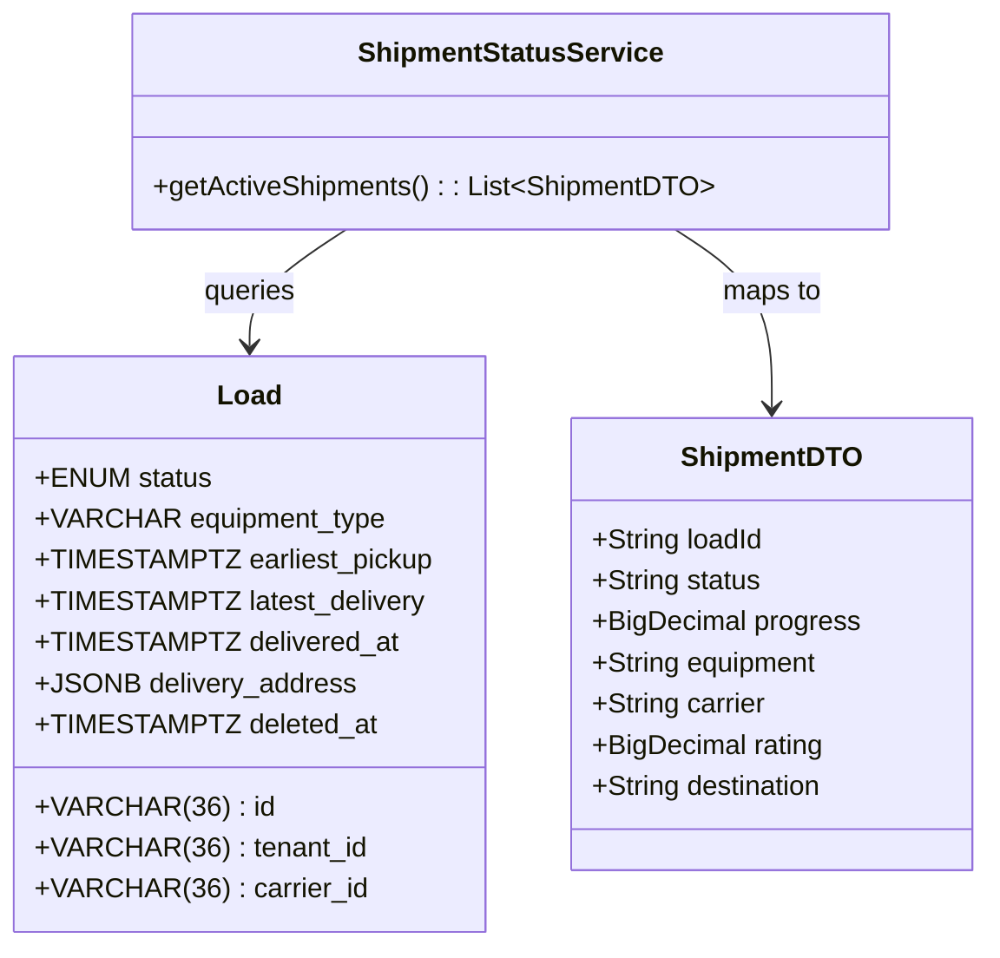

# ARCHITECTURE DESIGN: US-822 Shipment Status Panel

**Story ID:** US-822  
**Status:** ✅ **APPROVED FOR CODER**  
**Architect Sign-Off:** 2026-06-15  
**Authority:** Solution Architect (Sequential Lock Protocol)  
**Reference HFD Spec:** `docs/hfd/US-822_Shipment_Status_Panel_Design_Spec.md`

---

## 1. 🏗️ Domain Model & Logic

The **Shipment Status Panel** provides a real-time window into active logistics operations. It aggregates data from the `loads` and `carriers` domains, supplemented by calculated transit metrics.

### 1.1 "Status-First" Urgency Logic
To satisfy the "Status-First" ordering requirement (§3.2 HFD Spec), the backend must rank loads by operational urgency rather than chronological order.

**Urgency Ranking:**
1. **DELAYED** (Highest)
2. **CLAIMED** (Awaiting pickup)
3. **PICKED_UP / IN_TRANSIT** (Normal flow)
4. **DELIVERED** (Lowest - displayed for completion awareness)

### 1.2 TransitProgressCalculator
Calculates a `progressPercentage` (0–100) based on the load's temporal window and current status.

**Algorithm:**
- `status == POSTED`: return `0.00`
- `status == CLAIMED`: return `15.00` (Assigned but not moving)
- `status == PICKED_UP / IN_TRANSIT`: 
  - `progress = ((NOW - pickup_at) / (delivery_to - pickup_at)) * 100`
  - Clamp between `20.00` and `95.00`
- `status == DELIVERED`: return `100.00`



---

## 2. 🗄️ Database Schema & Query Map

### 2.1 "Status-First" Ordering Query
The Coder must implement this specific ordering logic in the repository/service layer:

```sql
SELECT l.*, c.name, r.avg_score 
FROM freightclub.loads l
LEFT JOIN freightclub.carriers c ON l.carrier_id = c.id
LEFT JOIN freightclub.shipper_reputation r ON l.carrier_id = r.shipper_id -- Reusing rep system
WHERE l.tenant_id = current_setting('app.current_tenant')::VARCHAR(36)
  AND l.deleted_at IS NULL
  AND l.status NOT IN ('DRAFT', 'CANCELED')
ORDER BY 
    CASE l.status
        WHEN 'DELAYED' THEN 1
        WHEN 'CLAIMED' THEN 2
        WHEN 'PICKED_UP' THEN 3
        WHEN 'IN_TRANSIT' THEN 4
        WHEN 'DELIVERED' THEN 5
        ELSE 6
    END ASC,
    l.latest_delivery ASC;
```

---

## 3. 📋 Field Contract Table (Architect + HFD Validated)

| UI Field | API Param | DB Column | Type | Required | Notes |
|---|---|---|---|---|---|
| Load ID | `loadId` | `loads.id` | VARCHAR(36) | Yes | Displayed as "Load #{id}" |
| Status Badge | `status` | `loads.status` | ENUM | Yes | Triggers semantic colors (§6.1) |
| Progress Bar | `progress` | (Derived) | DECIMAL(5,2) | Yes | Logic per Section 1.2 |
| Equipment | `equipment` | `loads.equipment_type` | VARCHAR(50) | Yes | Enum mapped to display string |
| Carrier Name | `carrier` | `carriers.name` | VARCHAR(255) | No | JOIN result; NULL if POSTED |
| Rating | `rating` | `ratings.avg_score` | DECIMAL(2,1) | No | 0-5.0 range |
| Destination | `dest` | `loads.destination_city` | VARCHAR(100) | Yes | Extracted from delivery address |

---

## 🛡️ 4. Row Level Security (RLS) Policy

Existing RLS on `loads` is authoritative. No new policies required, but Coder must ensure `TenantContextHolder` is active.

```sql
-- Isolation check
SELECT * FROM freightclub.loads 
WHERE tenant_id = current_setting('app.current_tenant')::VARCHAR(36);
```

---

## ⚙️ 5. Implementation Directives

1. **Caching (NFR-504):** 
   - **Key:** `shipper:shipments:active:{tenantId}`
   - **TTL:** 1 minute.
   - **Invalidation:** Trigger on any `Load` status change or `Load` soft-delete.
2. **DTO Mapping:** Do NOT leak the internal `Load` entity. Use the `ShipmentDTO` defined in Section 1.
3. **Progress Calculation:** Use the algorithm in Section 1.2. Ensure divide-by-zero protection if timestamps are missing/corrupt.
4. **Performance:** The query utilizes the `(tenant_id, deleted_at, status)` composite index.
5. **No-Java Rule:** This is a design-only artifact. Coder implements.

---

## ARCHITECT Sign-Off

**Architect:** ✅ APPROVED FOR CODER  
**Date:** 2026-06-15  
**Status:** LOCKED  
**Authority:** ARCHITECT Role (Sequential Lock Protocol)
