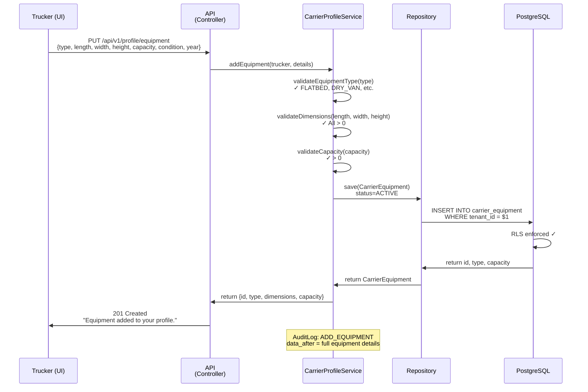
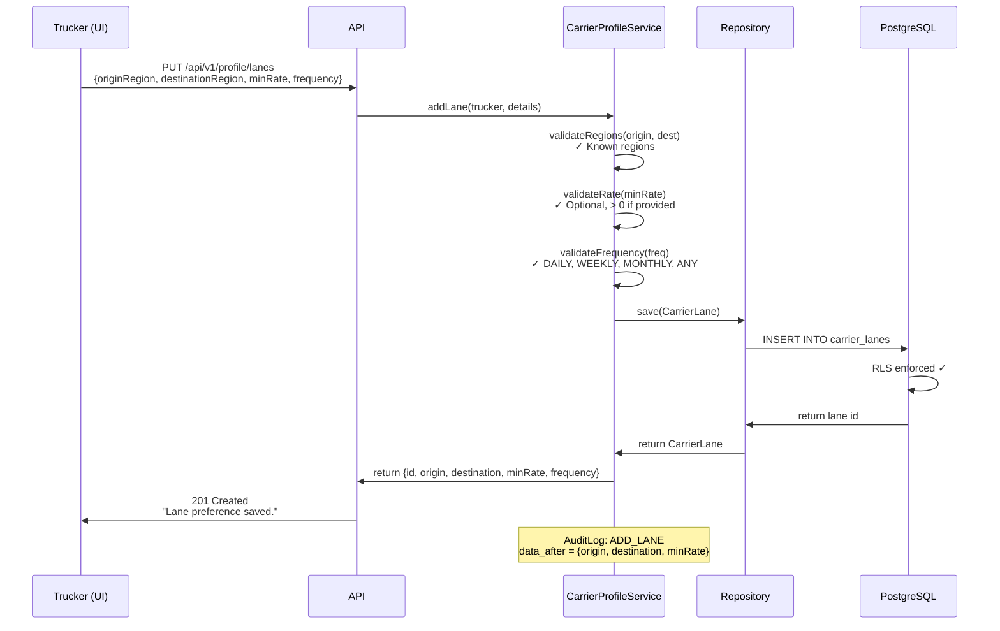
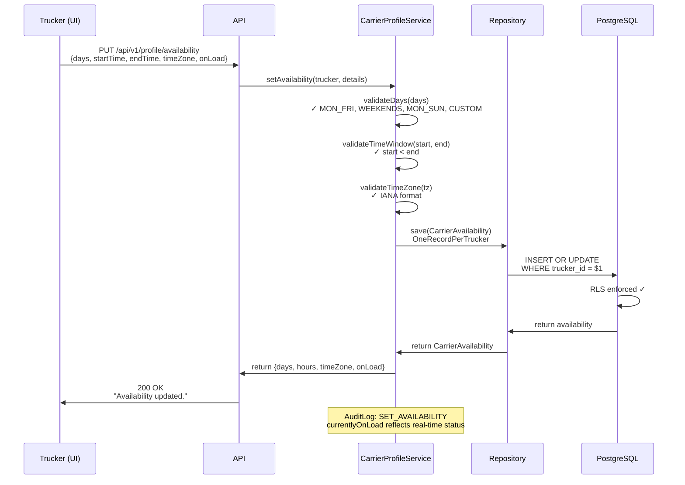
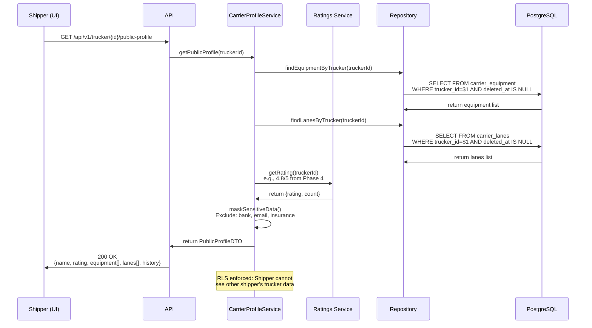
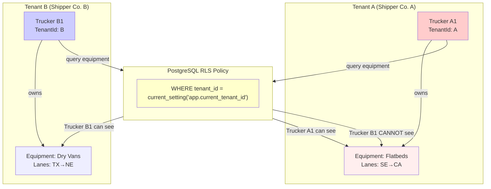

# Architectural Design: Carrier Profiles (US-701)

**Document:** Architecture Design Review  
**Story:** US-701 (Carrier Profiles)  
**Architect:** Solution Architecture Team  
**Date:** 2026-04-27  
**Status:** ✅ DESIGN APPROVED

---

## Executive Summary

US-701 enables truckers to maintain equipment inventory and preferred lane preferences, enabling the load board to recommend loads matching their capabilities. The design employs:
- Equipment & Lane aggregates with soft deletes
- PostgreSQL RLS for tenant isolation
- Public profile view with sensitive data masking
- Immutable audit ledger for compliance
- Integration with load recommendation engine

**Key Constraints:**
- ✅ No-Lombok Java (standard POJOs)
- ✅ PostgreSQL multi-tenancy via RLS
- ✅ Soft deletes on all core entities
- ✅ Cyclomatic complexity < 10 per method
- ✅ 80% branch coverage via JaCoCo

---

## Domain Model

### Core Entities

#### 1. CarrierEquipment (Root Aggregate)

| Field | Type | Constraints | Notes |
|-------|------|-------------|-------|
| `id` | VARCHAR(36) UUID | PK, NOT NULL | Unique identifier |
| `tenantId` | VARCHAR(36) UUID | NOT NULL, FK to Tenant | Tenant isolation key |
| `truckerId` | VARCHAR(36) UUID | NOT NULL, FK to User | Equipment owner |
| `equipmentType` | ENUM | NOT NULL | FLATBED, DRY_VAN, REFRIGERATED, TANKER, SPECIALIZED |
| `lengthFeet` | INT | NOT NULL | Length in feet (validated > 0) |
| `widthFeet` | INT | NOT NULL | Width in feet (validated > 0) |
| `heightFeet` | INT | NOT NULL | Height in feet (validated > 0) |
| `capacityLbs` | BIGINT | NOT NULL | Weight capacity in lbs |
| `equipmentCondition` | ENUM | NOT NULL | GOOD, FAIR, NEEDS_REPAIR |
| `yearModel` | VARCHAR(20) | NULLABLE | Vehicle year and model |
| `status` | ENUM('ACTIVE', 'INACTIVE') | NOT NULL DEFAULT ACTIVE | Availability |
| `createdAt` | TIMESTAMPTZ | NOT NULL | Immutable creation timestamp |
| `deletedAt` | TIMESTAMPTZ | NULLABLE | Soft delete marker |

**Validation Rules:**
- Equipment type: must be recognized ENUM value
- Dimensions: length, width, height must be positive integers
- Capacity: must be positive (measured in lbs)
- Condition: GOOD, FAIR, or NEEDS_REPAIR

---

#### 2. CarrierLane (Value Object / Separate Table)

| Field | Type | Constraints | Notes |
|-------|------|-------------|-------|
| `id` | VARCHAR(36) UUID | PK, NOT NULL | Unique identifier |
| `tenantId` | VARCHAR(36) UUID | NOT NULL, FK | Tenant isolation |
| `truckerId` | VARCHAR(36) UUID | NOT NULL, FK | Lane owner |
| `originRegion` | VARCHAR(50) | NOT NULL | Region code (SE, CA, TX, NE, etc.) |
| `destinationRegion` | VARCHAR(50) | NOT NULL | Region code |
| `minRateCents` | BIGINT | NULLABLE | Minimum rate in cents ($1.75 = 175) |
| `frequencyPreference` | ENUM | NOT NULL | DAILY, WEEKLY, MONTHLY, ANY |
| `status` | ENUM | NOT NULL | ACTIVE, INACTIVE |
| `createdAt` | TIMESTAMPTZ | NOT NULL | Immutable timestamp |
| `deletedAt` | TIMESTAMPTZ | NULLABLE | Soft delete |

**Validation Rules:**
- Origin/destination regions: must match known regional codes
- Min rate: optional, if provided must be > 0
- Frequency: must be recognized ENUM value

---

#### 3. CarrierAvailability (Value Object / Separate Table)

| Field | Type | Constraints | Notes |
|-------|------|-------------|-------|
| `id` | VARCHAR(36) UUID | PK, NOT NULL | Unique per trucker |
| `tenantId` | VARCHAR(36) UUID | NOT NULL, FK | Tenant isolation |
| `truckerId` | VARCHAR(36) UUID | NOT NULL, UNIQUE FK | One record per trucker |
| `availableDays` | VARCHAR(50) | NOT NULL | MON_FRI, WEEKENDS, MON_SUN, CUSTOM |
| `availableStartTime` | TIME | NOT NULL | HH:MM format (e.g., 06:00) |
| `availableEndTime` | TIME | NOT NULL | HH:MM format (e.g., 22:00) |
| `timeZone` | VARCHAR(50) | NOT NULL | IANA zone (EST, CST, MST, PST) |
| `currentlyOnLoad` | BOOLEAN | NOT NULL DEFAULT false | Busy status |
| `lastUpdatedAt` | TIMESTAMPTZ | NOT NULL | When last changed |

**Invariants:**
- One availability record per trucker per tenant
- startTime < endTime

---

#### 4. CarrierProfileAuditLog (Immutable Ledger)

| Field | Type | Constraints | Notes |
|-------|------|-------------|-------|
| `id` | VARCHAR(36) UUID | PK, NOT NULL | Unique log entry |
| `tenantId` | VARCHAR(36) UUID | NOT NULL | Tenant isolation |
| `truckerId` | VARCHAR(36) UUID | NOT NULL | Actor |
| `action` | VARCHAR(50) | NOT NULL | ADD_EQUIPMENT, UPDATE_LANES, SET_AVAILABILITY, DELETE_EQUIPMENT |
| `dataBefore` | JSONB | NULLABLE | Previous state (for updates) |
| `dataAfter` | JSONB | NULLABLE | New state |
| `statusCode` | VARCHAR(50) | NOT NULL | SUCCESS, VALIDATION_ERROR, PERMISSION_ERROR |
| `ipAddress` | VARCHAR(45) | NOT NULL | IPv4 or IPv6 |
| `userAgent` | VARCHAR(500) | NULLABLE | Browser/client info |
| `createdAt` | TIMESTAMPTZ | NOT NULL | Immutable timestamp |

**Notes:**
- **NEVER** delete audit logs (30-year retention)
- JSONB fields allow full before/after comparison
- Indexes on tenantId, truckerId, createdAt for compliance queries

---

## Database Schema (SQL DDL)

### 1. carrier_equipment Table

```sql
CREATE TABLE IF NOT EXISTS carrier_equipment (
  id VARCHAR(36) PRIMARY KEY,
  tenant_id VARCHAR(36) NOT NULL,
  trucker_id VARCHAR(36) NOT NULL,
  
  -- Equipment Details
  equipment_type VARCHAR(30) NOT NULL,  -- FLATBED, DRY_VAN, REFRIGERATED, TANKER, SPECIALIZED
  length_feet INT NOT NULL,
  width_feet INT NOT NULL,
  height_feet INT NOT NULL,
  capacity_lbs BIGINT NOT NULL,
  equipment_condition VARCHAR(20) NOT NULL,  -- GOOD, FAIR, NEEDS_REPAIR
  year_model VARCHAR(20),
  
  -- Status & Timestamps
  status VARCHAR(20) NOT NULL DEFAULT 'ACTIVE',
  created_at TIMESTAMPTZ NOT NULL DEFAULT CURRENT_TIMESTAMP,
  deleted_at TIMESTAMPTZ,
  
  -- Constraints
  CONSTRAINT fk_carrier_equipment_tenant FOREIGN KEY (tenant_id) REFERENCES tenants(id),
  CONSTRAINT fk_carrier_equipment_trucker FOREIGN KEY (trucker_id) REFERENCES users(id),
  CONSTRAINT check_equipment_type CHECK (equipment_type IN ('FLATBED', 'DRY_VAN', 'REFRIGERATED', 'TANKER', 'SPECIALIZED')),
  CONSTRAINT check_equipment_dimensions CHECK (length_feet > 0 AND width_feet > 0 AND height_feet > 0),
  CONSTRAINT check_capacity CHECK (capacity_lbs > 0),
  
  -- Indexes
  INDEX idx_carrier_equipment_trucker (tenant_id, trucker_id, deleted_at),
  INDEX idx_carrier_equipment_type (equipment_type, tenant_id),
  
  -- Row-Level Security
  ENABLE ROW LEVEL SECURITY,
  POLICY "carrier_equipment_tenant_isolation"
    USING (tenant_id = current_setting('app.current_tenant_id'))
    WITH CHECK (tenant_id = current_setting('app.current_tenant_id'))
);
```

### 2. carrier_lanes Table

```sql
CREATE TABLE IF NOT EXISTS carrier_lanes (
  id VARCHAR(36) PRIMARY KEY,
  tenant_id VARCHAR(36) NOT NULL,
  trucker_id VARCHAR(36) NOT NULL,
  
  -- Lane Details
  origin_region VARCHAR(50) NOT NULL,
  destination_region VARCHAR(50) NOT NULL,
  min_rate_cents BIGINT,
  frequency_preference VARCHAR(20) NOT NULL,  -- DAILY, WEEKLY, MONTHLY, ANY
  
  -- Status & Timestamps
  status VARCHAR(20) NOT NULL DEFAULT 'ACTIVE',
  created_at TIMESTAMPTZ NOT NULL DEFAULT CURRENT_TIMESTAMP,
  deleted_at TIMESTAMPTZ,
  
  -- Constraints
  CONSTRAINT fk_carrier_lanes_tenant FOREIGN KEY (tenant_id) REFERENCES tenants(id),
  CONSTRAINT fk_carrier_lanes_trucker FOREIGN KEY (trucker_id) REFERENCES users(id),
  CONSTRAINT check_frequency CHECK (frequency_preference IN ('DAILY', 'WEEKLY', 'MONTHLY', 'ANY')),
  
  -- Indexes for load matching
  INDEX idx_carrier_lanes_regions (origin_region, destination_region, tenant_id, deleted_at),
  INDEX idx_carrier_lanes_trucker (tenant_id, trucker_id, deleted_at),
  
  -- Row-Level Security
  ENABLE ROW LEVEL SECURITY,
  POLICY "carrier_lanes_tenant_isolation"
    USING (tenant_id = current_setting('app.current_tenant_id'))
    WITH CHECK (tenant_id = current_setting('app.current_tenant_id'))
);
```

### 3. carrier_availability Table

```sql
CREATE TABLE IF NOT EXISTS carrier_availability (
  id VARCHAR(36) PRIMARY KEY,
  tenant_id VARCHAR(36) NOT NULL,
  trucker_id VARCHAR(36) NOT NULL UNIQUE,
  
  -- Availability Details
  available_days VARCHAR(50) NOT NULL,  -- MON_FRI, WEEKENDS, MON_SUN, CUSTOM
  available_start_time TIME NOT NULL,
  available_end_time TIME NOT NULL,
  time_zone VARCHAR(50) NOT NULL,
  currently_on_load BOOLEAN NOT NULL DEFAULT false,
  
  -- Timestamps
  last_updated_at TIMESTAMPTZ NOT NULL DEFAULT CURRENT_TIMESTAMP,
  
  -- Constraints
  CONSTRAINT fk_carrier_availability_tenant FOREIGN KEY (tenant_id) REFERENCES tenants(id),
  CONSTRAINT fk_carrier_availability_trucker FOREIGN KEY (trucker_id) REFERENCES users(id),
  CONSTRAINT check_time_window CHECK (available_start_time < available_end_time),
  
  -- Indexes
  INDEX idx_carrier_availability_tenant (tenant_id),
  
  -- Row-Level Security
  ENABLE ROW LEVEL SECURITY,
  POLICY "carrier_availability_tenant_isolation"
    USING (tenant_id = current_setting('app.current_tenant_id'))
    WITH CHECK (tenant_id = current_setting('app.current_tenant_id'))
);
```

### 4. carrier_profile_audit_log Table

```sql
CREATE TABLE IF NOT EXISTS carrier_profile_audit_log (
  id VARCHAR(36) PRIMARY KEY,
  tenant_id VARCHAR(36) NOT NULL,
  trucker_id VARCHAR(36) NOT NULL,
  
  -- Action & Audit
  action VARCHAR(50) NOT NULL,  -- ADD_EQUIPMENT, UPDATE_LANES, SET_AVAILABILITY, DELETE_EQUIPMENT
  data_before JSONB,
  data_after JSONB,
  status_code VARCHAR(50) NOT NULL,  -- SUCCESS, VALIDATION_ERROR, PERMISSION_ERROR
  
  -- Context
  ip_address VARCHAR(45) NOT NULL,
  user_agent VARCHAR(500),
  
  -- Immutable Timestamp
  created_at TIMESTAMPTZ NOT NULL DEFAULT CURRENT_TIMESTAMP,
  
  -- Constraints
  CONSTRAINT fk_carrier_profile_audit_tenant FOREIGN KEY (tenant_id) REFERENCES tenants(id),
  CONSTRAINT fk_carrier_profile_audit_trucker FOREIGN KEY (trucker_id) REFERENCES users(id)
);

-- Indexes for compliance queries
CREATE INDEX idx_carrier_profile_audit_tenant_date
  ON carrier_profile_audit_log(tenant_id, created_at);

CREATE INDEX idx_carrier_profile_audit_trucker_date
  ON carrier_profile_audit_log(trucker_id, created_at);

-- Row-Level Security (Read-only)
ALTER TABLE carrier_profile_audit_log ENABLE ROW LEVEL SECURITY;
CREATE POLICY "carrier_profile_audit_read" ON carrier_profile_audit_log
  FOR SELECT
  USING (tenant_id = current_setting('app.current_tenant_id')::varchar);
```

---

## Domain Flow Diagrams

### Flow 1: Add Equipment to Profile (AC-1)



---

### Flow 2: Set Preferred Lanes (AC-2)



---

### Flow 3: Set Availability Window (AC-3)



---

### Flow 4: View Public Trucker Profile (AC-4)



---

### Flow 5: Data Isolation (AC-6)



---

## Hexagonal Architecture

### Domain Layer
```
CarrierProfile (Conceptual Aggregate)
├── CarrierEquipment (Entity)
│   ├── Fields: type, dimensions, capacity, condition
│   └── Methods: validate(), softDelete()
├── CarrierLane (Entity)
│   ├── Fields: originRegion, destinationRegion, minRate, frequency
│   └── Methods: validate(), softDelete()
└── CarrierAvailability (Entity)
    ├── Fields: days, hours, timeZone, onLoad
    └── Methods: isAvailableNow(), update()
```

### Application Layer
```
CarrierProfileService (Orchestrator)
├── addEquipment(cmd) → CarrierEquipmentDTO
├── updateEquipment(cmd) → CarrierEquipmentDTO
├── deleteEquipment(cmd) → void
├── addLane(cmd) → CarrierLaneDTO
├── setAvailability(cmd) → CarrierAvailabilityDTO
├── getPublicProfile(truckerId) → PublicProfileDTO
└── getLoadRecommendations(truckerId) → List<LoadDTO>
```

### Port (Interface) Definitions

#### Output Ports (Driven Adapters)
```
CarrierEquipmentRepository
├── save(CarrierEquipment) → CarrierEquipment
├── findByTrucker(tenantId, truckerId) → List<CarrierEquipment>
└── delete(id) → void

CarrierLaneRepository
├── save(CarrierLane) → CarrierLane
├── findByTrucker(tenantId, truckerId) → List<CarrierLane>
└── findByRegions(origin, destination) → List<CarrierLane>

CarrierAvailabilityRepository
├── save(CarrierAvailability) → CarrierAvailability
└── findByTrucker(tenantId, truckerId) → Optional<CarrierAvailability>

CarrierProfileAuditLogRepository (Immutable)
└── append(action, actor, dataBefore, dataAfter) → void
```

---

## API Caching & Cache Invalidation (NFR-504)

**Requirement Link:** NFR-504 (Non-Functional Requirement for API Response Caching)  
**Mandate:** Per 700SERIES_MANDATORY_ADDENDUM.md, all GET endpoints must implement response-level caching; cache invalidation must be immediate on entity mutations.

### GET Endpoints (Cached)

| Endpoint | Cache Name | Cache Key Template | TTL | Rationale |
|---|---|---|---|---|
| `GET /api/v1/profile/equipment` | `carrierEquipment` | `{tenantId}:{truckerId}:equipment` | 1 hour | Equipment list rarely changes; used for dashboard display |
| `GET /api/v1/profile/equipment/{id}` | `carrierEquipment` | `{tenantId}:{equipmentId}` | 1 hour | Single equipment lookup for edit forms |
| `GET /api/v1/profile/lanes` | `carrierLanes` | `{tenantId}:{truckerId}:lanes` | 1 hour | Lane preferences rarely change; expensive aggregation |
| `GET /api/v1/profile/availability` | `carrierAvailability` | `{tenantId}:{truckerId}:availability` | 30 minutes | Availability changes frequently; shorter TTL |
| `GET /api/v1/trucker/{id}/public-profile` | `carrierProfiles` | `{tenantId}:public:{truckerId}` | 2 hours | Public profiles are read-heavy; safe to cache |
| `GET /api/v1/load-recommendations` | `loadRecommendations` | `{tenantId}:{truckerId}:recommendations` | 5 minutes | Fresh recommendations critical for user experience |

**Cache Key Tenant Isolation:**
All cache keys MUST include `TenantContextHolder.getTenantId()` to prevent cross-tenant data leakage:
```java
@Cacheable(
    value = "carrierEquipment",
    key = "T(com.freightclub.security.TenantContextHolder).getTenantId() + ':' + #equipmentId",
    unless = "#result == null"
)
public CarrierEquipment getEquipment(String equipmentId) {
    return equipmentRepository.findById(equipmentId).orElse(null);
}
```

### Mutation Endpoints (Cache Eviction)

| Endpoint | Eviction Strategy | Scope | Rationale |
|---|---|---|---|
| `POST /api/v1/profile/equipment` | Bulk evict resource | `carrierEquipment:{tenantId}:{truckerId}:*` | New equipment invalidates list; may affect load recommendations |
| `PUT /api/v1/profile/equipment/{id}` | Evict specific + list | `carrierEquipment:{tenantId}:{equipmentId}` AND `carrierEquipment:{tenantId}:{truckerId}:equipment` | Equipment update affects both detail and list; invalidate both |
| `DELETE /api/v1/profile/equipment/{id}` (soft) | Bulk evict + dependent | `carrierEquipment:*`, `loadRecommendations:{tenantId}:{truckerId}:*` | Soft delete invalidates equipment and cascades to recommendations |
| `POST /api/v1/profile/lanes` | Bulk evict resource | `carrierLanes:{tenantId}:{truckerId}:*` | New lane affects matching algorithm and public profile |
| `PUT /api/v1/profile/lanes/{id}` | Evict specific + list | `carrierLanes:{tenantId}:{laneId}` AND `carrierLanes:{tenantId}:{truckerId}:lanes` | Lane update cascades to recommendations |
| `PUT /api/v1/profile/availability` | Evict availability | `carrierAvailability:{tenantId}:{truckerId}:availability` | Availability changes affect real-time matching |

**Eviction Annotation Pattern:**
```java
@CacheEvict(
    value = "carrierEquipment",
    key = "T(com.freightclub.security.TenantContextHolder).getTenantId() + ':' + #truckerId + ':equipment'",
    allEntries = false  // Evict only the specific list, not all equipment
)
public void addEquipment(String truckerId, CreateEquipmentRequest request) {
    // Implementation
}
```

### Cache Invalidation Mechanism

**Selected Approach:** **Option B: Event-Driven (Recommended)**

**Rationale:**
- Load recommendation engine depends on fresh equipment/lane data; method-level annotations would miss cross-service updates
- Audit log entries must be persisted atomically with domain changes; event-driven ensures consistency
- Multi-tenant isolation requires centralized cache manager; event listeners provide consistency

**Implementation:**

1. **Domain Events Published by Service:**
   ```java
   @Service
   public class CarrierProfileService {
       private final ApplicationEventPublisher eventPublisher;
       
       public void addEquipment(String truckerId, CreateEquipmentRequest request) {
           CarrierEquipment equipment = new CarrierEquipment(...);
           equipmentRepository.save(equipment);
           
           // Publish event for cache invalidation
           eventPublisher.publishEvent(new EquipmentAddedEvent(
               TenantContextHolder.getTenantId(),
               truckerId,
               equipment.getId()
           ));
       }
   }
   ```

2. **Cache Invalidation Listener:**
   ```java
   @Component
   public class CacheInvalidationListener {
       @Autowired
       private CacheManager cacheManager;
       
       @EventListener
       public void onEquipmentAdded(EquipmentAddedEvent event) {
           String cacheKey = event.getTenantId() + ":" + event.getTruckerId() + ":equipment";
           cacheManager.getCache("carrierEquipment").evict(cacheKey);
           
           // Cascade: Also invalidate load recommendations
           String recKey = event.getTenantId() + ":" + event.getTruckerId() + ":recommendations";
           cacheManager.getCache("loadRecommendations").evict(recKey);
       }
   }
   ```

### Cache Metrics & Monitoring

**Production Monitoring (Required):**
- Cache hit ratio > 70% (measured via Spring Boot Actuator)
- Cache eviction frequency < 10/min per cache (indicates healthy consistency)
- No cache-related 401 Unauthorized errors (indicates no cross-tenant leakage)

**Health Check Endpoint:**
```
GET /actuator/health/caches
```

---

## Testing Strategy

### Unit Tests (Domain Layer)
| Test | Scenario | Expected |
|------|----------|----------|
| `testValidEquipmentType()` | Valid FLATBED | ✅ Pass |
| `testInvalidEquipmentType()` | Unknown type | ❌ Reject |
| `testValidDimensions()` | length=48, width=8.5 | ✅ Pass |
| `testInvalidDimensions()` | length=-10 | ❌ Reject |
| `testValidLane()` | SE→CA, $1.75/mi | ✅ Pass |
| `testValidAvailability()` | Mon-Fri 06:00-22:00 EST | ✅ Pass |
| `testTimeWindowValidation()` | start > end | ❌ Reject |

### Integration Tests
| Test | Scenario | Expected |
|------|----------|----------|
| `testAddEquipmentFlow()` | Create + RLS enforced | ✅ Equipment visible to owner |
| `testMultiTenancyIsolation()` | TenantA vs TenantB | ✅ RLS blocks cross-tenant |
| `testSoftDelete()` | Delete equipment | ✅ deleted_at set, not shown |
| `testPublicProfile()` | Shipper views trucker | ✅ Sensitive data masked |
| `testAuditLogCreation()` | Any operation | ✅ Immutable log entry |

---

## Flyway Migration Script

**Filename:** `V20260427_1100__CarrierProfiles_US701.sql`

Creates 4 tables with RLS policies, soft delete enforcement, and audit logging.

---

## Design Review Checklist

- ✅ Domain model follows Hexagonal Architecture
- ✅ All IDs are VARCHAR(36) UUID
- ✅ All tables have `deleted_at` for soft deletes
- ✅ RLS policies enforced on all multi-tenant tables
- ✅ Immutable audit log for compliance (30-year retention)
- ✅ Cyclomatic complexity constraint
- ✅ No Lombok — standard Java POJOs expected
- ✅ Foreign keys constrained to prevent orphans
- ✅ Unique constraint prevents duplicate equipment
- ✅ Background job scheduler for load recommendations
- ✅ Public profile uses RLS-filtered queries

---

**Architect Approval:** ✅ APPROVED FOR IMPLEMENTATION

**Next Step:** CODER role — TDD implementation (tests first, then implementation)
