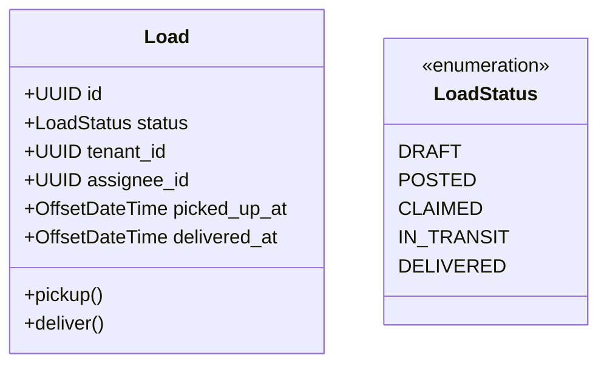

# Technical Design: Load Status Transitions (US-105)

**Role:** Architect  
**Story:** US-105  
**Status:** DESIGN_APPROVED

---

## 🏗️ Architecture Overview

This design implements the state machine transitions for the core load lifecycle (PICKED_UP and DELIVERED). It enforces the "Document Gate" required by US-305.

### Domain Model Updates

The `Load` entity will be updated to include new timestamps:

---

## 🔌 API Definition

### 1. Mark as Picked Up
- **Endpoint:** `PATCH /api/v1/loads/{id}/pickup`
- **Controller:** `LoadController`
- **Security:** `@PreAuthorize("hasRole('TRUCKER')")` + Tenant RLS.
- **Pre-conditions:**
  - Load status MUST be `CLAIMED`.
  - Current user MUST be the `assignee_id`.
  - At least one `document` with `type = BOL_PHOTO` MUST exist for this load.
- **Side Effects:**
  - Status → `IN_TRANSIT`.
  - `picked_up_at` → `now()`.
  - Publish `LoadStatusChangedEvent`.

### 2. Mark as Delivered
- **Endpoint:** `PATCH /api/v1/loads/{id}/deliver`
- **Controller:** `LoadController`
- **Security:** `@PreAuthorize("hasRole('TRUCKER')")` + Tenant RLS.
- **Pre-conditions:**
  - Load status MUST be `IN_TRANSIT`.
  - Current user MUST be the `assignee_id`.
  - At least one `document` with `type = POD_PHOTO` MUST exist for this load.
- **Side Effects:**
  - Status → `DELIVERED`.
  - `delivered_at` → `now()`.
  - Publish `LoadStatusChangedEvent`.

---

## 🛠️ Service Layer Logic

The `LoadApplicationService` will handle the orchestration:

1. **Transaction Start**
2. **Fetch Load:** `loadRepository.findByIdAndTenantId(id, tenantId)`
3. **Validate Assignee:** `if (load.getAssigneeId() != currentUser.getId()) throw Forbidden`
4. **Validate Documents:**
   - For pickup: `documentRepository.existsByLoadIdAndType(id, BOL_PHOTO)`
   - For delivery: `documentRepository.existsByLoadIdAndType(id, POD_PHOTO)`
5. **Update State:**
   - `load.setStatus(...)`
   - `load.setPickedUpAt(OffsetDateTime.now())` (or `delivered_at`)
6. **Save Load**
7. **Publish Event:** `eventPublisher.publishEvent(new LoadStatusChangedEvent(load))`
8. **Transaction Commit**

---

## 🔒 Security & Constraints (The Constitution)

- **RLS:** All queries MUST include `tenant_id`.
- **Concurrency:** Status updates are protected by the same pessimistic locking mechanism used in claiming (`US-104`).
- **Tenant Isolation:** Shippers receive notifications ONLY for loads belonging to their `tenant_id`.

---

## 📊 Field Contract Table

| Scope | UI Field | API Param | DB Column | N/A Justification |
| :--- | :--- | :--- | :--- | :--- |
| **SIGN** | Status Label | `status` | `loads.status` | — |
| **SIGN** | Pickup Date | `pickedUpAt` | `loads.picked_up_at` | — |
| **SIGN** | Delivery Date | `deliveredAt` | `loads.delivered_at` | — |
| **GATE** | "Mark Picked Up" Button | `hasBol` (bool) | `exists (documents where type=BOL)` | — |
| **GATE** | "Mark Delivered" Button | `hasPod` (bool) | `exists (documents where type=POD)` | — |

---

## Sign-Off

- **Architect:** ✅ Design complete (Gemini CLI)
- **BA:** ✅ Requirements satisfied
- **HFD:** ⬜ Pending UI Layout
