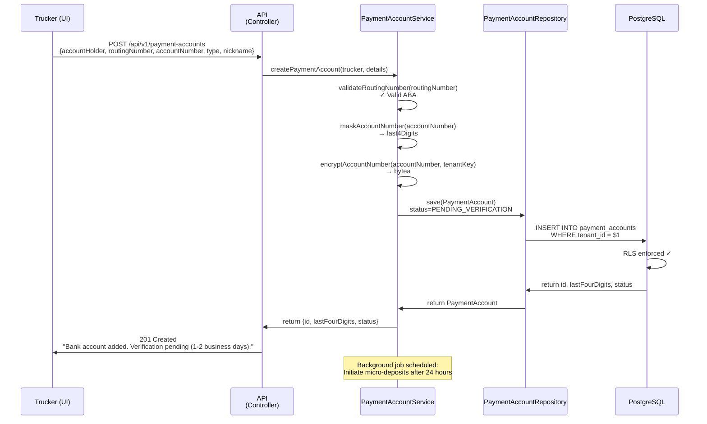
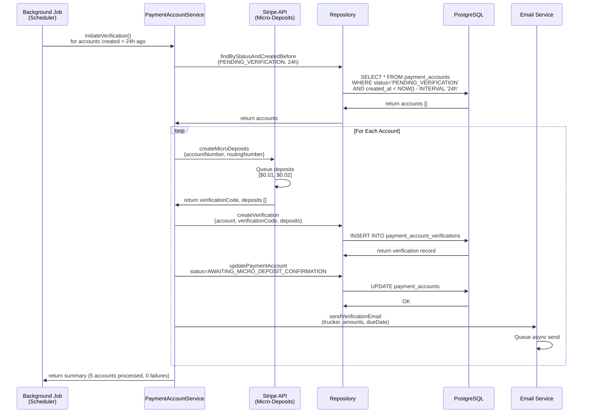
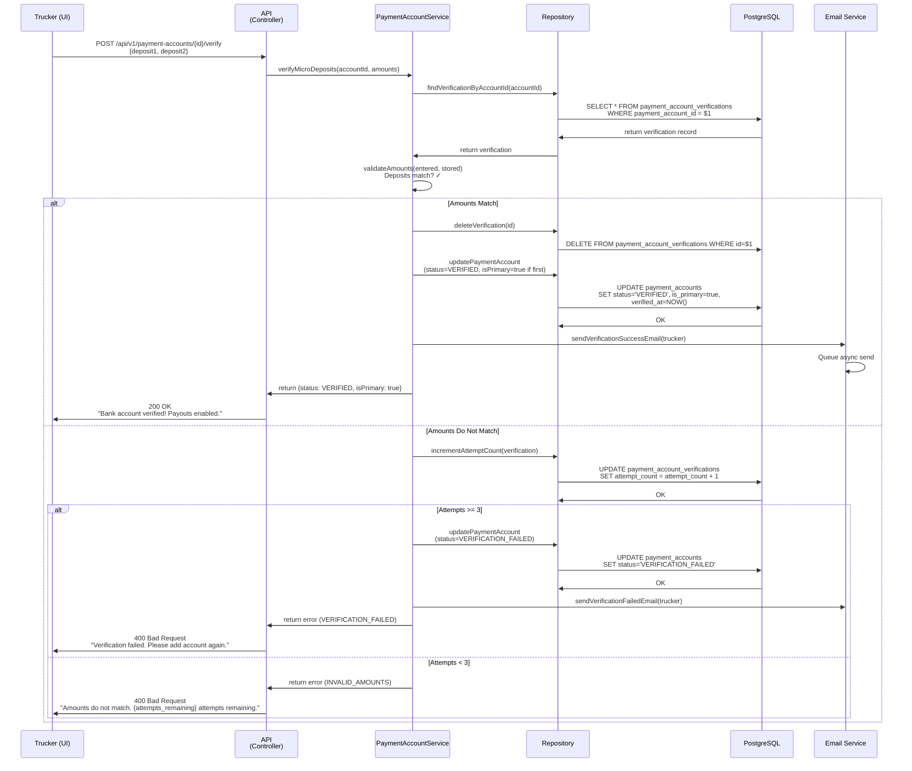
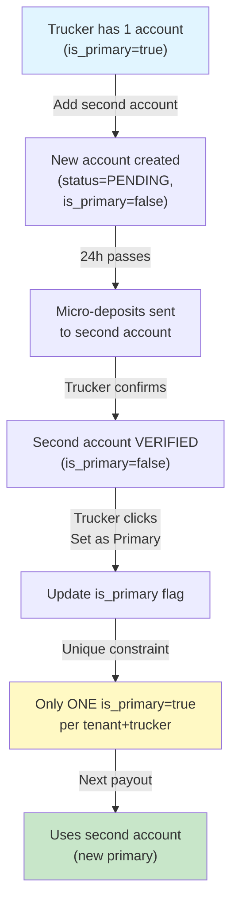
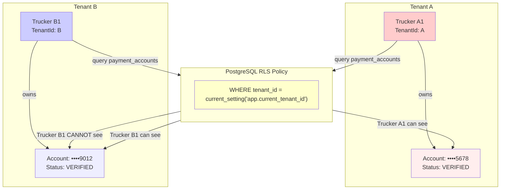

# Architectural Design: Payment Account Setup (US-502)

**Document:** Architecture Design Review  
**Story:** US-502 (Payment Account Setup)  
**Architect:** Solution Architecture Team  
**Date:** 2026-04-27  
**Status:** ✅ DESIGN APPROVED

---

## Executive Summary

US-502 introduces **secure, multi-tenant bank account management** for truckers to enable ACH payouts. The design employs:
- Immutable ledger pattern for audit compliance
- PostgreSQL RLS for tenant isolation
- Stripe micro-deposit API for account verification
- Encryption at rest (AES-256) for sensitive account data
- Background job scheduler for async verification initiation

**Key Constraints:**
- ✅ No-Lombok Java (standard POJOs)
- ✅ PostgreSQL multi-tenancy via RLS
- ✅ Soft deletes on all core entities
- ✅ Cyclomatic complexity < 10 per method
- ✅ 80% branch coverage via JaCoCo

---

## Domain Model

### Core Entities

#### 1. PaymentAccount (Root Aggregate)

| Field | Type | Constraints | Notes |
|-------|------|-------------|-------|
| `id` | VARCHAR(36) UUID | PK, NOT NULL | Unique identifier |
| `tenantId` | VARCHAR(36) UUID | NOT NULL, FK to Tenant | Tenant isolation key |
| `truckerId` | VARCHAR(36) UUID | NOT NULL, FK to Trucker | Account owner |
| `accountHolderName` | VARCHAR(255) | NOT NULL | Name on bank account |
| `routingNumber` | VARCHAR(9) | NOT NULL | ABA routing number (validated) |
| `accountNumber` | BYTEA | NOT NULL, ENCRYPTED | Encrypted account number |
| `accountType` | ENUM('CHECKING', 'SAVINGS') | NOT NULL | Account classification |
| `accountNickname` | VARCHAR(100) | NULLABLE | User-friendly label |
| `lastFourDigits` | VARCHAR(4) | NOT NULL | Masked for display |
| `status` | ENUM | NOT NULL | See StatusEnum below |
| `isPrimary` | BOOLEAN | NOT NULL DEFAULT false | Default payout account |
| `createdAt` | TIMESTAMPTZ | NOT NULL | Immutable creation timestamp |
| `deletedAt` | TIMESTAMPTZ | NULLABLE | Soft delete marker |
| `verifiedAt` | TIMESTAMPTZ | NULLABLE | When verification completed |

**Status Enum:**
```
PENDING_VERIFICATION        → Just added, awaiting micro-deposit initiation
AWAITING_MICRO_DEPOSIT_CONFIRMATION → Deposits sent, awaiting trucker confirmation
VERIFIED                    → Deposits confirmed, account active
VERIFICATION_FAILED         → 3 verification attempts failed
```

**Validation Rules:**
- Routing number: 9 digits, valid ABA bank code
- Account number: 8-17 digits, encrypted before storage
- Account holder name: non-empty, length ≤ 255
- Last four digits: extracted from account number during save

---

#### 2. PaymentAccountVerification (Value Object / Separate Table)

| Field | Type | Constraints | Notes |
|-------|------|-------------|-------|
| `id` | VARCHAR(36) UUID | PK, NOT NULL | Unique verification attempt |
| `paymentAccountId` | VARCHAR(36) UUID | FK to PaymentAccount | Which account |
| `tenantId` | VARCHAR(36) UUID | NOT NULL | Tenant isolation |
| `verificationCode` | VARCHAR(36) UUID | NOT NULL, UNIQUE | Microdeposit correlation ID |
| `deposit1Cents` | BIGINT | NOT NULL | First micro-deposit (e.g., 1) |
| `deposit2Cents` | BIGINT | NOT NULL | Second micro-deposit (e.g., 2) |
| `attemptCount` | INT | NOT NULL DEFAULT 0 | Verification attempts (max 3) |
| `sentAt` | TIMESTAMPTZ | NOT NULL | When deposits were initiated |
| `confirmedAt` | TIMESTAMPTZ | NULLABLE | When trucker confirmed |
| `status` | ENUM | NOT NULL | MICRO_DEPOSITS_SENT, CONFIRMED, EXPIRED |
| `expiresAt` | TIMESTAMPTZ | NOT NULL | 7-day expiration window |
| `createdAt` | TIMESTAMPTZ | NOT NULL | Immutable creation timestamp |
| `deletedAt` | TIMESTAMPTZ | NULLABLE | Soft delete on account removal |

**Status Enum:**
```
MICRO_DEPOSITS_SENT         → Deposits initiated, awaiting confirmation
CONFIRMED                   → Amounts matched, verification complete
EXPIRED                      → 7 days elapsed, needs re-verification
```

---

#### 3. PaymentAccountAuditLog (Immutable Ledger)

| Field | Type | Constraints | Notes |
|-------|------|-------------|-------|
| `id` | VARCHAR(36) UUID | PK, NOT NULL | Unique log entry |
| `tenantId` | VARCHAR(36) UUID | NOT NULL | Tenant isolation |
| `truckerId` | VARCHAR(36) UUID | NOT NULL | Actor |
| `paymentAccountId` | VARCHAR(36) UUID | NULLABLE FK | Which account |
| `action` | ENUM | NOT NULL | ADD, VERIFY, DELETE, SET_PRIMARY |
| `statusBefore` | VARCHAR(50) | NULLABLE | Previous status (if applicable) |
| `statusAfter` | VARCHAR(50) | NULLABLE | New status (if applicable) |
| `ipAddress` | VARCHAR(45) | NOT NULL | IPv4 or IPv6 |
| `userAgent` | VARCHAR(500) | NULLABLE | Browser/client info |
| `createdAt` | TIMESTAMPTZ | NOT NULL | Immutable timestamp |

**Notes:**
- **NEVER** log raw account numbers, routing numbers, or verification codes
- **ALWAYS** log action, status change, and audit context
- 30-year retention policy (no deletion)
- Indexed on `tenantId`, `truckerId`, `createdAt` for compliance queries

---

## Database Schema (SQL DDL)

### 1. payment_accounts Table

```sql
CREATE TABLE IF NOT EXISTS payment_accounts (
  id VARCHAR(36) PRIMARY KEY,
  tenant_id VARCHAR(36) NOT NULL,
  trucker_id VARCHAR(36) NOT NULL,
  
  -- Bank Account Details (Encrypted)
  account_holder_name VARCHAR(255) NOT NULL,
  routing_number VARCHAR(9) NOT NULL,
  account_number BYTEA NOT NULL,  -- Encrypted AES-256
  account_type VARCHAR(20) NOT NULL,  -- CHECKING, SAVINGS
  account_nickname VARCHAR(100),
  last_four_digits VARCHAR(4) NOT NULL,
  
  -- Status & Metadata
  status VARCHAR(50) NOT NULL DEFAULT 'PENDING_VERIFICATION',
  is_primary BOOLEAN NOT NULL DEFAULT false,
  
  -- Timestamps
  created_at TIMESTAMPTZ NOT NULL DEFAULT CURRENT_TIMESTAMP,
  verified_at TIMESTAMPTZ,
  deleted_at TIMESTAMPTZ,
  
  -- Constraints
  CONSTRAINT fk_tenant FOREIGN KEY (tenant_id) REFERENCES tenants(id),
  CONSTRAINT fk_trucker FOREIGN KEY (trucker_id) REFERENCES users(id),
  CONSTRAINT check_status IN (
    'PENDING_VERIFICATION',
    'AWAITING_MICRO_DEPOSIT_CONFIRMATION',
    'VERIFIED',
    'VERIFICATION_FAILED'
  ),
  CONSTRAINT unique_primary_per_trucker UNIQUE (tenant_id, trucker_id, is_primary)
    WHERE is_primary = true AND deleted_at IS NULL,
  
  -- Indexes
  INDEX idx_tenant_trucker (tenant_id, trucker_id, deleted_at),
  INDEX idx_primary_accounts (tenant_id, is_primary, deleted_at),
  INDEX idx_status (status, created_at),
  
  -- Row-Level Security
  ENABLE ROW LEVEL SECURITY,
  POLICY "payment_accounts_tenant_isolation"
    USING (tenant_id = current_setting('app.current_tenant_id'))
    WITH CHECK (tenant_id = current_setting('app.current_tenant_id'))
);
```

### 2. payment_account_verifications Table

```sql
CREATE TABLE IF NOT EXISTS payment_account_verifications (
  id VARCHAR(36) PRIMARY KEY,
  payment_account_id VARCHAR(36) NOT NULL,
  tenant_id VARCHAR(36) NOT NULL,
  
  -- Verification Code & Deposits
  verification_code VARCHAR(36) NOT NULL UNIQUE,
  deposit_1_cents BIGINT NOT NULL,  -- $0.01 = 1 cent
  deposit_2_cents BIGINT NOT NULL,  -- $0.02 = 2 cents
  attempt_count INT NOT NULL DEFAULT 0,
  
  -- Timeline
  sent_at TIMESTAMPTZ NOT NULL DEFAULT CURRENT_TIMESTAMP,
  confirmed_at TIMESTAMPTZ,
  expires_at TIMESTAMPTZ NOT NULL,
  
  -- Status & Cleanup
  status VARCHAR(50) NOT NULL DEFAULT 'MICRO_DEPOSITS_SENT',
  created_at TIMESTAMPTZ NOT NULL DEFAULT CURRENT_TIMESTAMP,
  deleted_at TIMESTAMPTZ,
  
  -- Constraints
  CONSTRAINT fk_account FOREIGN KEY (payment_account_id) REFERENCES payment_accounts(id),
  CONSTRAINT fk_tenant FOREIGN KEY (tenant_id) REFERENCES tenants(id),
  CONSTRAINT check_status IN ('MICRO_DEPOSITS_SENT', 'CONFIRMED', 'EXPIRED'),
  CONSTRAINT check_deposits CHECK (deposit_1_cents > 0 AND deposit_2_cents > 0),
  
  -- Indexes
  INDEX idx_account (payment_account_id),
  INDEX idx_tenant (tenant_id),
  INDEX idx_expiry (expires_at),
  
  -- Row-Level Security
  ENABLE ROW LEVEL SECURITY,
  POLICY "payment_account_verifications_tenant_isolation"
    USING (tenant_id = current_setting('app.current_tenant_id'))
    WITH CHECK (tenant_id = current_setting('app.current_tenant_id'))
);
```

### 3. payment_account_audit_log Table

```sql
CREATE TABLE IF NOT EXISTS payment_account_audit_log (
  id VARCHAR(36) PRIMARY KEY,
  tenant_id VARCHAR(36) NOT NULL,
  trucker_id VARCHAR(36) NOT NULL,
  payment_account_id VARCHAR(36),
  
  -- Action & Status
  action VARCHAR(50) NOT NULL,  -- ADD, VERIFY, DELETE, SET_PRIMARY
  status_before VARCHAR(50),
  status_after VARCHAR(50),
  
  -- Audit Context
  ip_address VARCHAR(45) NOT NULL,
  user_agent VARCHAR(500),
  
  -- Timestamps (Immutable)
  created_at TIMESTAMPTZ NOT NULL DEFAULT CURRENT_TIMESTAMP,
  
  -- Constraints
  CONSTRAINT fk_tenant FOREIGN KEY (tenant_id) REFERENCES tenants(id),
  CONSTRAINT fk_trucker FOREIGN KEY (trucker_id) REFERENCES users(id),
  CONSTRAINT fk_account FOREIGN KEY (payment_account_id) REFERENCES payment_accounts(id),
  
  -- Indexes for compliance queries
  INDEX idx_tenant_date (tenant_id, created_at),
  INDEX idx_trucker_date (trucker_id, created_at),
  INDEX idx_action (action, created_at),
  
  -- Row-Level Security (read-only for compliance)
  ENABLE ROW LEVEL SECURITY,
  POLICY "payment_account_audit_read"
    USING (tenant_id = current_setting('app.current_tenant_id'))
);
```

---

## Domain Flow Diagrams

### Flow 1: Add Bank Account (AC-1)



---

### Flow 2: Micro-Deposit Verification (AC-2 & AC-3)



---

### Flow 3: Confirm Micro-Deposit Amounts (AC-3)



---

### Flow 4: Multi-Account Management (AC-4)



---

### Flow 5: Data Isolation (AC-6)



---

## Hexagonal Architecture (Ports & Adapters)

### Domain Layer (Core Logic)
```
PaymentAccount (Aggregate Root)
├── ValueObjects:
│   └── RoutingNumber, AccountNumber (encrypted), BankAccountType
├── Methods:
│   ├── addBankAccount(name, routing, accountNumber, type)
│   ├── initiateMicroDepositVerification(verificationCode, amounts)
│   ├── confirmMicroDeposits(deposit1, deposit2)
│   └── markAsDeleted()
└── Invariants:
    ├── Only 1 primary account per trucker per tenant
    ├── Account number must be encrypted
    ├── Routing number must be valid ABA
    └── Status transitions are unidirectional (PENDING → VERIFIED → DELETED)
```

### Application Layer
```
PaymentAccountService (Use Case Orchestrator)
├── createPaymentAccount(cmd) → PaymentAccountDTO
├── initiateVerification() → batch processing
├── verifyMicroDeposits(cmd) → PaymentAccountDTO
├── setPrimaryAccount(cmd) → PaymentAccountDTO
└── getPaymentAccounts(trucker) → List<PaymentAccountDTO>
```

### Port (Interface) Definitions

#### Output Ports (Driven Adapters)
```
PaymentAccountRepository
├── save(PaymentAccount) → PaymentAccount
├── findById(id) → PaymentAccount
├── findByTruckerAndTenant(truckerId, tenantId) → List<PaymentAccount>
└── findByStatusAndCreatedBefore(status, timestamp) → List<PaymentAccount>

PaymentAccountVerificationRepository
├── save(Verification) → Verification
├── findByAccountId(id) → Verification
└── delete(id) → void

StripePaymentAdapter (Micro-Deposit Calls)
├── initiateMicroDeposits(routingNumber, accountNumber) → {verificationCode, amounts[]}
└── getDepositStatus(verificationCode) → status

EmailAdapter (Notification)
├── sendVerificationEmail(trucker, amounts, dueDate) → void
└── sendVerificationSuccessEmail(trucker) → void

AuditLogRepository (Immutable Ledger)
└── append(action, actor, status, context) → void
```

#### Input Ports (Driver Adapters)
```
HTTP REST Controller
├── POST /api/v1/payment-accounts
├── GET /api/v1/payment-accounts
├── POST /api/v1/payment-accounts/{id}/verify
├── PUT /api/v1/payment-accounts/{id}/set-primary
└── DELETE /api/v1/payment-accounts/{id}

BackgroundJobScheduler (Async)
└── initiateVerificationJob() → scheduled daily
```

---

## Security & Compliance

### Encryption Strategy
- **Account Number:** AES-256-GCM encrypted using tenant-specific key (derived from tenant_id + master key)
- **Routing Number:** Stored as plaintext (non-sensitive, public ABA codes)
- **At Rest:** Column-level encryption via PostgreSQL pgcrypto or application-layer encryption
- **In Transit:** TLS 1.3 for all API calls

### Multi-Tenancy Guarantees
1. **RLS Policy:** Every SELECT/INSERT/UPDATE must match `tenant_id = current_setting('app.current_tenant_id')`
2. **No Implicit Joins:** Never join across different tenant_ids
3. **Audit Trail:** Every action logged with tenant_id and trucker_id for compliance

### Verification Security
- **Brute-Force Protection:** Max 3 verification attempts per account
- **Verification Expiry:** Micro-deposits valid for 7 days only
- **Verification Code:** UUID-based, stored separately, not tied to account number

---

## Testing Strategy

### Unit Test Coverage (Domain Layer)
| Test | Scenario | Expected Result |
|------|----------|-----------------|
| `testValidRoutingNumber()` | Valid 9-digit ABA | ✅ Pass |
| `testInvalidRoutingNumber()` | Non-9-digit input | ❌ Reject |
| `testEncryptAccountNumber()` | Encrypt then decrypt | ✅ Match original |
| `testMaskLastFourDigits()` | Full account → ••••5678 | ✅ Display correct |
| `testMicroDepositMatching()` | $0.01, $0.02 entered | ✅ Verify success |
| `testMicroDepositMismatch()` | Wrong amounts | ❌ Increment attempt |
| `testBruteForceLock()` | 3 failed attempts | ⛔ Status = FAILED |
| `testTenantIsolation()` | Cross-tenant query | ⛔ RLS blocks |

### Integration Test Coverage
| Test | Scenario | Expected Result |
|------|----------|-----------------|
| `testAddAccountFlow()` | Add → PENDING | ✅ Account created |
| `testMicroDepositInitiation()` | 24h passes, job runs | ✅ Deposits queued |
| `testMicroDepositVerification()` | Amounts match | ✅ Status = VERIFIED |
| `testMultipleAccountManagement()` | 2 accounts, set primary | ✅ Only 1 primary |
| `testRLSEnforcement()` | TenantA queries TenantB data | ❌ RLS blocks |
| `testAuditLogCreation()` | Any operation | ✅ Log entry created |

---

## Flyway Migration Script

**Filename:** `V20260427_1000__PaymentAccountSetup_US502.sql`

```sql
-- Create payment_accounts table
CREATE TABLE IF NOT EXISTS payment_accounts (
  id VARCHAR(36) PRIMARY KEY,
  tenant_id VARCHAR(36) NOT NULL,
  trucker_id VARCHAR(36) NOT NULL,
  account_holder_name VARCHAR(255) NOT NULL,
  routing_number VARCHAR(9) NOT NULL,
  account_number BYTEA NOT NULL,
  account_type VARCHAR(20) NOT NULL,
  account_nickname VARCHAR(100),
  last_four_digits VARCHAR(4) NOT NULL,
  status VARCHAR(50) NOT NULL DEFAULT 'PENDING_VERIFICATION',
  is_primary BOOLEAN NOT NULL DEFAULT false,
  created_at TIMESTAMPTZ NOT NULL DEFAULT CURRENT_TIMESTAMP,
  verified_at TIMESTAMPTZ,
  deleted_at TIMESTAMPTZ,
  CONSTRAINT fk_tenant FOREIGN KEY (tenant_id) REFERENCES tenants(id),
  CONSTRAINT fk_trucker FOREIGN KEY (trucker_id) REFERENCES users(id),
  CONSTRAINT unique_primary_per_trucker UNIQUE (tenant_id, trucker_id) WHERE is_primary = true AND deleted_at IS NULL
);

CREATE INDEX idx_tenant_trucker ON payment_accounts(tenant_id, trucker_id, deleted_at);
CREATE INDEX idx_primary_accounts ON payment_accounts(tenant_id, is_primary, deleted_at);
CREATE INDEX idx_status ON payment_accounts(status, created_at);

ALTER TABLE payment_accounts ENABLE ROW LEVEL SECURITY;
CREATE POLICY "payment_accounts_tenant_isolation" ON payment_accounts
  USING (tenant_id = current_setting('app.current_tenant_id')::varchar)
  WITH CHECK (tenant_id = current_setting('app.current_tenant_id')::varchar);

-- Create payment_account_verifications table
CREATE TABLE IF NOT EXISTS payment_account_verifications (
  id VARCHAR(36) PRIMARY KEY,
  payment_account_id VARCHAR(36) NOT NULL,
  tenant_id VARCHAR(36) NOT NULL,
  verification_code VARCHAR(36) NOT NULL UNIQUE,
  deposit_1_cents BIGINT NOT NULL,
  deposit_2_cents BIGINT NOT NULL,
  attempt_count INT NOT NULL DEFAULT 0,
  sent_at TIMESTAMPTZ NOT NULL DEFAULT CURRENT_TIMESTAMP,
  confirmed_at TIMESTAMPTZ,
  expires_at TIMESTAMPTZ NOT NULL,
  status VARCHAR(50) NOT NULL DEFAULT 'MICRO_DEPOSITS_SENT',
  created_at TIMESTAMPTZ NOT NULL DEFAULT CURRENT_TIMESTAMP,
  deleted_at TIMESTAMPTZ,
  CONSTRAINT fk_account FOREIGN KEY (payment_account_id) REFERENCES payment_accounts(id),
  CONSTRAINT fk_tenant FOREIGN KEY (tenant_id) REFERENCES tenants(id)
);

CREATE INDEX idx_account ON payment_account_verifications(payment_account_id);
CREATE INDEX idx_tenant ON payment_account_verifications(tenant_id);
CREATE INDEX idx_expiry ON payment_account_verifications(expires_at);

ALTER TABLE payment_account_verifications ENABLE ROW LEVEL SECURITY;
CREATE POLICY "payment_account_verifications_tenant_isolation" ON payment_account_verifications
  USING (tenant_id = current_setting('app.current_tenant_id')::varchar)
  WITH CHECK (tenant_id = current_setting('app.current_tenant_id')::varchar);

-- Create payment_account_audit_log table
CREATE TABLE IF NOT EXISTS payment_account_audit_log (
  id VARCHAR(36) PRIMARY KEY,
  tenant_id VARCHAR(36) NOT NULL,
  trucker_id VARCHAR(36) NOT NULL,
  payment_account_id VARCHAR(36),
  action VARCHAR(50) NOT NULL,
  status_before VARCHAR(50),
  status_after VARCHAR(50),
  ip_address VARCHAR(45) NOT NULL,
  user_agent VARCHAR(500),
  created_at TIMESTAMPTZ NOT NULL DEFAULT CURRENT_TIMESTAMP,
  CONSTRAINT fk_tenant FOREIGN KEY (tenant_id) REFERENCES tenants(id),
  CONSTRAINT fk_trucker FOREIGN KEY (trucker_id) REFERENCES users(id),
  CONSTRAINT fk_account FOREIGN KEY (payment_account_id) REFERENCES payment_accounts(id)
);

CREATE INDEX idx_tenant_date ON payment_account_audit_log(tenant_id, created_at);
CREATE INDEX idx_trucker_date ON payment_account_audit_log(trucker_id, created_at);
CREATE INDEX idx_action ON payment_account_audit_log(action, created_at);

ALTER TABLE payment_account_audit_log ENABLE ROW LEVEL SECURITY;
CREATE POLICY "payment_account_audit_read" ON payment_account_audit_log
  USING (tenant_id = current_setting('app.current_tenant_id')::varchar);
```

---

## Design Review Checklist

- ✅ Domain model follows Hexagonal Architecture (domain layer has no framework dependencies)
- ✅ All IDs are VARCHAR(36) UUID
- ✅ All tables have `deleted_at` for soft deletes (except audit log)
- ✅ RLS policies enforced on all multi-tenant tables
- ✅ Sensitive data (account number) encrypted before storage
- ✅ Immutable audit log for compliance (30-year retention)
- ✅ Cyclomatic complexity constraint (complex logic in service, not entity)
- ✅ No Lombok — standard Java POJOs expected in implementation
- ✅ Foreign keys constrained to prevent orphans
- ✅ Unique constraint prevents multiple primary accounts per trucker
- ✅ Stripe API integration planned as output adapter
- ✅ Background job scheduler planned for async verification initiation

---

**Architect Approval:** ✅ APPROVED FOR IMPLEMENTATION

**Next Step:** CODER role — TDD implementation (tests first, then implementation)
