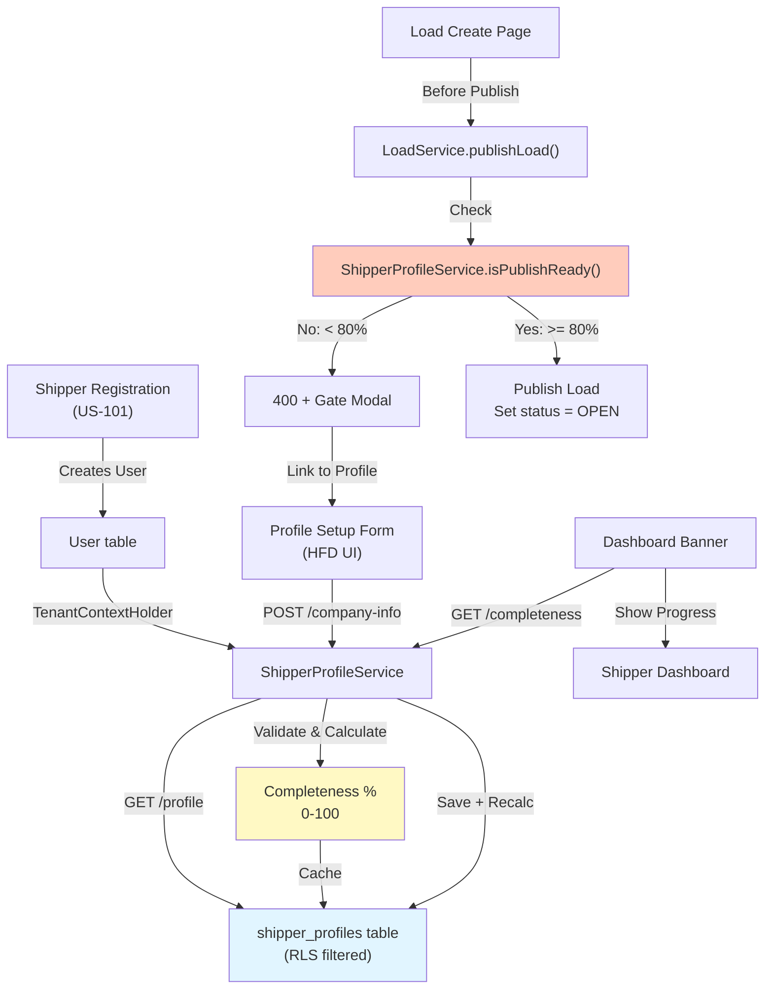

# US-713: Shipper Company Profile Setup — Architecture Design

**Phase:** Phase 7 (Carrier & User Management)  
**Dependency:** US-101 (User Registration)  
**Constraint:** Gated at 80% completeness before load publishing

---

## 1. Domain Model

### Entity: ShipperProfile
Represents company profile data for a shipper tenant. One profile per tenant (shipper organization).

**Responsibilities:**
- Store company metadata (name, contact, location)
- Calculate completeness % based on field population
- Enable pre-publish validation gate (≥ 80% required)

---

## 2. Database Schema

### Table: `shipper_profiles`

| Column | Type | Constraints | Purpose |
|---|---|---|---|
| `id` | VARCHAR(36) | PK, NOT NULL | Unique profile ID (UUID) |
| `tenant_id` | VARCHAR(36) | FK (users.tenant_id), NOT NULL, indexed | Multi-tenancy isolation; RLS filter |
| `company_name` | VARCHAR(120) | NOT NULL | Legal company name (visible to truckers) |
| `billing_email` | VARCHAR(255) | NOT NULL | Invoice/payment notifications |
| `phone_number` | VARCHAR(20) | NOT NULL | Trucker contact; format: (XXX) XXX-XXXX |
| `city` | VARCHAR(100) | NOT NULL | City (part of physical address) |
| `state` | VARCHAR(2) | NOT NULL | State code (AL, AK, ..., WY); validated on insert |
| `zip_code` | VARCHAR(5) | NOT NULL | 5-digit ZIP code |
| `mc_number` | VARCHAR(8) | NULL | Motor Carrier Number (6–8 digits) |
| `usdot_number` | VARCHAR(8) | NULL | USDOT Number (up to 8 digits) |
| `logo_url` | VARCHAR(500) | NULL | S3 URL to company logo (uploaded via US-301) |
| `completeness_pct` | SMALLINT | DEFAULT 0, CHECK (0 <= completeness_pct <= 100) | Computed % (0–100); cached for performance |
| `created_at` | TIMESTAMPTZ | NOT NULL, DEFAULT CURRENT_TIMESTAMP | Audit |
| `updated_at` | TIMESTAMPTZ | NOT NULL, DEFAULT CURRENT_TIMESTAMP | Audit |
| `deleted_at` | TIMESTAMPTZ | NULL | Soft delete flag |

### Indexes
- **Primary Index:** `(id)` — PK lookup
- **Tenant Index:** `(tenant_id, deleted_at)` — Multi-tenant RLS queries
- **Composite Index:** `(tenant_id, deleted_at, completeness_pct)` — Load publishing gate query

---

## 3. Row-Level Security (RLS)

### Policy: `shipper_profiles_tenant_isolation`

```sql
CREATE POLICY shipper_profiles_tenant_isolation ON shipper_profiles
  USING (tenant_id = app.current_tenant_id AND deleted_at IS NULL);
```

**Effect:** All SELECT/UPDATE/DELETE queries implicitly filter by current tenant. No shipper can read or modify another tenant's profile.

---

## 4. Completeness Calculation (Business Logic)

Calculated in application layer; cached in `completeness_pct` column for fast publish-gate checks.

| Field Completed | Points | Logic |
|---|---|---|
| `company_name` | 20 | NOT NULL ✓ |
| `billing_email` | 20 | NOT NULL + valid email format ✓ |
| `phone_number` | 15 | NOT NULL + valid US format ✓ |
| `city` | 15 | NOT NULL ✓ |
| `state` | 5 | NOT NULL + 2-letter code ✓ |
| `zip_code` | 10 | NOT NULL + 5-digit format ✓ |
| `mc_number` OR `usdot_number` | 15 | At least one: 6–8 digits ✓ |
| `logo_url` | 5 | NOT NULL ✓ |

**Min 80% without logo or MC/USDOT:**
- company_name (20) + billing_email (20) + phone (15) + city (15) + state (5) + zip (10) = 85% ✓

**Calculation Logic (Pseudocode):**
```
completeness = 0
if company_name is not null: completeness += 20
if billing_email is not null and valid: completeness += 20
if phone_number is not null and valid: completeness += 15
if city is not null: completeness += 15
if state is not null and 2-letter: completeness += 5
if zip_code is not null and 5-digit: completeness += 10
if mc_number is not null OR usdot_number is not null: completeness += 15
if logo_url is not null: completeness += 5
return min(completeness, 100)
```

---

## 5. API Contracts

### Endpoint: GET `/api/v1/profile/company-info`

**Purpose:** Fetch shipper's current company profile + completeness %

**Response (200 OK):**
```json
{
  "id": "uuid-shipper-profile-001",
  "companyName": "Apex Freight Solutions LLC",
  "billingEmail": "billing@apexfreight.com",
  "phoneNumber": "(512) 555-0182",
  "city": "Austin",
  "state": "TX",
  "zipCode": "78701",
  "mcNumber": "123456",
  "usdotNumber": "12345678",
  "logoUrl": "https://s3.amazonaws.com/freightclub/logos/uuid.png",
  "completeness_pct": 85,
  "createdAt": "2026-05-13T10:30:00Z",
  "updatedAt": "2026-05-13T10:30:00Z"
}
```

**Error (404 Not Found):**
```json
{
  "error": "Profile not found. Create a profile to get started.",
  "completeness_pct": 0
}
```

---

### Endpoint: POST/PUT `/api/v1/profile/company-info`

**Purpose:** Create or update shipper company profile

**Request Body:**
```json
{
  "companyName": "Apex Freight Solutions LLC",
  "billingEmail": "billing@apexfreight.com",
  "phoneNumber": "(512) 555-0182",
  "city": "Austin",
  "state": "TX",
  "zipCode": "78701",
  "mcNumber": "123456",
  "usdotNumber": null,
  "logoUrl": null
}
```

**Response (201 Created / 200 OK):**
```json
{
  "id": "uuid-shipper-profile-001",
  "companyName": "Apex Freight Solutions LLC",
  "billingEmail": "billing@apexfreight.com",
  "phoneNumber": "(512) 555-0182",
  "city": "Austin",
  "state": "TX",
  "zipCode": "78701",
  "mcNumber": "123456",
  "usdotNumber": null,
  "logoUrl": null,
  "completeness_pct": 80,
  "createdAt": "2026-05-13T10:30:00Z",
  "updatedAt": "2026-05-13T10:30:00Z"
}
```

**Validation Errors (400 Bad Request):**
```json
{
  "error": "Validation failed",
  "details": [
    { "field": "companyName", "message": "Required field" },
    { "field": "billingEmail", "message": "Invalid email format" },
    { "field": "state", "message": "Must be a valid 2-letter state code" },
    { "field": "zipCode", "message": "Must be a 5-digit ZIP code" }
  ]
}
```

---

### Endpoint: GET `/api/v1/profile/completeness`

**Purpose:** Check if shipper profile ≥ 80% complete (used by publish gate)

**Response (200 OK):**
```json
{
  "completeness_pct": 85,
  "isPublishReady": true,
  "remainingFields": []
}
```

**Or (if incomplete):**
```json
{
  "completeness_pct": 40,
  "isPublishReady": false,
  "remainingFields": ["companyName", "city", "state", "zipCode"]
}
```

---

## 6. Service Layer Design

### Class: ShipperProfileService

**Responsibilities:**
- CRUD operations on `ShipperProfile` entity
- Completeness % calculation
- Multi-tenant context enforcement (via TenantContextHolder)
- RLS + soft-delete filtering

**Key Methods:**
```java
public ShipperProfile getProfile() 
  // Fetches current tenant's profile; 
  // returns empty/default if not exists

public ShipperProfile saveProfile(ShipperProfileRequest req) 
  // Validates fields, calculates completeness,
  // persists to DB; returns updated profile

public Integer getCompletenessPercent() 
  // Returns cached completeness_pct

public boolean isPublishReady() 
  // Returns completeness_pct >= 80

public void markAsPublished() 
  // Optional: track when profile is first used for publishing
```

**Database Queries (with RLS):**
- `SELECT * FROM shipper_profiles WHERE tenant_id = ? AND deleted_at IS NULL`
- `INSERT INTO shipper_profiles (...) VALUES (...)`
- `UPDATE shipper_profiles SET ... WHERE id = ? AND tenant_id = ? AND deleted_at IS NULL`
- `UPDATE shipper_profiles SET deleted_at = NOW() WHERE id = ? AND tenant_id = ?` (soft delete)

---

## 7. Load Publishing Gate (Integration Point)

### Validation Before Publish (LoadService)

**When shipper clicks "Publish" on a DRAFT load:**

```
1. Check shipper's profile completeness:
   GET /api/v1/profile/completeness
   
2. If completeness_pct < 80:
   - Block publish action
   - Return 400 Bad Request:
     {
       "error": "Profile incomplete",
       "message": "Complete your company profile (currently X% complete) before publishing loads.",
       "completeness_pct": 40,
       "remainingFields": ["city", "state", "zipCode"]
     }
   - Frontend displays modal with "Complete Profile" CTA

3. If completeness_pct >= 80:
   - Proceed with load publish logic
   - Set load status = OPEN
```

**Implementation Location:**
- Service: `LoadService.publishLoad(loadId)`
- Check: `ShipperProfileService.isPublishReady()`
- If not ready: Throw `InsufficientProfileCompletenessException`
- Frontend catches 400 + displays gate modal

---

## 8. Data Flow Diagram



---

## 9. Flyway Migration Script

**File:** `V20260513_0930__CreateShipperProfiles.sql`

```sql
-- Create shipper_profiles table
CREATE TABLE shipper_profiles (
  id VARCHAR(36) PRIMARY KEY NOT NULL,
  tenant_id VARCHAR(36) NOT NULL,
  company_name VARCHAR(120) NOT NULL,
  billing_email VARCHAR(255) NOT NULL,
  phone_number VARCHAR(20) NOT NULL,
  city VARCHAR(100) NOT NULL,
  state VARCHAR(2) NOT NULL,
  zip_code VARCHAR(5) NOT NULL,
  mc_number VARCHAR(8),
  usdot_number VARCHAR(8),
  logo_url VARCHAR(500),
  completeness_pct SMALLINT DEFAULT 0 CHECK (completeness_pct >= 0 AND completeness_pct <= 100),
  created_at TIMESTAMPTZ NOT NULL DEFAULT CURRENT_TIMESTAMP,
  updated_at TIMESTAMPTZ NOT NULL DEFAULT CURRENT_TIMESTAMP,
  deleted_at TIMESTAMPTZ,
  CONSTRAINT fk_shipper_profiles_tenant FOREIGN KEY (tenant_id) REFERENCES users(tenant_id) ON DELETE CASCADE
);

-- Indexes
CREATE INDEX idx_shipper_profiles_tenant ON shipper_profiles(tenant_id, deleted_at);
CREATE INDEX idx_shipper_profiles_completeness ON shipper_profiles(tenant_id, deleted_at, completeness_pct);

-- RLS Policy
ALTER TABLE shipper_profiles ENABLE ROW LEVEL SECURITY;

CREATE POLICY shipper_profiles_tenant_isolation ON shipper_profiles
  USING (tenant_id = current_setting('app.current_tenant_id') AND deleted_at IS NULL)
  WITH CHECK (tenant_id = current_setting('app.current_tenant_id') AND deleted_at IS NULL);

-- Grant permissions to runtime role
GRANT SELECT, INSERT, UPDATE ON shipper_profiles TO freightclub_runtime;
```

---

## 10. CODER Hand-Off: Implementation Checklist

### Backend (Java/Spring)

- [ ] Create JPA entity: `ShipperProfile` (no-lombok; manual getters/setters)
- [ ] Create repository: `ShipperProfileRepository` (extends JpaRepository)
  - Include query: `findByTenantIdAndDeletedAtIsNull(tenantId)`
  - Include soft-delete logic
- [ ] Create service: `ShipperProfileService` 
  - Methods: `getProfile()`, `saveProfile(req)`, `getCompletenessPercent()`, `isPublishReady()`
  - TenantContextHolder enforcement
- [ ] Create controller: `ProfileController` with endpoints:
  - `GET /api/v1/profile/company-info`
  - `POST /api/v1/profile/company-info` (creates or updates)
  - `GET /api/v1/profile/completeness` (publish gate check)
- [ ] Add validation: Email format, phone format, state codes, ZIP codes
- [ ] Run Flyway migration: `V20260513_0930__CreateShipperProfiles.sql`
- [ ] Create unit tests: Completeness calculation, validation, RLS filtering
- [ ] Create integration tests: Full save flow, multi-tenant isolation, publish gate

### Frontend (React/TypeScript)

- [ ] Create form component: `ShipperProfileSetupForm` (per HFD spec)
- [ ] Create hook: `useShipperProfile()` (fetch/save via React Query)
- [ ] Create hook: `useProfileCompleteness()` (for dashboard banner)
- [ ] Create component: `ProfileCompletionBanner` (dismissible, on dashboard)
- [ ] Integrate publish gate: Check completeness before allowing "Publish" button
  - Show modal with remaining fields if < 80%
  - Link to profile setup form
- [ ] Add toast notifications: Success (green), error (red)
- [ ] Responsive layout: Full-width on sm, centered 600px on lg
- [ ] ARIA labels: Form fields, progress bar, error messages
- [ ] Test: Save form, progress bar updates, banner dismisses, publish gate blocks

---

## 11. NFR & Acceptance Thresholds

- **Save latency:** ≤ 500ms (single DB write)
- **Publish gate check:** ≤ 100ms (cached completeness_pct)
- **Test coverage:** ≥ 80% branch coverage (JaCoCo)
- **RLS enforcement:** All queries include `deleted_at IS NULL` filter
- **Multi-tenancy:** No shipper profile visible outside its tenant
- **Soft delete:** Never DELETE; always set `deleted_at`

---

## 12. Sign-Off

- [ ] Architect design complete (this document)
- [ ] CODER implementation ready
- [ ] Reviewer ready (once CODER submits PR)

