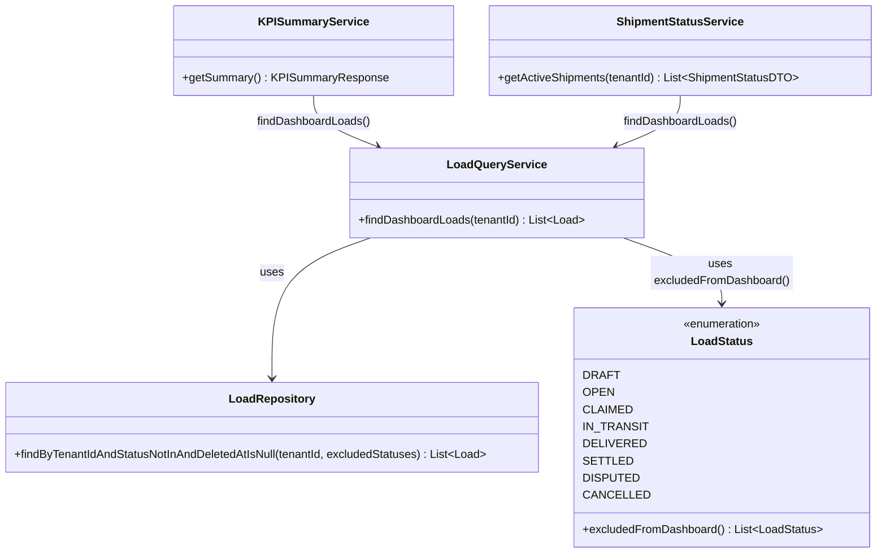

# US-820 Follow-up: KPI / Shipment Status Query Consolidation — Architect Design

**Story:** US-820 (bug fix + platform integrity follow-up) | **Jira:** —
**Architect Gate:** ✅ ACCEPTED retroactively 2026-07-20 — written after implementation began; flagged as a process violation, not repeated (see `feedback_skip_architect_gate_on_own_session_work.md`)
**Constraint:** No Java/TypeScript code below — design only, per ARCHITECT.md.

---

## Problem

`KPISummaryService` (US-820, live) and `ShipmentStatusService` (US-822, live) both need "the set of loads relevant to the shipper dashboard" for the same tenant, computed independently:

- `KPISummaryService` originally fetched **all** non-deleted loads (`findByTenantIdAndDeletedAtIsNull`), then Java-filtered `CLAIMED`/`IN_TRANSIT` for the active count.
- `ShipmentStatusService` ran its own native SQL (`status NOT IN ('DRAFT','CANCELLED','SETTLED','DISPUTED')`, joined `users` for carrier name).

These two independently-written filters drifted: the KPI tile excluded `OPEN` ("Posted") loads, the Shipment Status panel included them. A freshly-posted, unclaimed load showed as "1 active shipment" in one panel and "0 active shipments" in the KPI tile on the same dashboard — a real, user-reported production bug.

A narrow fix (just widen `KPISummaryService`'s filter to include `OPEN`) would have resolved the symptom but left two independent query implementations that can drift again the next time either needs a change (per user's explicit concern during this design conversation).

## Platform Reuse Check

| Existing artifact | What it does | Reused? |
|---|---|---|
| `LoadRepository` (Spring Data derived queries) | Existing tenant/status/soft-delete filtered queries (`countByTenantIdAndStatusAndDeletedAtIsNull`, `findByTenantIdAndStatusAndDeletedAtIsNull`, etc.) | ✅ Extended with one new derived query, not reimplemented |
| `LoadQueryService` | Already the shipper-scoped, RLS-context-setting home for load queries (`getLoadStats`, `getShipperLoads`) | ✅ Reused as the home for the new shared method, rather than introducing a third service |
| `OnTimeRateCalculator` / `CostEfficiencyCalculator` | Existing domain calculators already correctly reused by `KPISummaryService` per the original US-820 design | ✅ Unchanged, still reused |
| `ShipmentStatusService`'s native SQL query | Ad hoc, single-consumer, duplicated the "which loads are dashboard-relevant" filter independently | ❌ Retired — replaced by the shared query below |

**No new service class introduced.** The fix is one new repository method + one new `LoadQueryService` method; both existing services become consumers of it instead of each defining their own filter.

---

## Domain Model

**`LoadStatus.excludedFromDashboard()`** — new static method, single source of truth for "which statuses are NOT dashboard-relevant" (`DRAFT`, `CANCELLED`, `SETTLED`, `DISPUTED`). Both consumers derive their own aggregates from the same excluded set; neither can independently redefine it.

**`LoadQueryService.findDashboardLoads(tenantId)`** — new shared method. Sets RLS context once, runs the one derived query, returns `List<Load>`. This is the single query both `KPISummaryService` and `ShipmentStatusService` call — a future change to "which loads are dashboard-relevant" (e.g. excluding a new status) happens in exactly one place and both features pick it up automatically.

**`KPISummaryService`** — now depends on `LoadQueryService` instead of `LoadRepository` directly. Derives `activeLoadCount` (OPEN/CLAIMED/IN_TRANSIT subset) and on-time%/cost-per-mile (DELIVERED subset, via existing calculators) from the same fetched list.

**`ShipmentStatusService`** — rewritten from native SQL to JPA: calls `findDashboardLoads`, then a **batched** trucker-name lookup (`UserRepository.findAllById`, one query for every distinct `truckerId` in the result set — matches the existing N+1-avoidance pattern already used in `CarrierSearchService.lanesByTruckerId`, US-856) instead of a SQL `LEFT JOIN`. Status-based display ordering (`DELAYED` → `OPEN` → `CLAIMED` → `IN_TRANSIT` → `DELIVERED`) is preserved as an in-Java `Comparator`, matching the original SQL `ORDER BY CASE`. `@Cacheable(value = "shipment-status", key = "#tenantId")` is unchanged — `KPISummaryService` remains uncached, matching its original design (live per-request, since it's a lightweight aggregate over an already-small result set).

---

## Caching Note

The two services still have different caching behavior (`ShipmentStatusService` cached 1h TTL via `@Cacheable`, `KPISummaryService` uncached) — this is preserved, not resolved, by this design. Both derive from the same query logic now, but each call still issues its own DB round trip. Fully unifying into a single cached fetch (one query per dashboard load, shared between both features) is a reasonable future optimization but is out of scope here — this design fixes the correctness/drift risk, not the round-trip count.

---

## Out of Scope

- Merging the two endpoints/HTTP calls into one (evaluated and rejected during design discussion — different consumers, different caching needs; the risk being fixed is query-logic drift, not round-trip count)
- Adding `@Cacheable` to `KPISummaryService`
- Any frontend change (no UI surface touched by this fix)
