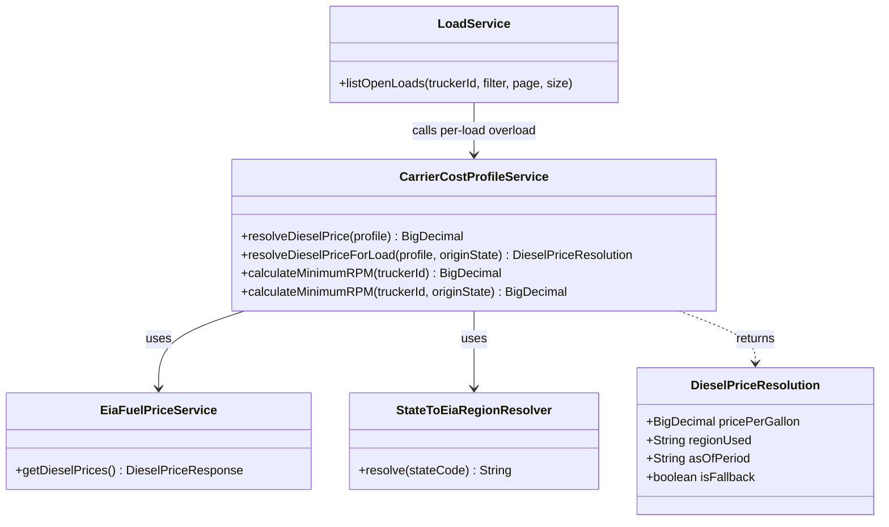
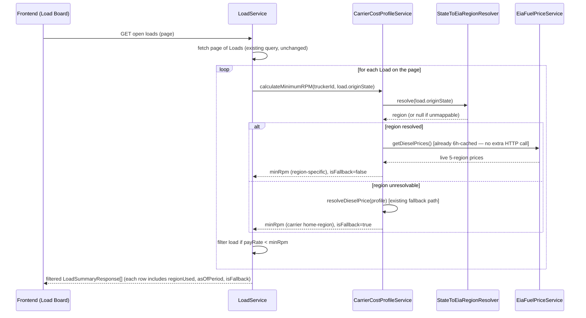

# US-854: Per-Load Diesel Fuel Cost Resolution — Architect Design

**Story:** US-854 | **Jira:** FREIG-116
**Architect Gate:** ✅ ACCEPTED (Input Acceptance Gate checklist passed — unique ID, 4 measurable ACs, no contradictions, no implementation details in BA story, fits normal CODER scope)
**Constraint:** No Java/TypeScript code below — design only, per ARCHITECT.md.

---

## Platform Reuse Check (Phase 10+ requirement)

Reviewed existing domain services before designing anything new:

| Existing service | What it does | Reused? |
|---|---|---|
| `EiaFuelPriceService` | Live-fetches + caches EIA weekly diesel prices for all 5 PADD regions (EAST/MIDWEST/SOUTH/ROCKY/WEST), 6h cache, 48h staleness flag | ✅ Reused as-is — no changes needed |
| `CarrierCostProfileService.resolveDieselPrice(profile)` | Looks up live price for the carrier's **saved** `dieselRegion` | ✅ Kept unchanged — this is the correct behavior for AC-4 (general Cost Profile summary) |
| `CarrierCostProfileService.calculateMinimumRPM(truckerId)` | Computes minimum profitable rate/mile using the carrier's saved region only | 🔶 Extended with a new overload (below) — not duplicated |
| `Load.stateToRegion()` / `getOriginRegion()` | Maps a load's origin/destination state to a **7-category** taxonomy (Southeast, California, Southwest, Midwest, Great Plains, Northeast) for `LoadRecommendationService`'s lane-matching | ❌ NOT reused — different taxonomy, different purpose, incompatible region names. Confirmed via code inspection: its only consumer is lane-preference matching, unrelated to fuel pricing. |

**No duplicate domain logic introduced** — one new small mapping utility is added (below) because no existing mapping targets the EIA 5-region taxonomy.

---

## Key Finding That Shapes This Design

`calculateMinimumRPM(truckerId)`'s only real production consumer is `LoadService.listOpenLoads()` — it computes **one** minimum-RPM threshold **before** iterating the page of loads, then filters every load on that page against the same single threshold, regardless of each load's actual origin. Making the threshold region-aware means this calculation must move **inside** the per-load filtering step, not stay a one-time pre-loop value.

Separately: the trucker-visible "RPM" badge on the load board (`LoadBoardTable.tsx`) is a **different, simpler client-side calculation** (`payRate ÷ distanceMiles`) that never touches the Cost Profile or diesel price at all. The fuel-aware minimum-RPM threshold is currently a **silent backend filter** — truckers never see the number today. This means AC-2 (transparency) has no existing UI surface to attach to; that's expected and is HFD's next job, not a blocker. ARCH's responsibility here is just to expose the right data on the right API response for HFD to place.

---

## Domain Model

**`DieselPriceResolution`** — new, small, unpersisted value object. Not an entity; never stored. Computed live on every request from existing data (`Load.originState` + `EiaFuelPriceService`'s already-cached response).

**`StateToEiaRegionResolver`** — new, stateless, pure mapping: 50 U.S. state codes → one of exactly 5 values (`EAST`, `MIDWEST`, `SOUTH`, `ROCKY`, `WEST`), matching `EiaFuelPriceService`'s existing taxonomy exactly. Deliberately separate from `Load.stateToRegion()` (different taxonomy, different consumer, do not merge — merging would break `LoadRecommendationService`'s existing lane-matching behavior, which depends on the 7-category scheme).

**`CarrierCostProfileService`** — extended, not replaced:
- `resolveDieselPrice(profile)` — **unchanged**, still used for AC-4 (general summary).
- `resolveDieselPriceForLoad(profile, originState)` — **new**. Resolves `originState` via `StateToEiaRegionResolver`; if it maps to a valid EIA region, returns that region's live price with `isFallback=false`. If `originState` is null or unmappable, falls back to `resolveDieselPrice(profile)`'s behavior with `isFallback=true` (AC-3).
- `calculateMinimumRPM(truckerId)` — **unchanged**, still used by `CarrierCostProfileController`/`CostProfileResponse` for AC-4.
- `calculateMinimumRPM(truckerId, originState)` — **new overload**, internally calls `resolveDieselPriceForLoad` instead of `resolveDieselPrice`.

---

## Sequence: Load Board List (per-load resolution)

**Performance note:** `EiaFuelPriceService.getDieselPrices()` is already cached 6 hours in-memory — moving the resolution inside the per-load loop adds cheap in-memory lookups (a switch/map), not additional HTTP calls or N+1 queries.

---

## Database Schema

**No migration required.** No new entity, no new table, no new column.

- `Load.originState` already exists and is populated (used today by the unrelated `LoadRecommendationService` lane-matching feature).
- `DieselPriceResolution` is computed live on every request, never persisted — there is nothing to store an "as of" price snapshot for; it always reflects the currently-cached EIA data at request time, which is exactly what AC-2 asks for (a live, dated figure, not a locked historical quote).
- `StateToEiaRegionResolver`'s mapping is a static, hardcoded lookup (50 states → 5 regions) — no table needed, same pattern as `Load.stateToRegion()`'s existing hardcoded switch.

RLS / soft-delete / multi-tenancy: **N/A** — no new persisted data, so none of the Core Rules' schema requirements apply. Existing `Load` and `CarrierCostProfile` RLS policies are untouched.

---

## Field Contract Table (completing BA's table)

| UI Field | API Param | DB Column | Type | Required |
|---|---|---|---|---|
| Fuel price region used (e.g. "Diesel: East Coast") | `regionUsed` (new field on `LoadSummaryResponse`) | N/A — computed, not persisted | `String` (one of `EAST`\|`MIDWEST`\|`SOUTH`\|`ROCKY`\|`WEST`) | Yes |
| Fuel price as-of date (e.g. "as of Jul 6, 2026") | `asOfPeriod` (new field on `LoadSummaryResponse`) | N/A — computed, not persisted | `String` (ISO date, from `EiaFuelPriceService`'s existing `period` field) | Yes |
| Fallback indicator (shown only when AC-3 applies) | `isFallback` (new field on `LoadSummaryResponse`) | N/A — computed, not persisted | `boolean` | Yes |

**ARCH sign-off:** ✅ Table complete. Handing off to HFD to design where/how `regionUsed` / `asOfPeriod` / `isFallback` are displayed on the load board (likely near the existing RPM badge in `LoadBoardTable.tsx`, but exact placement/visual treatment is HFD's call, not ARCH's).

---

## Out of Scope (confirmed, matches BA story)

- Multi-region mileage-weighted blending — deferred to a follow-up story.
- Any change to `Load.stateToRegion()` / `LoadRecommendationService` — untouched, different feature.
- Any change to how a carrier sets their home region.
- Any change to `EiaFuelPriceService`'s caching/refresh behavior.

---

**Next:** HFD — design the display of `regionUsed`/`asOfPeriod`/`isFallback` on the load board (small addition near the existing RPM badge, not a new page or major layout change).
