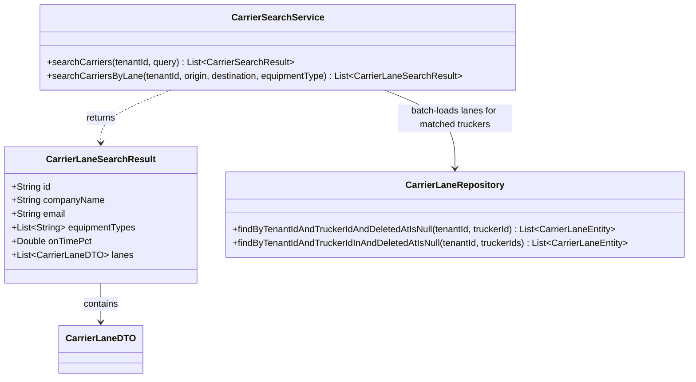
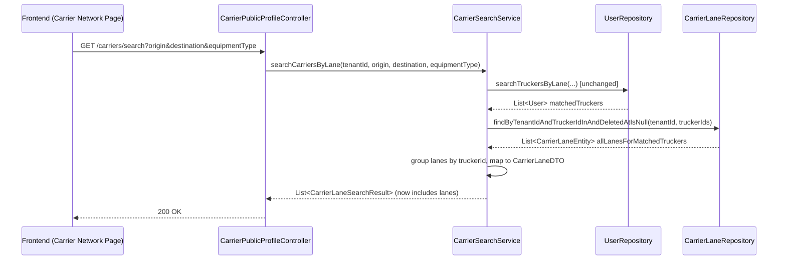

# US-856: Lane Tags on Carrier Search Cards — Architect Design

**Story:** US-856 | **Jira:** FREIG-105
**Architect Gate:** ✅ ACCEPTED (unique ID, 5 measurable ACs, no contradictions, no implementation details in BA story, fits normal CODER scope)
**Constraint:** No Java/TypeScript code below — design only, per ARCHITECT.md.
**Scope of this design:** Backend only (AC-1). Frontend card rendering (AC-2–AC-5) is a follow-up CODER task once this ships.

---

## Platform Reuse Check

| Existing artifact | What it does | Reused? |
|---|---|---|
| `CarrierLaneEntity` / `CarrierLaneRepository` | Persisted lane rows, tenant + trucker scoped, soft-deleted | ✅ Reused as-is |
| `CarrierLaneDTO` (id, originRegion, destinationRegion, minRateCents, frequencyPreference, status, createdAt) | Existing lane shape already returned by the detail-panel's `PublicCarrierProfileDTO.lanes` | ✅ Reused directly on the new field — deliberately **not** inventing a third lane shape. Frontend already knows how to render `originRegion`/`destinationRegion` from this exact type (`CarrierNetworkPage.tsx` line 446) |
| `CarrierMapper.toLaneDto(CarrierLane)` | Domain → `CarrierLaneDTO` mapping | ✅ Reused as-is |
| `UserRepository.searchTruckersByLane(...)` | Joins `CarrierLaneEntity` to filter matching truckers, but discards the matched lane rows themselves (`SELECT DISTINCT u`) and returns only `User` | ❌ NOT extended to return lanes — see Key Finding below |

**No duplicate domain logic introduced.** One new repository method (batch lane lookup by tenant + a list of trucker IDs) is added because no existing method fetches lanes for more than one trucker at a time.

---

## Key Finding That Shapes This Design

`searchTruckersByLane` filters on lane match but its query is `SELECT DISTINCT u FROM User u JOIN CarrierLaneEntity l ON ...` — it returns matched **users**, not the lane rows that matched. A carrier can have multiple lanes; the query only proves *at least one* lane matched the filter, it doesn't identify which one(s). Per US-848's existing detail-panel precedent (`PublicCarrierProfileDTO.lanes` shows **all** of a carrier's lanes, not just a matched subset), and per US-856 BR-2 ("same format used in the detail panel") and AC-2 ("renders lane tags... when the carrier has at least one lane on file" — not "the matched lane"), the card should show **all** of each carrier's lanes, exactly like the detail panel does. This means: after the existing filtered-user query runs unchanged, do one additional batched lookup of every returned trucker's full lane list — not a second per-trucker call (would be N+1), not a rewrite of the existing filter query (would risk the US-848/US-762 lane-matching regression coverage already in `CarrierSearchServiceTest`).

---

## Domain Model

**`CarrierLaneSearchResult`** — extended with one new field, `List<CarrierLaneDTO> lanes`, defaulting to an empty list (never null — matches the existing `equipmentTypes` empty-list-not-null convention in this same record, per `searchCarriersByLane_mapsNullEquipmentTypeToEmptyList`).

**`CarrierLaneRepository`** — extended with one new derived-query method, `findByTenantIdAndTruckerIdInAndDeletedAtIsNull(String tenantId, List<String> truckerIds)`, mirroring the existing single-trucker method's naming/shape but batched via Spring Data's `In` keyword.

**`CarrierSearchService.searchCarriersByLane`** — unchanged filtering logic (the existing `userRepository.searchTruckersByLane` / `findAllTruckers` call and all its branching stay exactly as they are, preserving every existing test in `CarrierSearchServiceTest`). After the trucker list is obtained, one new step: collect their IDs, call the new batch lane repository method once, group results by `truckerId`, and attach each carrier's lane list (mapped via the existing `CarrierMapper.toLaneDto`) when building each `CarrierLaneSearchResult`. Zero truckers in the input list short-circuits to an empty lane query (avoid an `IN ()` call).

---

## Sequence: Card Search With Lanes

---

## Multi-Tenancy & Security

- New batch query filters by `tenantId` explicitly (matches existing `findByTenantIdAndTruckerIdAndDeletedAtIsNull` pattern) — no cross-tenant lane leakage even if a caller passed a truckerId list not fully validated against tenant membership (it can't, since the input IDs originate from the tenant-scoped `searchTruckersByLane`/`findAllTruckers` result in the same request).
- `deletedAt IS NULL` preserved — soft-deleted lanes never surface on a card, consistent with every other lane read path.

---

## Out of Scope (unchanged from BA story)

- Frontend card rendering (separate CODER task, AC-2–AC-5)
- Filtering by clicking a lane tag
- Any change to `searchTruckersByLane`'s filtering semantics or the detail-panel's own lane fetch
