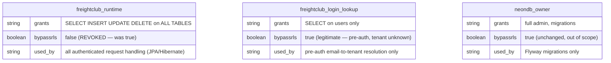
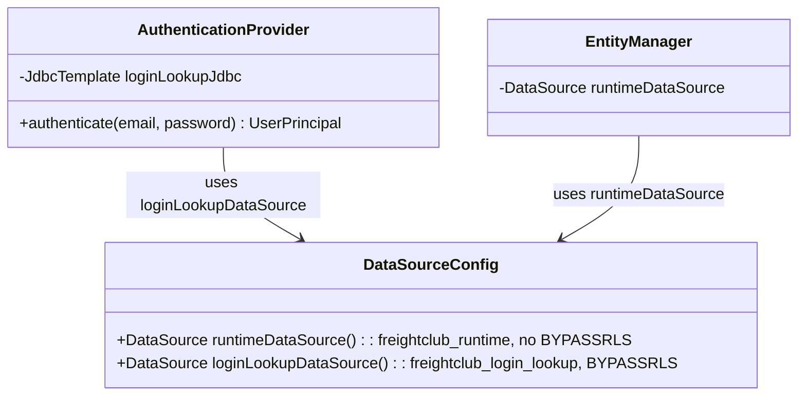

# US-857: Narrow Login-Flow RLS Bypass — Architecture Design

**Input Acceptance Gate:** Story has ID (US-857), 5 measurable AC, edge cases named, no implementation details in AC, scope fits well under 5 days. Design proceeds on the assumption BA ACs are approved per the story doc's Approval section — if Mike requests changes to AC-1–AC-5, this design is not yet locked.

---

## Problem

`freightclub_runtime` holds `BYPASSRLS`, granted in `V20260603_1000` to unblock the pre-auth login lookup. That grant is scoped to the *role*, not the *query* — every authenticated request this role ever issues also bypasses RLS. Tenant isolation for all authenticated traffic currently rests entirely on `WHERE tenant_id = ?` being present and correct in every repository/query in the Java codebase, with no database-level enforcement backstop.

---

## Design

### Role split



### Request flow

```mermaid
sequenceDiagram
    participant Client
    participant AuthController
    participant LoginLookupDS as freightclub_login_lookup DataSource
    participant TenantContextHolder
    participant JPA as JPA / EntityManager (freightclub_runtime)
    participant Postgres

    Client->>AuthController: POST /auth/login {email, password}
    AuthController->>LoginLookupDS: SELECT tenant_id, user_id, password_hash FROM users WHERE email = ?
    Note over LoginLookupDS,Postgres: BYPASSRLS role — cross-tenant read is<br/>the only way to resolve tenant before auth
    LoginLookupDS->>Postgres: query (RLS bypassed, SELECT-only, users table only)
    Postgres-->>AuthController: candidate row
    AuthController->>AuthController: verify password_hash
    AuthController->>TenantContextHolder: bind(tenant_id)
    AuthController-->>Client: JWT (tenant_id embedded)

    Note over Client,Postgres: --- subsequent authenticated requests ---
    Client->>JPA: any request with JWT
    JPA->>TenantContextHolder: read tenant_id
    JPA->>Postgres: SET LOCAL app.current_tenant = ?; <query>
    Note over JPA,Postgres: freightclub_runtime, BYPASSRLS revoked —<br/>Postgres now ENFORCES tenant_id policy
    Postgres-->>JPA: rows filtered by RLS policy (defense in depth,<br/>even if application WHERE clause is missing/wrong)
```

### 1. New role: `freightclub_login_lookup`

```sql
-- V<timestamp>__Create_Login_Lookup_Role.sql
DO $$
BEGIN
    IF NOT EXISTS (SELECT FROM pg_roles WHERE rolname = 'freightclub_login_lookup') THEN
        CREATE ROLE freightclub_login_lookup WITH LOGIN BYPASSRLS;
    END IF;

    GRANT USAGE ON SCHEMA freightclub TO freightclub_login_lookup;
    GRANT SELECT (email, password_hash, tenant_id, id, status) ON freightclub.users TO freightclub_login_lookup;
    -- No INSERT/UPDATE/DELETE. No other tables.
EXCEPTION WHEN duplicate_object THEN
    NULL;
END $$;
```

`BYPASSRLS` here is legitimate and column-scoped `SELECT` limits blast radius to "read login credentials cross-tenant" if this role's credentials leak — not "read or write everything."

### 2. Revoke bypass from `freightclub_runtime`

```sql
-- V<timestamp>__Revoke_Runtime_Bypassrls.sql
DO $$
BEGIN
    ALTER ROLE freightclub_runtime NOBYPASSRLS;
EXCEPTION WHEN OTHERS THEN
    RAISE NOTICE 'V<timestamp> partial: %', SQLERRM;
END $$;
```

### 3. RLS policy: fail closed, not fail open — `users` only (scope corrected 2026-07-21)

**Scope correction:** this design originally assumed 9 tenant-isolation policies platform-wide (based on US-856's LIBRARIAN note). Direct migration inspection during CODER implementation found **60+ policies across 20+ tables** — payments, settlements, carrier profiles, telemetry, analytics, and more, added across many migrations since `V20260422_11`. Rewriting all of them is real, valuable hardening but is a separate, larger effort with its own regression risk per domain — tracked as follow-on backlog, not done here (see story doc Out of Scope). This design fixes only the one policy actually on the login/auth path.

`users_tenant_isolation` (`V20260422_11`) currently reads:

```sql
USING (tenant_id = current_setting('app.current_tenant')::VARCHAR)
```

`current_setting('app.current_tenant')` **throws** if unset. Change to:

```sql
USING (tenant_id = current_setting('app.current_tenant', true)::VARCHAR)
```

`current_setting(name, missing_ok := true)` returns `NULL` instead of throwing; `tenant_id = NULL` evaluates to `NULL` (not `TRUE`), so the row is excluded. Net effect if `TenantContextHolder` is ever unbound on an authenticated `freightclub_runtime` connection querying `users`: **zero rows returned, not a 500.**

### 3b. Docker test environment gap (found 2026-07-21)

`docker-compose.test.yml` sets `POSTGRES_USER: freightclub_runtime`, which the official Postgres image grants `SUPERUSER`. Superusers bypass RLS unconditionally, independent of the `BYPASSRLS` role attribute — so revoking `BYPASSRLS` from `freightclub_runtime` has no observable effect in the current test container, and a cross-tenant negative test run there would pass without proving anything.

Fix: add a second, non-superuser Postgres role in the test container that mirrors prod's post-fix `freightclub_runtime` (normal login role, `NOBYPASSRLS`, same table grants), and point the backend's test datasource at *that* role instead of the Postgres bootstrap superuser. The bootstrap `POSTGRES_USER` remains for container init/Flyway only, analogous to how `neondb_owner` is used for migrations in prod.

### 4. Application layer: second DataSource for the one pre-auth query

Spring config needs a second `DataSource`/`JdbcTemplate` bean, credentialed as `freightclub_login_lookup`, used **only** by the authentication entry point (the `UserDetailsService`/`AuthenticationProvider` implementation that resolves email → user/tenant before a JWT exists). Every other repository/service continues through the existing JPA `EntityManager` backed by `freightclub_runtime`.



### 5. Environment / credentials

New env vars, following the existing `DB_ADMIN_USER`/`DB_RUNTIME_USER` pattern (`CLAUDE.local.md`):

- `DB_LOGIN_USER=freightclub_login_lookup`
- `DB_LOGIN_PASSWORD=<new, generated — not reused from any existing role>`

Threaded through: `.env`, `docker-compose.yml`, `docker-compose.test.yml`, Cloud Run env vars (`--env-vars-file` per `feedback_cloud_run_dual_urls.md`).

**Flag to Mike (not blocking this story, same-motion opportunity):** `DB_RUNTIME_PASSWORD` is on record as a known-exposed, deferred credential rotation. Since this PR already touches `freightclub_runtime`'s grants and the env-var wiring, rotating that password in the same PR is low-marginal-cost — CODER's call whether to bundle it or keep it a separate follow-up.

---

## Multi-Tenancy Filters

Unchanged — `TenantContextHolder` remains the source of truth the application sets; this design adds the database as a second, independent enforcer of the same `tenant_id` scoping, not a replacement for the app-layer filters already in place.

## Soft Delete Strategy

Unchanged — `deleted_at IS NULL` filtering is orthogonal to this fix and untouched.

## Validation Rules

- `freightclub_login_lookup` role: reject any grant broader than `SELECT` on the named `users` columns at review time (REVIEWER hard-gate item for this story).
- Both new migrations must be idempotent (`DO $$ ... EXCEPTION WHEN duplicate_object/OTHERS THEN NULL/RAISE NOTICE`) per `.claude/rules/postgres-native.md` convention already used in this file's siblings.

---

## Deliverables to CODER

1. Two Flyway migrations (login-lookup role creation + grants; runtime `NOBYPASSRLS`), each idempotent.
2. One migration updating all 9 tenant-isolation policies to `current_setting(..., true)`.
3. `DataSourceConfig` addition: second `DataSource`/`JdbcTemplate` bean for login lookup.
4. Refactor of the existing pre-auth lookup code path to use the new bean instead of the shared `EntityManager`.
5. New env vars wired through `.env` / both `docker-compose*.yml` / Cloud Run env file.
6. Tests (TDD, red-green-refactor):
   - Negative cross-tenant read test via `freightclub_runtime` (the core regression guard this story exists to add).
   - Login still succeeds end-to-end via `freightclub_login_lookup`.
   - `freightclub_login_lookup` cannot write / cannot read outside `users` (permission-denied assertions).
   - A request with unbound `TenantContextHolder` on `freightclub_runtime` returns empty, not 500.

**ARCH sign-off:** ☑ (pending BA AC approval per gate above)
