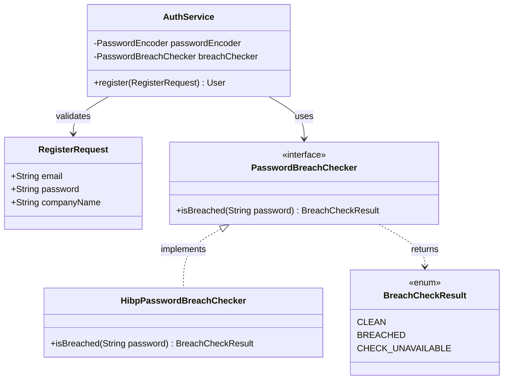
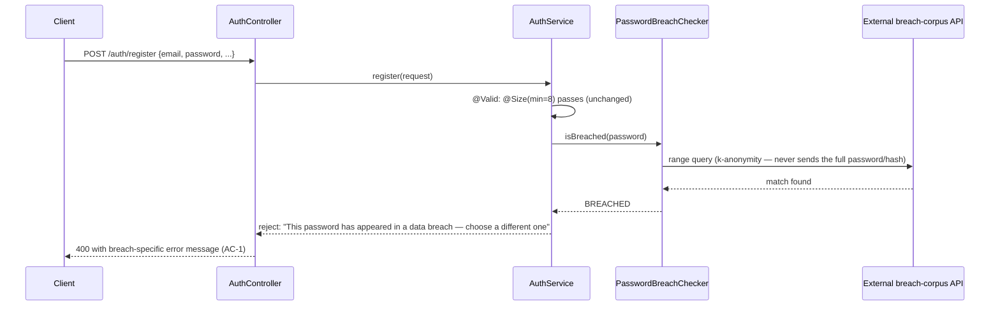
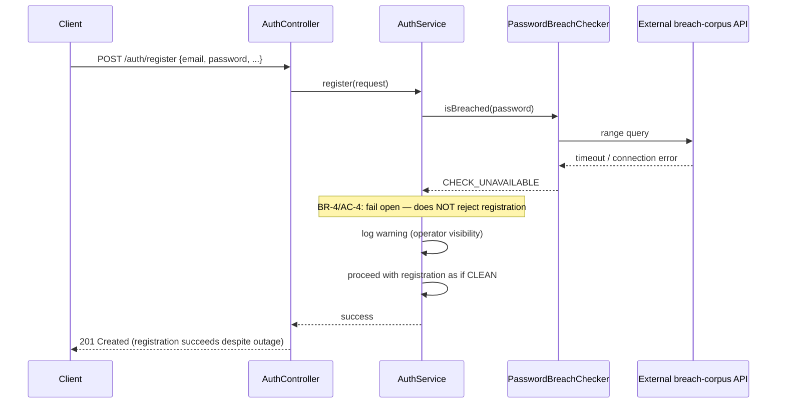

# US-866: Breached-Password Screening on Registration — Architecture Design

**Input Acceptance Gate:** Story has ID (US-866), 4 measurable AC after CHG-866 narrowing (AC-2 removed), edge cases named (AC-4 outage behavior), no implementation details in AC, no contradictory AC, scope fits well under 5 days of CODER work. Design proceeds on the story doc's Approval section (Mike, 2026-08-27) plus CHG-866 (same day, scope narrowed to registration-only).

**Platform Reuse Check:** Searched `backend/src/main/java` for any existing password-validation, breach-check, or external-credential-screening service — none exists. `RegisterRequest.java` currently has only `@Size(min = 8)`. No duplication risk; this is new capability.

---

## Problem

`RegisterRequest.java`'s password field is validated for length only (`@Size(min = 8)`). Nothing screens a submitted password against known-compromised-password corpora, so a user can register with a password already exposed in a public breach (e.g. `password123`) with no warning or rejection.

---

## Design

### Component boundary

No new domain entity, no new database table, no migration. This is a stateless validation step that calls an external service and returns a boolean-equivalent result — it does not persist anything new about the user or their password beyond what `AuthService` already does (BCrypt hash storage, unchanged).

`PasswordBreachChecker` is a port (interface) so the concrete breach-corpus provider is swappable and independently testable — CODER's choice of implementation (an HIBP k-anonymity range-query client is the obvious default given it needs no API key and no locally-hosted corpus, but that's an implementation decision, not an architecture mandate).

### Request flow — happy path (breached password, per AC-1)

### Request flow — check-service outage (per AC-4, fail open)

### Validation rules

| Condition | Result |
|---|---|
| Password fails existing `@Size(min = 8)` | Rejected — unchanged, existing behavior (AC-3) |
| Password passes length AND breach check returns `CLEAN` | Registration proceeds (AC-3) |
| Password passes length AND breach check returns `BREACHED` | Rejected with breach-specific message (AC-1) |
| Password passes length AND breach check returns `CHECK_UNAVAILABLE` | Registration proceeds — fail open, warning logged (AC-4) |

No new DB column, no new table, no RLS policy needed — `BreachCheckResult` is a transient in-request value, never persisted. `User`/`users` table schema is unchanged.

### Multi-tenancy / soft-delete

Not applicable — registration happens before a `tenant_id` is resolved for the new user (same pre-auth pattern already established by `freightclub_login_lookup` in US-857/US-858), and this check has no interaction with tenant-scoped data or soft-deleted rows.

---

## Field Contract Table

**Scope:** BACKEND_ONLY (per story doc) — no UI fields introduced or changed by this story (the existing registration form's password field is unchanged; only the server-side validation behind it gains a new rejection path with a new error message). Table skipped, mirroring the established precedent for BACKEND_ONLY security stories (US-857).

---

## Deliverables (per ARCHITECT.md)

1. **Database schema:** None — no new table, no migration.
2. **ERD:** N/A — no new persisted entity.
3. **Domain model:** Class diagram above (`PasswordBreachChecker` port + `BreachCheckResult` enum + `AuthService` integration point).
4. **Validation rules:** Table above.
5. **Soft delete strategy:** N/A.
6. **Multi-tenancy filters:** N/A — pre-auth, no tenant context yet.

**Handoff to CODER:** Implement `PasswordBreachChecker` as an interface with a concrete HIBP-k-anonymity (or equivalent) implementation, wire into `AuthService.register()` before `passwordEncoder.encode()`, following Red-Green-Refactor per `docs/roles/CODER.md` (including the Fail-Fast Boundary Validation section — the breach-check result at this entry point is exactly the kind of external-payload/trust-boundary crossing that section calls out) and the External Config/Secret Wiring Verification gate (AC-5 requires a real unmocked call against the live endpoint, pasted as evidence, before sign-off).
