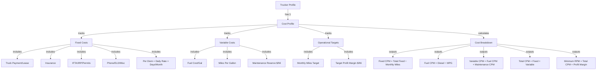
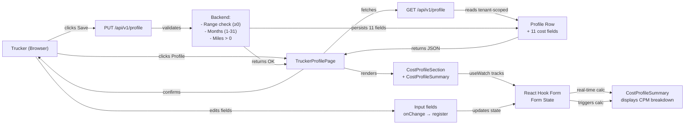

# Technical Design: Trucker Cost Per Mile Calculator (US-757)

**Status:** READY_FOR_CODER  
**Phase:** 7 (Financial Intelligence Foundation)  
**Approved By:** Solution Architect  

---

## 1. Domain Model

The Cost Profile domain represents a trucker's operating cost structure used to calculate minimum revenue per mile (RPM).



---

## 2. Database Schema

### 2.1 Profile Table Updates

The `profile` table (tenant-scoped) will be extended with cost tracking columns.

| Column Name | Type | Nullable | Default | Notes |
|---|---|---|---|---|
| id | VARCHAR(36) | NO | UUID | Primary Key (existing) |
| tenant_id | VARCHAR(36) | NO | - | Tenant isolation (existing) |
| user_id | VARCHAR(36) | NO | - | Foreign Key (existing) |
| truckPaymentLease | NUMERIC(10,2) | YES | NULL | Monthly cost |
| insurance | NUMERIC(10,2) | YES | NULL | Monthly cost |
| iftaIrpPermits | NUMERIC(10,2) | YES | NULL | Monthly cost |
| phoneEldMisc | NUMERIC(10,2) | YES | NULL | Monthly cost |
| perDiemDailyRate | NUMERIC(10,2) | YES | NULL | Daily per diem ($) |
| perDiemDaysPerMonth | INTEGER | YES | NULL | Days per month (1-31) |
| fuelCostPerGallon | NUMERIC(6,3) | YES | NULL | Diesel price ($/gal) |
| milesPerGallon | NUMERIC(4,1) | YES | NULL | Truck fuel efficiency |
| maintenanceCostPerMile | NUMERIC(6,3) | YES | NULL | Reserve per mile ($) |
| monthlyMilesTarget | INTEGER | YES | NULL | Target monthly miles |
| targetMarginPerMile | NUMERIC(6,3) | YES | NULL | Profit margin ($/mi) |
| created_at | TIMESTAMPTZ | NO | CURRENT_TIMESTAMP | Audit (existing) |
| updated_at | TIMESTAMPTZ | NO | CURRENT_TIMESTAMP | Audit (existing) |
| deleted_at | TIMESTAMPTZ | YES | NULL | Soft delete (existing) |

### 2.2 Migration Checklist

- [ ] New columns added to `profile` table
- [ ] All NUMERIC columns set to NOT NULL → nullable (optional per AC7)
- [ ] Foreign key to `users(id)` verified as unique
- [ ] RLS policy: `tenant_id = current_user_tenant_id` already enforced on profile table
- [ ] Indexes on `(tenant_id, deleted_at)` verified for query performance
- [ ] Flyway migration script created: `V<YYYYMMDD>_HHmm__AddCostProfileFields.sql`

---

## 3. Data Flow Diagram



---

## 4. Component Architecture

### 4.1 Frontend Structure

```
src/features/carrier/components/profile/
├── CostProfileSection.tsx          ← Main form section (existing, enhanced)
│   ├── Fixed Monthly Costs subsection (4 fields)
│   ├── Variable Costs subsection (5 fields)
│   ├── Operational subsection (2 fields)
│   └── CostProfileSummary component
│       └── Real-time CPM calculation display
└── index.ts
```

### 4.2 Component Props

**CostProfileSection**
```typescript
interface Props {
  register: UseFormRegister<UpdateProfileValues>
  control: Control<UpdateProfileValues>
}
```

**CostProfileSummary** (internal)
```typescript
interface Props {
  control: Control<UpdateProfileValues>
}
// Uses useWatch() to track all cost fields
// Calculates and displays:
// - Fixed CPM, Variable CPM, Total CPM, Minimum RPM
```

---

## 5. Calculation Rules (Business Logic)

### 5.1 Real-Time Calculations

Performed in `CostProfileSummary.tsx` using `useWatch()`:

```
fixedCosts = 
  truckPayment + insurance + iftaIrpPermits + phoneEldMisc 
  + (perDiemDailyRate × perDiemDaysPerMonth)

perMonthlyFixedCosts = fixedCosts

fuelCpm = fuelCostPerGallon ÷ milesPerGallon
variableCpm = fuelCpm + maintenanceCostPerMile
totalCpm = (perMonthlyFixedCosts ÷ monthlyMilesTarget) + variableCpm

minimumRpm = totalCpm + targetMarginPerMile
```

### 5.2 Rendering Rules

- **Show CPM Summary:** Only if `monthlyMilesTarget > 0` (AC7: partial data OK)
- **Handle Division by Zero:** If `milesPerGallon = 0`, set `fuelCpm = 0`
- **Empty Fields:** Treat as `0` in calculations (AC7: optional fields)
- **Decimal Places:** Display CPM/RPM to 4 decimal places (per AC5)

---

## 6. API Contract

**Endpoint:** `PUT /api/v1/profile`  
**Auth:** JWT (TenantContextHolder validates tenant isolation)

### 6.1 Request/Response Payload

```json
{
  "truckPaymentLease": 1800,
  "insurance": 900,
  "iftaIrpPermits": 200,
  "phoneEldMisc": 150,
  "perDiemDailyRate": 800,
  "perDiemDaysPerMonth": 20,
  "fuelCostPerGallon": 3.89,
  "milesPerGallon": 6.5,
  "maintenanceCostPerMile": 0.17,
  "monthlyMilesTarget": 8000,
  "targetMarginPerMile": 0.60
}
```

### 6.2 Backend Validation

**Range Checks:**
- Cost fields (truck, insurance, ifta, phone): `≥ 0`
- Per Diem Daily Rate: `≥ 0`
- Per Diem Days: `1 ≤ x ≤ 31`
- Fuel Price: `≥ 0`
- MPG: `≥ 0`
- Maintenance: `≥ 0`
- Monthly Miles: `≥ 0` (but > 0 required for CPM display)
- Profit Margin: `≥ 0`

**Error Response (400):**
```json
{
  "status": "VALIDATION_ERROR",
  "errors": {
    "perDiemDaysPerMonth": "Must be between 1 and 31"
  }
}
```

---

## 7. Acceptance Criteria Mapping

| AC | Component | Status |
|---|---|---|
| AC1 | Fixed Monthly Costs fields (4) | Schema + Form ✓ |
| AC2 | Variable Cost fields (3 base) | Schema + Form ✓ |
| AC3 | Per Diem tracking (2 fields) | Schema + Form ✓ |
| AC4 | Operational Targets (2 fields) | Schema + Form ✓ |
| AC5 | CPM Calculation & Display | CostProfileSummary ✓ |
| AC6 | Form Layout (3 sections) | CostProfileSection ✓ |
| AC7 | Optional fields + smart defaults | useWatch with OR 0 ✓ |
| AC8 | Data Persistence | GET/PUT /api/v1/profile |
| AC9 | API Contract | JSON schema defined ✓ |

---

## 8. Test Strategy

### 8.1 Backend Unit Tests (Java)

- **ProfileService:** Test CPM calculation logic for edge cases
  - Zero miles → no CPM display
  - Zero MPG → fuel CPM = 0
  - All fields empty → calculations use 0
  - Valid range checks on each field

- **ProfileController:** Test GET/PUT endpoints
  - Tenant isolation (can only fetch/update own profile)
  - Validation errors return 400
  - Valid payloads persist and return 200

### 8.2 Frontend Unit Tests (Vitest)

- **CostProfileSummary:** Test real-time calculations
  - Fixed CPM formula correct
  - Per diem multiplication correct
  - Variable CPM formula correct
  - Minimum RPM formula correct
  - Display hidden when miles = 0

- **CostProfileSection:** Test form submission
  - All 10 fields register correctly
  - Form submits 11-field payload
  - Loading state during POST
  - Error message display

### 8.3 E2E Tests (Playwright)

- **Golden Path:** Trucker logs in → navigates to Profile → enters all 10 cost fields → sees CPM breakdown → saves → reloads → values persist
- **Partial Entry:** Trucker enters only 3 fields → saves → CPM displays partial calculation
- **Edge Cases:** Zero miles, zero MPG, negative input (if validation allows)

---

## 9. Definition of Done (Architecture)

- [ ] Schema design reviewed and migrated
- [ ] Data flow diagram validates happy path
- [ ] API contract matches US-757 AC9
- [ ] Component architecture avoids circular dependencies
- [ ] Calculation rules handle edge cases (division by zero, empty fields)
- [ ] Backend validation spec complete
- [ ] Test strategy covers unit, integration, and E2E

---

## 10. Notes

- **No new tables required:** All cost fields extend existing `profile` table.
- **RLS enforcement:** Automatic via `TenantContextHolder` in ProfileService.
- **Soft deletes:** Profile rows remain queryable post-deletion (deleted_at NULL filter in service layer).
- **Frontend state management:** All cost state lives in React Hook Form, no Zustand needed.
- **Real-time UX:** CostProfileSummary uses `useWatch()` for zero-latency calculation feedback.

---

**Architecture Sign-Off:** Ready for CODER phase implementation.
