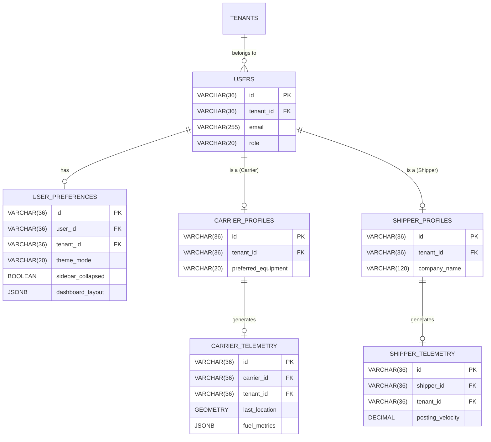

# Plan: Theme-State Schema Separation (Carrier vs Shipper)

## Objective
Decouple user theme states and telemetry parameters between Carrier and Shipper personas to prevent data blending and ensure role-specific UI/UX consistency.

## Key Files & Context
- `freightclub.users`: Currently contains shared and some carrier-specific fields (e.g., `equipment_type`, `fuel_cost_per_gallon`).
- `freightclub.carrier_profiles`: Stores extended carrier data.
- `freightclub.shipper_profiles`: Stores extended shipper data.
- Goal: Create a unified yet separated `user_theme_states` or similar structure that respects RLS and prevents telemetry cross-contamination.

## Proposed Solution

### 1. New Schema Design
We will introduce `user_preferences` and role-specific telemetry tables to isolate theme settings and telemetry metrics.

#### `freightclub.user_preferences`
- `id` (UUID)
- `user_id` (FK to users.id)
- `tenant_id` (FK to tenants.id)
- `theme_mode` (VARCHAR: 'LIGHT', 'DARK', 'SYSTEM')
- `sidebar_collapsed` (BOOLEAN)
- `dashboard_layout` (JSONB: role-specific layout config)
- RLS: `user_id = current_user_id()`

#### `freightclub.carrier_telemetry` (Specialized for Truckers)
- `id` (UUID)
- `carrier_id` (FK to users.id)
- `tenant_id` (FK to tenants.id)
- `last_known_location` (GEOMETRY Point)
- `active_hours_today` (INTEGER)
- `fuel_efficiency_metrics` (JSONB)
- RLS: `carrier_id = current_user_id()`

#### `freightclub.shipper_telemetry` (Specialized for Shippers)
- `id` (UUID)
- `shipper_id` (FK to users.id)
- `tenant_id` (FK to tenants.id)
- `load_posting_velocity` (DECIMAL)
- `preferred_carrier_engagement` (DECIMAL)
- RLS: `shipper_id = current_user_id()`

### 2. Migration Strategy
1. Create new tables with RLS.
2. (Optional) Deprecate/Move carrier-specific fields from `users` to `carrier_profiles` or `carrier_telemetry`.
3. Update API payloads to route telemetry/preferences to these new tables.

## Mermaid Diagram

## Verification & Testing
1. SQL Validation: Ensure RLS policies correctly isolate data by `tenant_id` and `user_id`.
2. Integration Tests: Verify that a Carrier cannot access `shipper_telemetry` and vice versa.
3. Schema Audit: Confirm `users` table no longer serves as a "catch-all" for role-specific telemetry.
