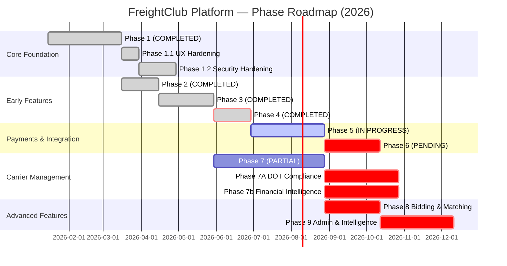

# FreightClub Project Gantt Chart

## Legend

| Status | Color | Count |
|--------|-------|-------|
| ✅ COMPLETED | Green | 6 phases (1, 1.1, 1.2, 2, 3, 4) |
| 🔄 IN_PROGRESS | Orange | 1 phase (5: US-502 Stripe Connect) |
| 🟡 PARTIAL | Gray | 1 phase (7: 6/13 stories implemented) |
| ⚠️ MIGRATION_PENDING | Red | 6 phases (6, 7A, 7b, 8, 9) |

## Phase Completion Summary

| Phase | Stories | Status | Completion Date | Notes |
|-------|---------|--------|-----------------|-------|
| Phase 1 | 4 | ✅ COMPLETED | 2026-03-15 | Core load lifecycle + hardening |
| Phase 2 | 3 | ✅ COMPLETED | 2026-04-20 | Email/in-app notifications, EIA API |
| Phase 3 | 5 | ✅ COMPLETED | 2026-05-25 | Document mgmt + US-308 audit logging |
| Phase 4 | 4 | ✅ COMPLETED | 2026-05-25 | Bidirectional ratings + shipper reputation |
| Phase 5 | 7 | 🔄 IN_PROGRESS | — | US-502 (Stripe Connect) committed; US-501, 503-507 pending |
| Phase 6 | 4 | ⚠️ PENDING | — | Blocked on message broker infrastructure |
| Phase 7 | 13 | 🟡 PARTIAL | — | 6 stories complete; 7 pending; blocks phases 7A-7b |
| Phase 7A | 5 | ⚠️ PENDING | — | Depends on Phase 7 completion |
| Phase 7b | 8 | ⚠️ PENDING | — | Depends on Phase 7 + US-305/US-308 |
| Phase 8 | 5 | ⚠️ PENDING | — | Blocked on Phase 5 (payments) |
| Phase 9 | 10 | ⚠️ PENDING | — | Depends on Phases 5, 7, 8 |

## Story Counts by Status

| Status | Count | Phases |
|--------|-------|--------|
| ✅ COMPLETED | 23 | 1, 1.1, 1.2, 2, 3, 4 |
| 🔄 IN_PROGRESS | 1 | 5 (US-502) |
| 🟡 PARTIAL | 6 | 7 |
| ⚠️ MIGRATION_PENDING | 51 | 5 (6 stories), 6, 7A, 7b, 8, 9 |
| **TOTAL** | **81** | — |

## Critical Path

**Blocking Dependencies:**
1. ✅ **Phase 5 (Payments)**: US-502 (Stripe Connect) committed; unblocks Phases 7b, 8, 9
   - Pending: US-501 (Invoice), US-503 (Bank Setup), US-504-507 (History, Receipts, Settlements, Disputes)

2. ✅ **Phase 3 (Documents)**: US-305 (POD UI) + US-308 (Audit Log) unblock Phase 7b earnings tracking
   - Both COMPLETED; Phase 7b can proceed on mileage tracking (US-732)

3. ⚠️ **Phase 6 (Messaging)**: Requires message broker infrastructure (WebSocket/SSE)
   - No external dependency; engineering effort needed for real-time infrastructure

4. ⚠️ **Phase 7 (Carrier)**: 6/13 stories complete; 7 pending
   - Blocks Phase 7A finalization; Phase 7b can start in parallel (different dependencies)

## Next Milestones (2026)

### Immediate (May 25 – June 30)
- **Phase 5**: Ship US-501, US-503 (invoice generation, bank account setup)
- **Phase 7**: Complete US-704-706 (suggested loads, filters, posting validation)
- **Phase 6**: Greenlight message broker architecture decision

### Mid-term (July – August)
- **Phase 5**: Complete US-504-507 (history, receipts, settlements, disputes)
- **Phase 7**: Complete remaining 7 stories; finalize Phase 7 governance
- **Phase 7A**: Begin US-720+ (DOT compliance documentation)

### Late-term (September – November)
- **Phase 7b**: Start US-730+ (earnings log, P&L reports, IFTA tracking)
- **Phase 8**: Begin US-801+ (bidding system, once Phase 5 payments live)
- **Phase 9**: Begin US-901+ (admin tools, once foundational phases stabilize)

## Risks & Mitigations

| Risk | Impact | Mitigation | Status |
|------|--------|-----------|--------|
| Message broker setup delay | Blocks Phase 6 (2+ weeks) | Define tech stack (RabbitMQ/Redis Pub-Sub/Kafka) early | ⚠️ PENDING |
| Payment processor integration complexity | Extends Phase 5 (Stripe, ACH, settlements) | Stripe Connect API stability is high; risk low | ✅ LOW |
| Phase 7 scope (13 stories) | Risk of bottleneck; blocks downstream | Prioritize US-701-705 (carrier profiles + lanes); defer US-707-711 | 🟡 MEDIUM |
| Backend test coverage gap (50.6% → 70%) | Blocks production shipping | Phase B-C remediation scheduled 2026-05-26 | 🟡 IN_PROGRESS |

## Deployment Gates

- ✅ Phase 1–4: Ready to ship (all governance complete)
- 🟡 Phase 5: Ship when US-502, US-501, US-503 PASS reviewer
- ⚠️ Phase 6+: Unblock on external integrations (message broker, Stripe production account)

---

**Generated:** 2026-05-25  
**Last Story Map Sync:** 2026-05-25  
**Current Velocity:** 4 phases/quarter (Phase 1–4 in ~4.5 months)  
**Projected Completion:** Q3–Q4 2026 (9 phases total)
