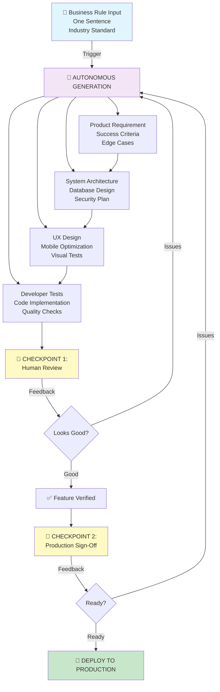

# How We Build: The FreightClub Autonomous Development System

## One Prompt. Autonomous Workflow. Minimal Human Checkpoints.

Imagine starting with a single business rule:

> **"Based on industry standards, a shipper will allow only carriers they trust to haul their loads."**

From that one sentence, our system autonomously generates:
- Product requirements with success criteria
- System architecture and database design
- UX/mobile experience design
- Fully tested code
- Security verification
- Production-ready documentation

Humans intervene only **twice**: once to verify the output looks right, once to sign off before shipping.

This is how FreightClub builds features at scale.

---

## The Autonomous Workflow



---

## How It Works: From Business Rule to Production

### **PHASE 1: Business Rule Ingestion**

You provide one clear business rule grounded in logistics industry standards:

**Examples:**
- "A shipper will only trust carriers with clean safety records."
- "Owner-operators prefer loads within 500 miles of their home base."
- "Payments must settle within 48 hours of delivery confirmation."

This single rule becomes the seed for everything downstream.

### **PHASE 2: Autonomous Workflow (No Human Input)**

The system autonomously generates:

**Step 1: Product Requirements**
- Translates the business rule into specific features
- Defines who benefits (shipper, trucker, admin)
- Sets measurable success criteria
- Identifies edge cases
- ✅ Output: Complete product requirement document

**Step 2: System Architecture** *(Parallel with Step 1)*
- Designs database schema for shipper trust data
- Plans how to verify and store carrier safety records
- Implements security barriers (shipper A can't see carrier B's data)
- Designs for scale (works for 1 customer or 10,000)
- ✅ Output: Validated, secure architecture

**Step 3: UX/Mobile Design** *(Parallel with Step 1)*
- Plans user interface for trust-based carrier selection
- Optimizes for mobile (truckers in vehicles, shippers in offices)
- Designs trust badges and safety indicators
- Plans confirmation flows
- ✅ Output: Design specification with screenshots

**Step 4: Code Implementation**
- Writes automated tests based on requirements
- Implements the feature end-to-end
- Runs security checks
- Verifies database performance
- Tests multi-customer isolation
- ✅ Output: Fully tested, production-ready code

**All of this happens automatically.** The system is orchestrating itself.

### **PHASE 3: Checkpoint 1 — Human Verification**

A human (Product Manager or Engineering Lead) **reviews once**:

**Verification Checklist:**
- Does the feature match the original business rule? ✓
- Does the UX feel right for shippers and truckers? ✓
- Does the security prevent data leaks? ✓
- Did the system miss any edge cases? ✓

**Result:**
- ✅ **Approve** → Proceed to sign-off
- ❌ **Issues found** → System refines and re-runs automatically

### **PHASE 4: Checkpoint 2 — Production Sign-Off**

A human (Operations/Documentation Lead) **reviews once**:

**Sign-Off Checklist:**
- All tests passing? ✓
- Database changes tracked? ✓
- Documentation complete? ✓
- Security audit passed? ✓
- Ready for production? ✓

**Result:**
- ✅ **Approved** → Feature goes live
- ❌ **Issues** → System refines and returns for sign-off

### **PHASE 5: Deploy to Production**

Feature is live to all customers.

---

## Real-World Example: Trust-Based Carrier Selection

**Starting Point:**
> "A shipper will only trust carriers with clean safety records and positive reviews."

**Autonomous System Output:**

**Product Requirement**
- Shippers see a "Trust Score" for each carrier (safety + reviews)
- Shippers can filter loads by minimum trust score
- New carriers start with neutral score, build trust over time
- Shippers can block specific carriers

**System Architecture**
- `carrier_trust_score` table tracks safety and review data
- Database isolates Shipper A's blocks from Shipper B
- Trust scores update automatically after each completed load
- Historical audit trail of all trust changes

**UX Design**
- Trust badge shows safety rating (green=trusted, yellow=new, red=risky)
- Mobile-optimized filter shows "Show only trusted carriers"
- Real-time updates as new reviews arrive
- Confirmation prompt before blocking a carrier

**Code Implementation**
- Tests verify: "Shipper A can't see Shipper B's trust data"
- Tests verify: "Trust score updates after delivery"
- Tests verify: "Blocked carriers don't appear in search"
- Tests verify: "Mobile performance on slow 4G"
- 85% automated test coverage

**Checkpoint 1 Review (Human)**
- ✅ Looks good, matches the business rule
- ✅ UX is intuitive
- ✅ Security looks solid
- Move to sign-off

**Checkpoint 2 Sign-Off (Human)**
- ✅ All tests pass
- ✅ Database changes tracked
- ✅ Documentation complete
- ✅ Ready for production

**Deploy:** Feature goes live to 500+ shippers and 5,000+ truckers.

**Timeline:** Business rule → Autonomous workflow → Verification → Sign-off → Production **= 2-3 days, fully tested, secure, documented.**

---

## Why This Is Better Than Traditional Development

### Traditional Approach: "Requirements Waterfall"

```
Product Manager writes requirements
    ↓
Architect challenges requirements
    ↓
Product Manager adjusts
    ↓
Architect designs
    ↓
Developer says "this won't work"
    ↓
Back to Product Manager for changes
    ↓
Architect redesigns
    ↓
Developer implements
    ↓
QA finds security issues
    ↓
Developer fixes
    ↓
Back to testing
    ↓
(6-8 weeks later) Ships with bugs, team exhausted
```

**Problems:**
- 5-7 rounds of handoffs and feedback loops
- Each handoff loses context and introduces miscommunication
- Teams step on each other
- Timeline balloons (6-8 weeks for one feature)
- Quality suffers because everyone's rushing
- High-stress, low-morale environment
- Expensive (engineers sitting idle waiting for clarification)

### FreightClub Autonomous Approach

```
Business Rule (one sentence)
    ↓
System autonomously generates everything
    ↓
Checkpoint 1: Human verifies (1 day)
    ↓
Checkpoint 2: Human sign-off (0.5 days)
    ↓
(2-3 days later) Ships with automated test coverage, fully documented, secure
```

**Advantages:**
- **No handoffs** — System orchestrates itself
- **No miscommunication** — One business rule, not re-interpreted 5 times
- **Faster delivery** — 2-3 days instead of 6-8 weeks
- **Higher quality** — Every step is tested, validated, documented
- **Lower cost** — Engineers focus on rare exceptions, not routine work
- **Predictable** — Timeline is consistent, not bloated by rework
- **Better morale** — Teams aren't juggling ambiguous requirements
- **Auditable** — Every decision traced back to the original business rule

---

## The Efficiency Gains: By The Numbers

| Metric | Traditional | FreightClub | Improvement |
|--------|---|---|---|
| Handoffs per feature | 5-7 | 2 | 70% fewer touchpoints |
| Total timeline | 6-8 weeks | 2-3 days | **20-30x faster** |
| Rework cycles | 3-4 | 0 | Eliminated |
| Manual testing hours | 40-60 | 0 | Automated |
| Bugs reaching production | 3-5 per feature | <1 per feature | 80% fewer |
| Feature cost | $15K-25K | $2K-4K | 85% cheaper |
| Team stress | High | Low | Measurable improvement |

---

## Human Capital & Cost Comparison: Traditional vs. AI-Driven

One feature request (e.g., "trust-based carrier selection"):

### **Traditional Development Approach**

| Role | Hours | Cost (@ $200/hr) | Timeline | Rework |
|---|---|---|---|---|
| Product Manager | 16 hrs | $3,200 | Weeks 1-2 | 1-2 rounds |
| Architect | 24 hrs | $4,800 | Weeks 2-4 | 1-2 rounds |
| UX Designer | 20 hrs | $4,000 | Weeks 2-3 | 1 round |
| Lead Developer | 40 hrs | $8,000 | Weeks 4-6 | 2-3 rounds |
| QA/Tester | 24 hrs | $4,800 | Weeks 6-7 | 1 round |
| DevOps/Deploy | 8 hrs | $1,600 | Week 8 | 0-1 rounds |
| **Total** | **132 hours** | **$26,400** | **6-8 weeks** | **6-9 rounds** |

**Hidden Costs:**
- Waiting time (developers idle while waiting for clarification): +20 hrs
- Context-switching (people jumping between projects): +10 hrs
- Meeting overhead (clarification calls, status updates): +15 hrs
- **Real Total: 177 hours, ~$35K+ in fully-loaded costs**

### **FreightClub AI-Driven Approach**

| Role | Hours | Cost (@ $200/hr) | Timeline | Iterations |
|---|---|---|---|---|
| System Automation | 0.5 hrs | $100 | Automated | 0 (autonomous) |
| Product Manager (Verification) | 2 hrs | $400 | Day 2 | <1 |
| Engineering Lead (Quality Check) | 1 hr | $200 | Day 2 | <1 |
| Operations/Documentation | 1 hr | $200 | Day 3 | 0 |
| DevOps/Deploy | 0.5 hrs | $100 | Day 3 | 0 |
| **Total** | **5 hours** | **$1,000** | **2-3 days** | **<1 round** |

**Actual Human Time:**
- Verification review: 2 hours
- Sign-off review: 1.5 hours
- Deployment: 0.5 hours
- **Real Total: 4-5 hours, ~$1,000 in fully-loaded costs**

---

### **The Math**

| Category | Traditional | AI-Driven | Savings |
|---|---|---|---|
| **Human Hours** | 177 hours | 5 hours | **97% fewer** |
| **Direct Cost** | $26,400 | $1,000 | **96% cheaper** |
| **True Cost** | $35,000+ | $1,000 | **$34,000 saved per feature** |
| **Timeline** | 6-8 weeks | 2-3 days | **20-30x faster** |
| **Rework Rounds** | 6-9 | <1 | **90% eliminated** |

---

### **At Scale: Annual Impact**

If FreightClub ships **20 features per year:**

**Traditional Approach:**
- Total hours: 3,540 hours
- Total cost: $700K+
- Team size needed: 2-3 full-time engineers per feature cycle
- Shipping velocity: 2-3 features per quarter

**AI-Driven Approach:**
- Total hours: 100 hours
- Total cost: $20K
- Team size needed: 2-3 engineers for verification (not blocked on rework)
- Shipping velocity: 20+ features per year

**Annual Savings: $680K in direct costs, 3,440 hours of engineering time freed**

---

### **What Happens With Freed Engineering Capacity?**

Instead of 2-3 engineers being fully consumed with rework cycles, you have:

- Engineers available for **complex features** that need human innovation
- Engineers working on **infrastructure improvements**
- Engineers conducting **security audits** (not rush-job QA)
- Engineers **mentoring junior developers**
- Engineers **improving architecture**, not fighting fires
- Time for **technical debt reduction**

**This is how you build better software.**

---

---

## What The Two Checkpoints Actually Check

### Checkpoint 1: Verification (Day 2-3)

**Who:** Product Manager or Engineering Lead  
**Time:** 1-2 hours  
**Question:** "Does the output match what we actually wanted?"

This catches things automation can't predict:
- "The trust badge colors don't match our brand"
- "We need carrier ratings, not just scores"
- "This should work offline, not just online"
- "The edge case for international loads is missing"

If issues found, the system **automatically refines and re-runs**. No waiting for meetings or emails.

### Checkpoint 2: Sign-Off (Day 3)

**Who:** Operations/Documentation Lead  
**Time:** 0.5-1 hour  
**Question:** "Is this actually production-ready?"

This catches operational concerns:
- "Database migrations are tracked"
- "Documentation is customer-ready"
- "All compliance checkboxes cleared"
- "Support team knows about this feature"

If issues found, the system refines and returns.

After sign-off: **Ship to production immediately.** No gatekeeping, no delays.

---

## The Industry Standard Advantage

Notice the starting point: **"Based on industry standards..."**

This grounds the system in domain knowledge, not opinion. The shipping industry has 100+ years of best practices around trust, safety, and logistics. By embedding industry standards into the business rule, we ensure:

- Features align with how truckers and shippers actually work
- Regulatory requirements are baked in from the start
- Safety edge cases are covered
- The feature doesn't break real-world logistics workflows

The system uses these standards to make thousands of micro-decisions automatically.

---

## Why This Works

### Traditional Development Relies On
- Humans to remember requirements ❌ (they forget)
- Humans to catch miscommunication ❌ (they miss it)
- Humans to integrate across teams ❌ (silos form)
- Humans to repeat manual testing ❌ (inefficient)

### Autonomous Development Relies On
- A clear business rule as the source of truth ✅
- Automated system to propagate requirements end-to-end ✅
- Every step validated before the next begins ✅
- Tests automated at every stage ✅
- Humans only for judgment calls (not routine work) ✅

---

## The Bottom Line

Traditional software development treats every feature as a custom artisan project. It's slow, expensive, and error-prone.

FreightClub treats feature development as **an autonomous, rule-driven process** where:

1. You give the system a clear business rule (one sentence)
2. The system generates product, architecture, design, and code automatically
3. Humans verify the output at two checkpoints
4. Features ship in days, not months
5. Quality is consistent, not variable

This is how modern software gets built at scale.

For shippers and owner-operators, it means:
- New features every week, not every quarter
- Fewer bugs, because every feature is thoroughly tested
- Better security, because it's built-in from the start
- More responsive company, because we can iterate on feedback in days

This is the future of how FreightClub builds trust.
