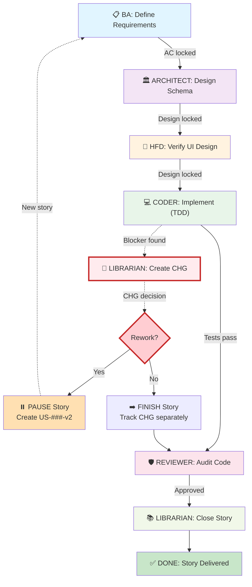

# FreightClub SDLC: Role-Based Governance & Workflow

**Authority:** CLAUDE.md Sequential Lock Protocol + Role Documents  
**Status:** CANONICAL - All roles must follow this flow  
**Effective:** 2026-05-25 (Sequential Lock Protocol enforcement date)  
**Last Updated:** 2026-06-09

---

## Table of Contents

1. [Executive Overview](#executive-overview)
2. [The Full SDLC Workflow (Flowchart)](#the-full-sdlc-workflow)
3. [Role Responsibilities & Authority](#role-responsibilities--authority)
4. [Sequential Gate Protocol (NO Circular Dependencies)](#sequential-gate-protocol)
5. [Stage-by-Stage Interactions](#stage-by-stage-interactions)
6. [Input Acceptance Gates (Role Checklists)](#input-acceptance-gates)
7. [Change Request (CHG-###) Protocol](#change-request-chg-protocol)
8. [Escalation & Decision Authority](#escalation--decision-authority)
9. [Delivery & Sign-Off](#delivery--sign-off)
10. [Anti-Patterns & What NOT to Do](#anti-patterns--what-not-to-do)

---

## Executive Overview

FreightClub uses a **Sequential Gate System** to prevent circular rework loops:

```
BA (Define) → ARCHITECT (Design) → HFD (Visual) → CODER (Build) → REVIEWER (Audit) → LIBRARIAN (Close)
```

Each role is a **gate**. A role cannot start work until the previous role has **locked inputs** (frozen for changes).

**Core Principle:** Once a role accepts inputs, they are **immutable during that role's execution**. Changes require a formal **CHG (Change Request) ticket**, never backward communication to the previous role.

---

## The Full SDLC Workflow

### Workflow Diagram (Mermaid)



---

## Role Responsibilities & Authority

### 1. 📋 **Business Analyst (BA)**

**Location:** `docs/roles/BUSINESS_ANALYST.md`

**Responsibilities:**
- Translate business goals into granular User Stories (INVEST standard)
- Define Acceptance Criteria in Gherkin format (Given/When/Then)
- Map UI fields, API parameters, and database columns (contract table)
- Verify story aligns with current phase in `docs/business/FEATURES.md`
- Identify and document business rules, edge cases, and constraints

**Authority:**
- ✅ Defines what the system should do (business logic)
- ✅ Approves user stories before ARCHITECT begins design
- ❌ Cannot design technical schema or specify API endpoints
- ❌ Cannot make architectural trade-offs (escalate to LIBRARIAN)

**Input Gate (Checklist Before Starting):**
- [ ] Business goal is clear (e.g., "Shippers can claim loads faster")
- [ ] User persona identified (SHIPPER / TRUCKER / ADMIN)
- [ ] Success metric defined (e.g., "80% claim rate within 30s")
- [ ] No circular dependencies on other stories

**Output Gate (Before Passing to ARCHITECT):**
- [ ] Story status set to `READY_FOR_DESIGN`
- [ ] Acceptance Criteria written in Gherkin (Given/When/Then)
- [ ] All UI fields listed in contract table
- [ ] No technical assumptions (schema, API endpoints left blank for ARCH)
- [ ] BA sign-off box checked

**Blocking Conditions:**
- If AC is ambiguous → PAUSE story, request clarification from Product/Stakeholder
- If story conflicts with existing AC → Escalate to LIBRARIAN (may create CHG)
- If dependent story not ready → PAUSE until dependency is locked

---

### 2. 🏛️ **Architect**

**Location:** `docs/roles/ARCHITECT.md`

**Responsibilities:**
- Design domain model, database schema, and API contracts
- Create Mermaid domain diagrams and ER diagrams
- Define repository ports (interfaces, not Spring Data)
- Verify no Spring/JPA dependencies in domain layer
- Ensure multi-tenancy isolation (TenantContextHolder usage)
- Identify database migrations (Flyway naming convention)

**Authority:**
- ✅ Designs how the system should work (technical design)
- ✅ Specifies database schema, endpoints, microservice contracts
- ✅ Makes architectural trade-offs (caching, indexing, locking strategies)
- ✅ Decides domain vs. application vs. infrastructure layer splits
- ❌ Cannot write Java code or UI component code
- ❌ Cannot change BA's Acceptance Criteria

**Input Gate (Checklist Before Starting):**
- [ ] BA story status is `READY_FOR_DESIGN`
- [ ] All Acceptance Criteria are locked (immutable)
- [ ] Contract table filled by BA (UI fields, no API/DB columns yet)
- [ ] No ambiguous AC (if found, escalate, don't guess)

**Output Gate (Before Passing to HFD/CODER):**
- [ ] Technical design document created with diagrams
- [ ] Domain model defined (entities, value objects, services)
- [ ] Database schema designed (columns, types, constraints, migrations)
- [ ] API endpoints specified (path, method, request/response DTOs)
- [ ] Repository ports defined (interfaces, no Spring Data)
- [ ] Complexity verified (cyclomatic ≤ 10 per method)
- [ ] Multi-tenancy isolation verified (TenantContextHolder in all queries)
- [ ] ARCHITECT sign-off completed

**Blocking Conditions:**
- If AC is technically impossible → Escalate to LIBRARIAN (create CHG)
- If existing schema conflicts → Propose migration to LIBRARIAN
- If complexity exceeds limits → Redesign and re-review

---

### 3. 🎨 **Human Factors Designer (HFD)**

**Location:** `docs/roles/HUMAN_FACTORS_DESIGNER.md`

**Responsibilities:**
- Design user interface mockups and interaction flows
- Verify WCAG accessibility compliance (contrast ratios, semantic HTML)
- Create high-fidelity design specs for shipper/trucker personas
- Define information architecture and cognitive load reduction
- Ensure designs account for high-glare mobile use and high-density data

**Authority:**
- ✅ Designs how users interact with the system (visual/UX)
- ✅ Creates design specs, personas, and interaction patterns
- ✅ Approves visual direction and accessibility compliance
- ❌ Cannot specify technical implementation details
- ❌ Cannot change BA's Acceptance Criteria

**Input Gate (Checklist Before Starting):**
- [ ] BA story status is `READY_FOR_DESIGN`
- [ ] All AC are locked
- [ ] ARCHITECT has provided domain model and API spec
- [ ] Business rules are documented (e.g., "State must be dropdown, not free-text")

**Output Gate (Before Passing to CODER):**
- [ ] High-fidelity mockups created (Figma/Sketch)
- [ ] Interaction flows documented (how users navigate)
- [ ] Accessibility verified (WCAG AA compliance, contrast ratios)
- [ ] Responsive design confirmed (mobile, tablet, desktop)
- [ ] Design spec locked (no changes during CODER phase)
- [ ] HFD sign-off completed

**Blocking Conditions:**
- If design conflicts with BA business rules → Escalate to LIBRARIAN
- If accessibility compliance cannot be met → Recommend design adjustment or create CHG
- If interaction flow violates AC → Escalate, don't proceed

---

### 4. 💻 **Coder**

**Location:** `docs/roles/CODER.md`

**Responsibilities:**
- Implement features using Test-Driven Development (Red → Green → Refactor)
- Write tests first, then implementation code
- Follow DDD principles (domain purity, no Spring in /domain/)
- Ensure 80%+ branch coverage via JaCoCo
- Respect soft-delete semantics (deletedAt IS NULL in all queries)
- Apply multi-tenancy isolation (TenantContextHolder)

**Authority:**
- ✅ Implements technical design in code
- ✅ Writes tests and verifies coverage
- ✅ Makes code-level optimization decisions
- ❌ Cannot change AC, architecture, or design
- ❌ Cannot skip tests or defer coverage

**Input Gate (Checklist Before Starting):**
- [ ] BA story status is `READY_FOR_DESIGN`
- [ ] ARCHITECT design is complete and locked
- [ ] HFD design spec is complete and locked
- [ ] All inputs are immutable (frozen)

**Output Gate (Before Passing to REVIEWER):**
- [ ] All tests pass (0 failures)
- [ ] Branch coverage ≥ 80% (JaCoCo enforced)
- [ ] Code follows DDD patterns (no Spring in /domain/)
- [ ] Multi-tenancy enforced (TenantContextHolder in all queries)
- [ ] Soft-delete aware (deletedAt IS NULL in all SELECT)
- [ ] Frontend matches HFD design spec (visual parity)
- [ ] No compiler warnings
- [ ] CODER sign-off: "Ready for review"

**Blocking Conditions:**
- If AC is impossible to implement → Create CHG ticket (don't attempt workarounds)
- If coverage < 80% → PAUSE, write more tests
- If design spec insufficient → Escalate to HFD/LIBRARIAN, don't guess

---

### 5. 🛡️ **Reviewer**

**Location:** `docs/roles/REVIEWER.md`

**Responsibilities:**
- Audit code for correctness, security, and compliance
- Verify AC fulfillment (acceptance criteria checklist)
- Check cyclomatic complexity (≤ 10 per method)
- Verify multi-tenancy isolation (RLS, TenantContextHolder)
- Ensure test coverage ≥ 80%
- Validate database migrations (schema consistency, FK constraints)
- Confirm API contract matches ARCHITECT spec

**Authority:**
- ✅ Approves or rejects code (PASS/REJECT verdict)
- ✅ Requests changes before approval
- ✅ Identifies technical debt (logs to .claude/learnings.md)
- ❌ Cannot change AC, architecture, or design (post-code)
- ❌ Cannot merge without sign-off

**Input Gate (Checklist Before Starting):**
- [ ] CODER outputs all complete (tests, coverage, HFD compliance)
- [ ] PR references valid story ID (US-###)
- [ ] Commit messages follow convention

**Output Gate (Before Passing to LIBRARIAN):**
- [ ] **PASS or REJECT verdict** issued
- [ ] If PASS:
  - [ ] All hard gates met (complexity, coverage, multi-tenancy, RLS)
  - [ ] AC verified fulfilled
  - [ ] No security issues
  - [ ] REVIEWER sign-off: "APPROVED FOR MERGE"
- [ ] If REJECT:
  - [ ] Specific blockers listed (not vague)
  - [ ] Guidance provided (not just "fix this")
  - [ ] REVIEWER sign-off: "BLOCKED - requires [specific action]"

**Hard Gates (Auto-Reject if Failed):**
- Complexity > 10 (cyclomatic)
- Coverage < 80%
- RLS/multi-tenancy violations
- SQL injection vulnerabilities
- Missing or insufficient tests

---

### 6. 📚 **Librarian**

**Location:** `docs/roles/LIBRARIAN.md`

**Responsibilities:**
- Manage backlog, story lifecycle, and traceability
- Track Change Requests (CHG-###) and escalations
- Update Story_Map.md and Sprint_Log.md (single source of truth)
- Ensure story completion aligns with Definition of Done
- Manage Phase transitions and dependencies
- Create new stories (US-###) with proper ID tracking
- Handle Change Request decisions (rework vs. track-separately)

**Authority:**
- ✅ Marks stories as DONE (only after REVIEWER PASS)
- ✅ Creates and decides on CHG tickets
- ✅ Manages story lifecycle (READY → IN_PROGRESS → DONE)
- ✅ Resolves blockers and escalations
- ✅ Updates authoritative documents (Story_Map, Sprint_Log)
- ❌ Cannot approve code (that's REVIEWER's role)
- ❌ Cannot change AC (that's BA's role)

**Input Gate (Checklist Before Closing Story):**
- [ ] REVIEWER has issued "PASS" verdict
- [ ] All tests passing (0 failures)
- [ ] Coverage verified ≥ 80%
- [ ] Design verified vs HFD spec
- [ ] Story status updated to IN_REVIEW

**Output Gate (Before Marking DONE):**
- [ ] REVIEWER sign-off: "APPROVED FOR MERGE"
- [ ] Commit message includes story ID + brief summary
- [ ] Story_Map.md updated with completion date + commit hash
- [ ] Sprint_Log.md updated with resolved story + effort/velocity
- [ ] Any CHG tickets created during story linked
- [ ] Story status set to DONE
- [ ] LIBRARIAN sign-off: "Story complete and traceably delivered"

**Blocking Conditions:**
- If REVIEWER hasn't signed off → PAUSE story closure
- If CHG created during story → Evaluate: finish story + log CHG, or pause + rework
- If traceability missing → PAUSE, require story file + documentation

---

### 7. **All Roles: When Blocking Issues Arise**

**Who to Escalate:**

| Issue | Escalate To | Action |
|-------|-------------|--------|
| AC is ambiguous | LIBRARIAN | Request clarification from BA/Product |
| AC is technically impossible | LIBRARIAN | Create CHG; decide: finish or rework |
| Design conflicts with AC | LIBRARIAN | Create CHG; ARCHITECT/BA rework inputs |
| Accessibility failure | LIBRARIAN | HFD + ARCHITECT rework; may need CHG |
| Coverage < 80% | LIBRARIAN | CODER must write more tests (no override) |
| Complexity > 10 | LIBRARIAN | CODER must refactor (no override) |
| RLS/multi-tenancy broken | LIBRARIAN | CODER must fix (security-critical) |
| Test failures in code review | REVIEWER | CODER must debug + re-run tests |
| Merge conflicts | LIBRARIAN | CODER resolves; REVIEWER re-signs-off |

---

## Sequential Gate Protocol

### The Chain of Gates (Immutable Inputs)

```
1. BA ACCEPTS Story Requirements
   ↓
   [AC are NOW FROZEN — cannot change during ARCH/HFD/CODER phases]
   
2. ARCHITECT ACCEPTS BA Inputs
   ↓
   [Design is NOW FROZEN — cannot change during HFD/CODER phases]
   
3. HFD ACCEPTS ARCHITECT Spec + BA AC
   ↓
   [Design spec is NOW FROZEN — cannot change during CODER phase]
   
4. CODER ACCEPTS All Inputs
   ↓
   [Tests + code written; frozen for REVIEWER phase]
   
5. REVIEWER AUDITS Code
   ↓
   [PASS or REJECT verdict issued]
   
6. LIBRARIAN CLOSES Story
   ↓
   [Story marked DONE; cannot reopen without CHG]
```

### What "Frozen" Means

Once a role **accepts inputs**, the previous role's outputs are **locked for that role's execution**. 

**Example:**
- BA writes AC and locks story to `READY_FOR_DESIGN`
- ARCHITECT accepts and begins design
- **During ARCHITECT phase**, BA cannot change AC
- If AC must change → ARCHITECT escalates to LIBRARIAN → create CHG ticket
- CHG decision: finish story with old AC, or create new story with new AC

**This prevents circular loops:**
```
❌ BAD: CODER finds AC wrong → asks BA to change → BA changes → ARCHITECT must redesign
✅ GOOD: CODER finds AC wrong → escalates to LIBRARIAN → CHG created → decision made once
```

---

## Stage-by-Stage Interactions

### Stage 1: BA → ARCHITECT (Input Lock)

**BA Delivers:**
- Story file in `docs/business/stories/US-###.md`
- Status: `READY_FOR_DESIGN`
- AC locked (no changes during design phase)
- Contract table: UI fields filled; API/DB columns blank
- Business rules documented

**ARCHITECT Receives:**
- Reviews BA inputs
- **If issues found:**
  - Cannot change BA's AC
  - Escalates to LIBRARIAN
  - LIBRARIAN contacts BA
  - Decision: proceed with current AC or create CHG
- **If inputs clear:**
  - Creates technical design
  - Fills in API/DB columns in contract table
  - Delivers domain model, schema, endpoint specs

**Gate Check:**
- ✅ ARCHITECT explicitly confirms AC are acceptable (in commit message: "Accepted AC from US-###")
- ✅ ARCHITECT locks design (no changes after HFD/CODER start)

---

### Stage 2: ARCHITECT → HFD (Design Spec)

**ARCHITECT Delivers:**
- Technical design document (Mermaid diagrams)
- API endpoint specs (path, method, request/response DTOs)
- Database schema (columns, types, constraints)
- Repository port interfaces

**HFD Receives:**
- Reviews business rules + API spec
- Creates visual mockups matching AC
- Verifies accessibility (WCAG AA)
- Ensures design feasibility with ARCHITECT spec

**Gate Check:**
- ✅ HFD explicitly confirms technical spec is feasible (in design doc: "Feasible with API spec provided by ARCHITECT")
- ✅ HFD locks design (no changes after CODER starts)

---

### Stage 3: HFD + ARCHITECT → CODER (Implementation Spec)

**CODER Receives:**
- BA AC (immutable)
- ARCHITECT design (immutable)
- HFD design spec (immutable)

**CODER Implements:**
- Writes tests first (Red)
- Implements code (Green)
- Refactors (Refactor)
- Ensures frontend matches HFD spec (pixel-perfect)
- Ensures backend implements ARCHITECT design (schema, endpoints, ports)

**Gate Check:**
- ✅ CODER explicitly confirms all inputs are clear (no ambiguity)
- ✅ If blocker found → escalate to LIBRARIAN (don't attempt workarounds)

---

### Stage 4: CODER → REVIEWER (Code Audit)

**CODER Delivers:**
- PR with tests + code
- Commit message: `feature(US-###): [description] Implements AC: [AC#1, AC#2]`
- All tests passing
- Coverage ≥ 80%

**REVIEWER Audits:**
- Checks AC fulfillment
- Runs tests locally
- Verifies complexity, coverage, security
- Issues **PASS or REJECT verdict**

**Gate Check:**
- ✅ REVIEWER sign-off required before merge
- ✅ Hard gates (coverage, complexity, RLS) are non-overridable

---

### Stage 5: REVIEWER → LIBRARIAN (Story Closure)

**REVIEWER Delivers:**
- "PASS" verdict (or REJECT with blockers)
- Code review comments

**LIBRARIAN:**
- Waits for PASS verdict
- Updates Story_Map.md + Sprint_Log.md
- Marks story DONE
- Links any CHG tickets

**Gate Check:**
- ✅ LIBRARIAN cannot close story without REVIEWER PASS
- ✅ Traceability verified (story → commit → deployed)

---

## Input Acceptance Gates

Each role must validate **inputs before starting work**. These are mandatory checklists.

### BA: Input Acceptance (Before Story Creation)

- [ ] Business goal is clear (not vague like "improve dashboard")
- [ ] User persona identified (SHIPPER / TRUCKER / ADMIN / other)
- [ ] Success metric defined (how do we know this is done?)
- [ ] No circular dependencies (story doesn't depend on undefined future stories)
- [ ] Aligns with current phase in `docs/business/FEATURES.md`
- [ ] No technical assumptions (e.g., "use Redis cache" — that's ARCHITECT's job)
- [ ] Stakeholder sign-off (Product Manager, user representative, or Director)

**If any checkbox is unchecked:** Do NOT create story. Return to Product/Stakeholder for clarification.

---

### ARCHITECT: Input Acceptance (Before Design)

- [ ] BA story status is `READY_FOR_DESIGN`
- [ ] All AC are written in Gherkin (Given/When/Then) — no ambiguity
- [ ] Contract table has UI fields filled; API/DB columns are blank
- [ ] No circular dependencies in story
- [ ] Related stories are already designed or not blocking this one
- [ ] Business rules are documented (e.g., "Soft-delete required", "Multi-tenant isolation needed")

**If any checkbox fails:** Escalate to LIBRARIAN. Do NOT guess or make assumptions.

---

### HFD: Input Acceptance (Before Design Spec)

- [ ] BA AC are locked and immutable
- [ ] ARCHITECT technical spec is complete (API endpoints, database schema)
- [ ] Business rules are documented (constraints like "State must be dropdown, not free-text")
- [ ] Persona is clear (shipper/trucker = different cognitive models)
- [ ] Accessibility requirements are defined (WCAG AA minimum)
- [ ] No conflicting design direction (verify against locked HFD spec in project)

**If any checkbox fails:** Do NOT create mockups. Escalate to LIBRARIAN for clarification.

---

### CODER: Input Acceptance (Before Implementation)

**Mandatory Gate Check:**
- [ ] BA story exists (US-###) with locked AC
- [ ] ARCHITECT technical design is complete (domain model, schema, endpoints)
- [ ] HFD design spec is complete (mockups, interaction flows)
- [ ] All inputs are immutable (no pending BA/ARCH/HFD changes)
- [ ] No ambiguous AC (if found, escalate to LIBRARIAN)
- [ ] Related services are available (e.g., if using PricingEngine, it's implemented and working)

**Explicit Confirmation (Required in PR):**
```
Implements: US-### (full story title)
Accepts AC: 
- AC#1: [Given/When/Then statement]
- AC#2: [Given/When/Then statement]
Design: [Link to ARCHITECT design doc]
UI Spec: [Link to HFD design]
```

**If any input is unclear:** DO NOT START coding. Escalate to LIBRARIAN immediately.

---

### REVIEWER: Input Acceptance (Before Code Review)

- [ ] PR references valid story ID (US-###)
- [ ] All tests are present (not deferred)
- [ ] Coverage report generated (JaCoCo or equivalent)
- [ ] Commit message follows convention: `feature(US-###): [description]`
- [ ] No unrelated changes (refactoring, chore, etc. in same PR — should be separate)
- [ ] Code is compilable (no syntax errors)

**If any checkbox fails:** Reject PR with reason. Request CODER to fix.

---

### LIBRARIAN: Input Acceptance (Before Story Closure)

- [ ] REVIEWER issued "PASS" verdict (explicit sign-off)
- [ ] All tests passing (0 failures)
- [ ] Coverage ≥ 80% verified
- [ ] Story status updated to `IN_REVIEW`
- [ ] Any CHG tickets created are linked to story
- [ ] No pending escalations

**If any checkbox fails:** DO NOT mark story DONE. Return to blocking role (CODER or REVIEWER).

---

## Change Request (CHG-###) Protocol

When a role discovers that **inputs from a previous role are wrong, incomplete, or impossible**, they **must escalate via CHG**, never communicate backward directly.

### CHG Workflow

```
Role X discovers issue with Role Y's inputs
        ↓
Role X escalates to LIBRARIAN (not directly to Role Y)
        ↓
LIBRARIAN creates CHG-### ticket
        ↓
LIBRARIAN evaluates: Finish current story? Or rework?
        ↓
Decision: Option A (Finish) or Option B (Rework)
        ↓
Story completes or pauses
```

### CHG Creation Template

**File:** `docs/change-requests/CHG-###.md`

```markdown
## CHG-###: [Issue Title]

**Original Story:** US-###  
**Discovered By:** [Role] on [date]  
**Root Cause:** [Why input is wrong/incomplete/impossible]  
**Technical Blocker:** [How it blocks implementation]  

**Options:**
1. [Option A: quickest fix] — Finish story with current inputs, track CHG separately
2. [Option B: long-term] — Create new story (US-###-v2) with reworked inputs

**Recommendation:** [Option X, with reasoning]

**Next Steps:**
1. [Role] reworks inputs (if Option B chosen)
2. [Next role] reviews changes
3. Decision escalated to [Role]

**Status:** CHG-### OPEN (awaiting LIBRARIAN decision)
```

### LIBRARIAN CHG Decision

**LIBRARIAN decides:**

**Option A: Finish Current Story**
- Story completes with current inputs (even if suboptimal)
- CHG-### is logged as technical debt in `.claude/learnings.md`
- New story (US-###-v2) created for next cycle to fix the issue
- Story timeline: unchanged (no rework)

**Option B: Create New Story**
- Current story marked PAUSED
- New story (US-###-v2) created with reworked inputs
- Previous role (who provided wrong inputs) reworks them
- New story goes through full SDLC from BA gate
- Timeline: +1-2 cycles

---

## Escalation & Decision Authority

### Who Decides What?

| Decision Type | Authority | Escalation Path |
|---|---|---|
| **Business Logic** | BA | Product Manager → Director |
| **Technical Design** | ARCHITECT | Engineering Lead → CTO |
| **Visual/UX Design** | HFD | Product Manager → Chief Designer |
| **Code Implementation** | CODER | Peer review → REVIEWER → Engineering Lead |
| **Test Coverage** | REVIEWER | Quality Lead → Engineering Lead |
| **Story Lifecycle** | LIBRARIAN | Project Manager → Director |
| **CHG Decision** | LIBRARIAN | Product Manager + Engineering Lead |
| **Accessibility** | HFD + REVIEWER | Compliance Officer (if legal risk) |
| **Security** | REVIEWER | Security Lead → CTO |

### Escalation Path for Blockers

```
1. ROLE discovers issue
   ↓
2. ROLE escalates to LIBRARIAN (not directly to previous role)
   ↓
3. LIBRARIAN evaluates severity
   ├─ Blocker (critical): escalate immediately
   └─ Issue (non-critical): escalate in standup
   ↓
4. LIBRARIAN contacts affected role(s)
   ↓
5. Decision made (Option A or B, rework or track, etc.)
   ↓
6. LIBRARIAN updates story status + CHG status
```

---

## Delivery & Sign-Off

### Definition of Done (All Roles)

A story is **DONE** when:

1. ✅ **BA Sign-Off:** Story created with locked AC (READY_FOR_DESIGN)
2. ✅ **ARCHITECT Sign-Off:** Design document complete + approved (READY_FOR_IMPLEMENTATION)
3. ✅ **HFD Sign-Off:** Design spec complete + accessibility verified (READY_FOR_CODE)
4. ✅ **CODER Sign-Off:** Tests passing + coverage ≥ 80% (READY_FOR_REVIEW)
5. ✅ **REVIEWER Sign-Off:** "PASS" verdict issued (APPROVED_FOR_MERGE)
6. ✅ **LIBRARIAN Sign-Off:** Story marked DONE + traceability verified

### Sign-Off Format

Each role signs off in the story file or commit message:

```markdown
## Sign-Offs

**BA:** @[name] | Date: 2026-06-10 | Status: READY_FOR_DESIGN
- AC locked
- Contract table filled (UI fields only)
- Business rules documented

**ARCHITECT:** @[name] | Date: 2026-06-11 | Status: READY_FOR_IMPLEMENTATION
- Domain model complete
- Schema designed (Flyway migration prepared)
- Endpoints specified

**HFD:** @[name] | Date: 2026-06-12 | Status: READY_FOR_CODE
- Mockups complete
- WCAG AA verified
- Interaction flows documented

**CODER:** @[name] | Date: 2026-06-13 | Status: READY_FOR_REVIEW
- Tests: 24 passing, 0 failing
- Coverage: 82% branch (JaCoCo)
- Code matches HFD spec

**REVIEWER:** @[name] | Date: 2026-06-14 | Status: APPROVED_FOR_MERGE
- ✅ PASS: All hard gates met
- ✅ AC verified fulfilled
- ✅ No security issues

**LIBRARIAN:** @[name] | Date: 2026-06-15 | Status: DONE
- Story closed
- Commit: abc1234 (hash)
- Deployed to: Production
```

---

## Anti-Patterns & What NOT to Do

### ❌ **Anti-Pattern 1: BA Asking ARCHITECT Mid-Design**
**What:** "Hey, I realized we need to support 3 types of loads, not 2. Can you redesign?"

**Why it's bad:** Breaks frozen inputs. ARCHITECT has already committed to 2-type design. Rework cascades.

**What to do instead:**
1. CODER finds the issue during implementation
2. Escalates to LIBRARIAN
3. LIBRARIAN creates CHG-### ticket
4. LIBRARIAN decides: finish with 2 types, or create US-###-v2 for 3 types
5. No direct backward communication

---

### ❌ **Anti-Pattern 2: CODER Skipping Tests**
**What:** "Tests are too slow. I'll ship without them and add later."

**Why it's bad:** Blocks REVIEWER gate. Coverage < 80% is auto-reject. "Later" never comes.

**What to do instead:**
1. Slow tests? Optimize them (mocking, parallelization)
2. Missing tests? Write more (TDD discipline)
3. Cannot reach 80%? Escalate to LIBRARIAN (request tech debt CHG, but don't ship untested code)

---

### ❌ **Anti-Pattern 3: REVIEWER Approving Untested Code**
**What:** "Coverage is 65%, but the logic looks right. I'll approve."

**Why it's bad:** Hard gates exist for a reason. 65% coverage WILL cause production bugs. No exceptions.

**What to do instead:**
1. REVIEWER rejects with: "Coverage 65% < 80%. BLOCKED."
2. CODER writes more tests
3. CODER re-submits
4. REVIEWER re-reviews and approves

---

### ❌ **Anti-Pattern 4: Circular Feedback Loop**
**What:** CODER → REVIEWER → CODER → REVIEWER (4+ cycles on same code)

**Why it's bad:** Indicates AC was ambiguous or design was incomplete. Should have been caught upstream.

**What to do instead:**
1. First REVIEWER rejection? Check: are AC/design truly locked?
2. If AC/design ambiguity found? Escalate to LIBRARIAN
3. Create CHG, resolve upstream ambiguity
4. Second submission should be final (if upstream inputs were locked)

---

### ❌ **Anti-Pattern 5: LIBRARIAN Closing Story Without REVIEWER PASS**
**What:** "Tests are taking time to run. I'll mark it DONE anyway."

**Why it's bad:** REVIEWER sign-off is a gate. No exceptions. Untested code ships.

**What to do instead:**
1. LIBRARIAN waits for REVIEWER PASS
2. If timeline is tight? Escalate to Project Manager for priority re-ranking
3. Never skip gates to meet deadlines

---

### ❌ **Anti-Pattern 6: Creating Story Without BA Gate**
**What:** CODER creates US-### directly and starts coding

**Why it's bad:** No BA validation of AC. Technical assumptions baked in. Rework inevitable.

**What to do instead:**
1. All stories go through BA FIRST
2. BA writes AC in Gherkin
3. BA locks story to READY_FOR_DESIGN
4. ARCHITECT begins

---

## Role Interaction Matrix

### Who Talks to Whom? (And How)

| From → To | Medium | Content | Gating |
|---|---|---|---|
| **BA → ARCHITECT** | Story file (US-###.md) | Locked AC, business rules | ARCHITECT reviews, accepts, or escalates |
| **ARCHITECT → HFD** | Design doc (DESIGN_###.md) | Schema, endpoints, API spec | HFD reviews, designs UI matching spec |
| **HFD → CODER** | Design spec (FIGMA link + doc) | Mockups, interaction flows, constraints | CODER references during implementation |
| **CODER → REVIEWER** | PR with code + tests | Implementation, test coverage report | REVIEWER audits, issues PASS/REJECT |
| **REVIEWER → LIBRARIAN** | PR review comment + verdict | PASS/REJECT, sign-off | LIBRARIAN waits for PASS before closing |
| **LIBRARIAN ← → BA/ARCH/HFD/CODER** | CHG ticket (CHG-###.md) | Escalation of blockers | LIBRARIAN makes decision (Option A/B) |
| **Everyone → LIBRARIAN** | Sprint_Log.md, Story_Map.md | Story status updates, completed work | LIBRARIAN is single source of truth |

### Who Should NOT Talk to Whom (Direct Feedback Loop)

| Anti-Pattern | Why Blocked | Escalation |
|---|---|---|
| CODER asks BA to change AC | Breaks sequential lock | Escalate to LIBRARIAN → CHG |
| ARCHITECT asks CODER to refactor design | Design is locked after CODER starts | Escalate to LIBRARIAN → CHG |
| REVIEWER asks HFD to change design | Design is locked | Escalate to LIBRARIAN → CHG |
| CODER demands BA clarify AC mid-code | Should have asked before starting | Escalate to LIBRARIAN → request extension |

---

## Common Scenarios & Responses

### Scenario 1: CODER Finds AC Impossible
**CODER:** "AC says load must be claimed in <1 second, but the API is slow."

**Process:**
1. CODER does NOT attempt workaround
2. CODER escalates to LIBRARIAN immediately
3. LIBRARIAN creates CHG-###
4. LIBRARIAN contacts BA + ARCHITECT
5. Decision:
   - Option A: Change AC to "<5 second claim time" (rework BA AC)
   - Option B: Create US-###-v2 with revised AC; pause current story
6. LIBRARIAN notifies CODER of decision
7. CODER proceeds based on decision

---

### Scenario 2: REVIEWER Finds Test Coverage < 80%
**REVIEWER:** "Coverage is 72%. Hard gate requires 80%. BLOCKED."

**Process:**
1. REVIEWER rejects PR with: "Coverage 72% < 80% required. BLOCKED."
2. CODER analyzes: which code paths are untested?
3. CODER writes additional tests
4. CODER re-runs JaCoCo; confirms ≥ 80%
5. CODER pushes updated PR
6. REVIEWER re-reviews and approves (if coverage met)

---

### Scenario 3: HFD Discovers Design Conflicts With AC
**HFD:** "AC says 'State field must be dropdown' but ARCHITECT specified free-text input."

**Process:**
1. HFD escalates to LIBRARIAN (does not communicate directly to ARCHITECT)
2. LIBRARIAN creates CHG-###
3. LIBRARIAN contacts BA + ARCHITECT
4. Decision:
   - Option A: Use BA's dropdown (AC is source of truth)
   - Option B: Use ARCHITECT's free-text (create new AC revision)
5. LIBRARIAN resolves conflict
6. HFD proceeds with locked decision

---

### Scenario 4: LIBRARIAN Needs to Close Story But REVIEWER Is Unavailable
**LIBRARIAN:** "CODER finished. REVIEWER on vacation. Can I mark DONE?"

**Answer:** NO. Story cannot be marked DONE without REVIEWER PASS.

**Process:**
1. LIBRARIAN assigns review to another REVIEWER
2. If no reviewers available: escalate to Engineering Lead
3. Engineering Lead assigns qualified reviewer or extends deadline
4. Story waits for REVIEWER approval (no exceptions)

---

## Tools & Documentation

### Mandatory Role Documents
- `docs/roles/BUSINESS_ANALYST.md` — BA duties and constraints
- `docs/roles/ARCHITECT.md` — ARCHITECT duties and constraints
- `docs/roles/HUMAN_FACTORS_DESIGNER.md` — HFD duties and constraints
- `docs/roles/CODER.md` — CODER duties and constraints
- `docs/roles/REVIEWER.md` — REVIEWER duties and constraints
- `docs/roles/LIBRARIAN.md` — LIBRARIAN duties and constraints

### Mandatory Project Documents
- `docs/business/FEATURES.md` — Phase definitions and current phase
- `docs/business/stories/US-###.md` — Individual story files
- `docs/business/Story_Map.md` — Master story index
- `docs/project/Sprint_Log.md` — Current sprint progress
- `docs/standards/Definition_of_Done.md` — Definition of done checklist
- `docs/architecture/PLAN_CommandCenter_KPI_DDD.md` — Phase 7 design plan
- `.claude/learnings.md` — Technical debt ledger

### Artifacts Per Role

**BA:**
- Story file (US-###.md) with AC in Gherkin

**ARCHITECT:**
- Design document with Mermaid diagrams
- Schema migration script (Flyway format)
- API endpoint specification

**HFD:**
- Figma/design tool mockups
- Interaction flow diagrams
- WCAG accessibility report

**CODER:**
- Source code (following TDD)
- Test files (matching implementation)
- JaCoCo coverage report

**REVIEWER:**
- PR review comments
- Sign-off verdict (PASS/REJECT)
- List of issues (if rejected)

**LIBRARIAN:**
- Story_Map.md update
- Sprint_Log.md update
- CHG-### tickets (if created)

---

## Governance Enforcement

### How This is Enforced

**Pre-Commit Hooks:**
- Verify commit message references valid story ID (US-### or CHG-###)
- Verify branch name follows convention (feature/US-###, fix/CHG-###)

**GitHub Branch Protection:**
- Require REVIEWER approval before merge
- Require all tests passing before merge
- Require coverage report (JaCoCo attached)

**SonarQube Quality Gates:**
- Complexity > 10: auto-reject
- Coverage < 80%: auto-reject
- Security issue: auto-reject

**Manual Enforcement:**
- LIBRARIAN reviews Story_Map.md weekly
- LIBRARIAN flags stories in backlog >4 weeks without progress
- LIBRARIAN checks for unresolved CHG tickets

---

## Summary: The Sequential Flow

```
1. BA Creates Story (US-###)
   - AC locked in Gherkin format
   - Status: READY_FOR_DESIGN
   - No changes allowed after this step (except via CHG)

2. ARCHITECT Designs (DESIGN_###.md)
   - Accepts BA inputs
   - Creates schema, endpoints, domain model
   - Status: READY_FOR_IMPLEMENTATION

3. HFD Designs UI (FIGMA)
   - Accepts ARCHITECT inputs
   - Creates mockups, interaction flows
   - Status: READY_FOR_CODE

4. CODER Implements (TDD)
   - Accepts all inputs (immutable)
   - Writes tests first
   - Implements code
   - Status: READY_FOR_REVIEW
   - Coverage ≥ 80% required

5. REVIEWER Audits (PR Review)
   - Checks AC fulfillment
   - Verifies complexity, coverage, security
   - Issues: PASS or REJECT
   - Status: APPROVED_FOR_MERGE or BLOCKED

6. LIBRARIAN Closes (Story Closure)
   - Waits for REVIEWER PASS
   - Updates Story_Map.md + Sprint_Log.md
   - Status: DONE
   - Story delivered + traceable

7. If Blocker Found at Any Step:
   - Escalate to LIBRARIAN
   - Create CHG-### ticket
   - LIBRARIAN decides: finish or rework
   - No backward communication to previous role
```

---

## Version History

| Version | Date | Changes |
|---------|------|---------|
| 1.0 | 2026-06-09 | Initial SDLC Governance document |

---

**Authority:** CLAUDE.md Sequential Lock Protocol  
**Status:** CANONICAL - All roles must follow this  
**Questions?** Escalate to Project Manager or Engineering Lead
